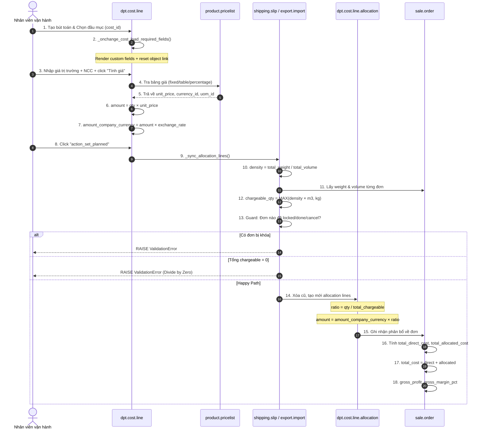

# 🧪 QUY TRÌNH & CHI TIẾT CÁC TEST CASES: QUẢN LÝ CHI PHÍ VẬN HÀNH
> **Vai trò:** Kỹ sư QA Lead (Elena 🧪) · **BMAD Method:** v6.3 · **Hệ thống:** Odoo 17
> **Module liên quan:** `dpt_cost_management`
> **Commit tham chiếu:** `5cb1c91` (ED-26)
> **Tài liệu tham chiếu:** `Business Need - Quản lý Chi phí Vận hành.md` & `Database & UI Design - Quản lý Chi phí.md`
> **Cập nhật lần cuối:** 21/05/2026

---

## 1. 🔍 BỐI CẢNH & PHẠM VI ẢNH HƯỞNG (SHIFT-LEFT)

Hệ thống quản lý Chi phí Vận hành của Kỳ Tốc Logistics kiểm soát toàn bộ 5 chặng vận chuyển (từ Trung Quốc về Việt Nam). Với triết lý **Shift-Left**, tài liệu test này được xây dựng song song với quá trình triển khai code để chặn đứng các lỗi logic trước khi đưa lên môi trường Production.

### 🎭 Ánh xạ Vai trò (BA 🔍 ➔ DEV 🏗️ ➔ QA 🧪)
```
Sofia (BA) ✍️                  Diego (Dev) 🏗️                 Elena (QA) 🧪
"Chỉ cho phép phân bổ     ➔   Chặn đứng bằng Guard      ➔   Đập phá bằng cách:
 chi phí nếu đơn hàng         Clause:                        • Thử phân bổ khi đơn đã locked.
 chưa bị chốt/hủy/khóa,       if so.locked or                • Nhập incidental_cost > 0
 tỷ giá > 0 và có lý do       so.state in ('done','cancel')    nhưng lý do trống/spaces.
 khi phát sinh chi phí."      raise ValidationError(...)     • Đưa trọng lượng & thể tích về 0."
```

---

## 2. ❓ BẢNG PHÂN TÍCH 5 WHY (5 WHY TABLE)

| # | Câu hỏi "Vì sao?" | Lý do & Giải pháp kỹ thuật |
|---|---|---|
| 1 | Vì sao **tổng sản lượng tính phí = 0** nguy hiểm? | Gây lỗi **Divide by Zero** khi tính `ratio = qty / total`. Hệ thống crash.<br>**Fix:** Guard Clause → ValidationError rõ ràng. |
| 2 | Vì sao **đơn đã chốt/khóa** không được phân bổ lại? | Thay đổi giá vốn sau khi kế toán đã xuất hóa đơn → sai sổ sách.<br>**Fix:** Guard Clause chặn và hiển thị tên đơn bị khóa. |
| 3 | Vì sao **1 đơn trên chuyến** dùng tỷ trọng của chính đơn? | Tỷ trọng cả chuyến = tỷ trọng đơn đó → nhất quán toán học.<br>**Fix:** `if len(sale_orders) == 1 → density = so.weight / so.volume`. |
| 4 | Vì sao **incidental_cost > 0** bắt buộc có **incidental_reason**? | Tránh nhập khống chi phí phát sinh, không thể kiểm toán.<br>**Fix:** `@api.constrains` + `@api.onchange` cảnh báo sớm. |
| 5 | Vì sao **tỷ giá vốn** lưu riêng trên từng Cost Line? | Tỷ giá tại thời điểm thanh toán NCC thực tế ≠ tỷ giá hạch toán.<br>**Fix:** Field `exchange_rate` override được, mặc định theo `rate_date`. |
| 6 | Vì sao **BIEN (đường biển)** không dùng công thức thông thường? | Cước biển tính theo container tĩnh, tỷ trọng KG/M3 không có nghĩa.<br>**Fix:** `is_sea_freight → chargeable_qty = 1.0` (placeholder, cần implement ED-27). |
| 7 | Vì sao `total_common_allocated` phải lấy từ `sale_id.total_allocated_cost`? | 1 đơn hàng có thể có allocation từ nhiều chuyến/tờ khai khác nhau (Chặng 1+3+4). Sum từ 1 parent thiếu các chặng còn lại.<br>**Fix:** Dùng `sale_id.total_allocated_cost` để aggregate toàn bộ. |
| 8 | Vì sao `direct_cost` phải cộng thêm `incidental_cost`? | Chi phí phát sinh là loại chi phí đích danh cho đơn hàng cụ thể, không phân bổ từ xe/tờ khai.<br>**Fix:** `direct_cost = SUM(cost_line_ids[order]) + incidental_cost`. |

---

## 3. 🔄 SƠ ĐỒ TUẦN TỰ LUỒNG TÍNH TOÁN & PHÂN BỔ



---

## 4. 📊 MAPPING CHẶNG → ĐỐI TƯỢNG GHI NHẬN

> **Quy tắc cốt lõi:** `object_type` trên Đầu mục Chi phí quyết định cách hệ thống xử lý.
> - `order` → **Chi phí đích danh** (biết rõ đơn nào chịu ngay) → **KHÔNG phân bổ**
> - `shipping_slip / export_import / export` → **Chi phí chung** → **Phân bổ theo KG/M3**

| Chặng | Tên | `object_type` | Cách tính | Cột Excel |
|-------|-----|--------------|-----------|----------|
| **C1** | Kho TQ (lưu kho, bốc xếp nội địa TQ) | `order` | Đích danh – gắn thẳng vào đơn | Cột J |
| **C2** | Vận chuyển nội địa TQ | `order` | Đích danh – gắn thẳng vào đơn | Cột J |
| **C3** | Xe container TQ→VN | `shipping_slip` | Phân bổ theo MAX(density×M3, KG) | Cột I |
| **C4** | Hải quan nhập VN | `export_import` | Phân bổ theo MAX(density×M3, KG) | Cột I |
| **C5** | Giao chặng cuối VN | `order` | Đích danh – gắn thẳng vào đơn | Cột J |
| **Thủ tục** | Phí XNK, khai báo hải quan | `order` | Đích danh – gắn thẳng vào đơn | Cột J |

---

## 5. 📊 MAPPING CÔNG THỨC EXCEL → ODOO (BẢNG 2)

| Cột Excel | Tên | Field Odoo | Công thức |
|-----------|-----|-----------|----------|
| D | Khối lượng | `sale_weight` | `related: sale_id.weight` |
| E | M3 | `sale_volume` | `related: sale_id.volume` |
| F | Tỷ trọng xe | `chargeable_density` | `1 đơn: weight/volume` · `N đơn: total_w/total_v` |
| G | Sản lượng tính phí | `chargeable_quantity` | `IF(BIEN,1, IF(KG+M3=0,1, MAX(F×E,D)))` |
| H | Tỷ lệ phân bổ | `allocation_ratio` | `G / SUMIFS(G, cùng chuyến)` |
| I | CP phân bổ chung (C3+C4) | `total_common_allocated` | `sale_id.total_allocated_cost` |
| J | CP đích danh **(C1+C2+C5+Thủ tục)** | `direct_cost` | `SUM(cost_line_ids[object_type=order]) + incidental_cost` |
| K | Tổng CP VC-XNK | `total_cost` | `=IFERROR(SUM(I:J), 0)` |

> ⚠️ **Ghi chú quan trọng:** Cột J = tổng **TẤT CẢ** các chặng có `object_type=order` (C1+C2+C5+Thủ tục), không chỉ C2+C5.


---

## 5. 🛠️ TEST CASES SUITES

### SUITE 1: MASTER DATA & CONFIGURATION (ĐẦU MỤC & BẢNG GIÁ)

> **Lưu ý:** Khi tạo Đầu mục Chi phí phải chọn đúng `object_type`:
> - C1, C2, C5, Thủ tục → **Đơn hàng** (`order`)
> - C3 → **Phiếu vận chuyển** (`shipping_slip`)
> - C4 → **Tờ khai nhập khẩu** (`export_import`)


| ID | Tên Kịch Bản | Loại | Steps | Kết quả mong đợi |
|---|---|---|---|---|
| **TC-MD-001** | Trùng mã đầu mục chi phí | Unhappy | 1. Tạo đầu mục `code='CP-VAN-C3'`.<br>2. Tạo thêm đầu mục thứ 2 cùng mã.<br>3. Lưu. | SQL Constraint: `Mã đầu mục chi phí đã tồn tại!` |
| **TC-MD-002** | Ràng buộc XOR trường thông tin | Unhappy | 1. Tạo trường thông tin.<br>2. Set đồng thời `service_id` & `cost_id`.<br>3. Lưu. | ValidationError: `Trường thông tin chỉ được thuộc về 1 trong 3: Service, Combo, Cost`. |
| **TC-MD-003** | Mã tự sinh khi để trống | Happy | 1. Tạo đầu mục, bỏ trống `code`.<br>2. Lưu. | Tự sinh mã sequence duy nhất (VD: `COST/2026/0001`). |
| **TC-MD-004** | Ngưng sử dụng đầu mục đang có bút toán active | Unhappy | 1. Tạo đầu mục chi phí có bút toán trạng thái `planned`.<br>2. Archive đầu mục.<br>3. Kiểm tra bút toán. | Cảnh báo hoặc block archive nếu có bút toán đang chạy. |
| **TC-MD-005** | Đầu mục không có bảng giá — fallback nhập tay | Happy | 1. Chọn đầu mục chưa có bảng giá.<br>2. Bấm "Tính giá" trên bút toán. | `manual_input = True` tự bật, không crash. User tự nhập đơn giá. |
| **TC-MD-006** | Tạo đầu mục C1 (Kho TQ) — object_type=order | Happy | 1. Tạo đầu mục tên "Phí lưu kho TQ", chọn `object_type=order`, `stage_ids=[C1]`.<br>2. Lưu.<br>3. Tạo bút toán từ đầu mục này trên đơn hàng SO-01. | Cost line gắn trực tiếp vào SO-01, KHÔNG sinh ra allocation line. `total_direct_cost` của SO tăng. |
| **TC-MD-007** | Tạo đầu mục C3 — object_type=shipping_slip | Happy | 1. Tạo đầu mục "Cước xe TQ-VN", `object_type=shipping_slip`, `stage_ids=[C3]`.<br>2. Tạo bút toán trên Phiếu vận chuyển.<br>3. Planned. | Sinh ra `dpt.cost.line.allocation` về từng đơn trong chuyến. `total_allocated_cost` trên SO tăng. |
| **TC-MD-008** | Nhầm object_type: đầu mục C1 gắn vào shipping_slip | Unhappy | 1. Đầu mục C1 có `object_type=order`.<br>2. Tạo bút toán nhưng chỉ điền `shipping_slip_id`, bỏ trống `sale_id`.<br>3. Lưu. | ValidationError: `Bút toán chi phí trên Đơn hàng phải có sale_id.` |

---

### SUITE 2: PRICELIST ENGINE MATCHING (TRA CỨU BẢNG GIÁ NCC)

| ID | Tên Kịch Bản | Loại | Steps | Kết quả mong đợi |
|---|---|---|---|---|
| **TC-PL-001** | Bảng giá NCC không có partner | Unhappy | 1. Tạo `pricelist.item` không có `partner_id`.<br>2. Lưu. | ValidationError: `Bảng giá nhà cung cấp bắt buộc phải chọn Nhà cung cấp.` |
| **TC-PL-002** | Sửa bảng giá đang active (không bật ngoại lệ) | Unhappy | 1. Bảng giá `state=active`, `allow_edit_without_approval=False`.<br>2. Thử sửa đơn giá.<br>3. Lưu. | ValidationError: `Không thể chỉnh sửa bảng giá ở trạng thái 'Đang hoạt động'.` |
| **TC-PL-003** | Sửa bảng giá active (bật ngoại lệ) | Happy | 1. Set `allow_edit_without_approval=True`.<br>2. Sửa đơn giá bảng giá active.<br>3. Lưu. | Lưu thành công. |
| **TC-PL-004** | Ưu tiên NCC có partner trùng > partner trống | Happy | 1. Cấu hình 2 bảng giá cho `CP-A`:<br>• BG-1: NCC=`A Thành`, giá=1.000 CNY.<br>• BG-2: NCC=Trống, giá=1.200 CNY.<br>2. Tạo cost line `CP-A`, NCC=`A Thành`, bấm "Tính giá". | Match BG-1, `unit_price=1.000`. BG-2 bị bỏ qua. |
| **TC-PL-005** | Tra bảng cước bậc thang (Table tier) | Happy | 1. BG dạng `Table`, field=Weight, tier: 0–100kg→10CNY, 101–500kg→8CNY.<br>2. Cost line nhập Weight=250kg, bấm "Tính giá". | `unit_price=8` (nằm tier 101-500). |
| **TC-PL-006** | Biên giới tier bậc thang (Boundary) | Boundary | 1. Tier như TC-PL-005.<br>2. Lần lượt nhập Weight=100, 101, 500, 501. | • 100→tier1→10CNY<br>• 101→tier2→8CNY<br>• 500→tier2→8CNY<br>• 501→không match→`manual_input=True` |
| **TC-PL-007** | Bảng giá dạng `percentage` | Happy | 1. BG có `compute_price='percentage'`, `percent_price=5`.<br>2. Bấm "Tính giá". | `unit_price=5`. |
| **TC-PL-008** | Không match bảng giá nào → fallback | Happy | 1. BG chỉ có partner=`NCC-X`.<br>2. Cost line chọn NCC=`NCC-Y`, bấm "Tính giá". | `manual_input=True`, không báo lỗi crash. |

---

### SUITE 3: COST LINE VALIDATION & EXCHANGE RATES (BÚT TOÁN & TỶ GIÁ)

| ID | Tên Kịch Bản | Loại | Steps | Kết quả mong đợi |
|---|---|---|---|---|
| **TC-CL-001** | Tỷ giá vốn = 0 | Boundary | 1. Tạo cost line, `exchange_rate=0.0`. Lưu. | ValidationError: `Tỷ giá vốn phải lớn hơn 0.` |
| **TC-CL-002** | Tỷ giá vốn âm | Boundary | 1. Nhập `exchange_rate=-3500`. Lưu. | ValidationError: `Tỷ giá vốn phải lớn hơn 0.` |
| **TC-CL-003** | Object_type không khớp – đầu mục type=order thiếu sale_id | Unhappy | 1. Chọn đầu mục `object_type='order'`.<br>2. Bỏ trống `sale_id`.<br>3. Lưu. | ValidationError: `Bút toán chi phí trên Đơn hàng phải có sale_id.` |
| **TC-CL-004** | Object_type không khớp – đầu mục type=shipping_slip thiếu slip_id | Unhappy | 1. Chọn đầu mục `object_type='shipping_slip'`.<br>2. Bỏ trống `shipping_slip_id`.<br>3. Lưu. | ValidationError: `Bút toán chi phí trên Phiếu vận chuyển phải có shipping_slip_id.` |
| **TC-CL-005** | Tỷ giá tự động khi đổi tiền tệ sang CNY | Happy | 1. Tạo cost line, chọn `currency_id=CNY`, `rate_date=Hôm nay`.<br>2. Quan sát `exchange_rate`. | `exchange_rate` tự điền = `1/rate_CNY` từ hệ thống. Khác 1.0 và > 0. |
| **TC-CL-006** | Tỷ giá về 1.0 khi đổi tiền tệ sang VND | Happy | 1. Đổi `currency_id=VND` (= company currency). | `exchange_rate` tự reset = `1.0`. |
| **TC-CL-007** | Tính Thành tiền (amount) tự động | Happy | 1. Nhập `quantity=150`, `unit_price=12 CNY`.<br>2. Quan sát `amount`. | `amount = 150 × 12 = 1.800 CNY`. |
| **TC-CL-008** | Tính Thành tiền VND (amount_company_currency) | Happy | 1. `amount=1.800 CNY`, `exchange_rate=3.500`. | `amount_company_currency = 1.800 × 3.500 = 6.300.000 VND`. |
| **TC-CL-009** | Ghi đè amount tay (manual_input) | Happy | 1. Bật `manual_input=True`.<br>2. Nhập tay `amount=5.000.000` (không qua bảng giá). | `amount` ghi đè thành 5.000.000, `amount_company_currency` tính lại theo tỷ giá. |
| **TC-CL-010** | Reset liên kết sai khi đổi đầu mục | Happy | 1. Cost line có `object_type=order`, đã điền `sale_id=SO-01`.<br>2. Đổi đầu mục sang `object_type=shipping_slip`. | `sale_id` tự xóa về `False`. `shipping_slip_id` được kích hoạt để điền. |
| **TC-CL-011** | Tên (name) tự tổng hợp | Happy | 1. Chọn đầu mục `Cước xe`, partner=`A Thành`.<br>2. Kiểm tra field `name`. | `name = "Cước xe - A Thành"` (tự động, không cần nhập tay). |
| **TC-CL-012** | Cost line không có partner — name chỉ có đầu mục | Happy | 1. Tạo cost line không chọn partner. | `name = "Cước xe"` (chỉ đầu mục). |

---

### SUITE 4: COST ALLOCATION ENGINE (BỘ MÁY PHÂN BỔ — LÕI HỆ THỐNG)

| ID | Tên Kịch Bản | Loại | Steps | Kết quả mong đợi |
|---|---|---|---|---|
| **TC-AL-001** | Tổng sản lượng tính phí = 0 (Divide by Zero Guard) | Boundary | 1. Xe chở 3 đơn, tất cả weight=0 & volume=0.<br>2. Tạo cost line trên xe.<br>3. Chuyển sang `planned`. | ValidationError: `Không thể phân bổ chi phí: Tổng sản lượng tính phí… đang bằng 0. Vui lòng nhập khối lượng/thể tích.` |
| **TC-AL-002** | Phân bổ khi có đơn hàng locked | Unhappy | 1. Xe chở SO-01 (draft) + SO-02 (done/locked).<br>2. Chuyển cost line sang `planned`. | ValidationError: `Không thể phân bổ… chứa đơn hàng đã chốt hoặc khóa: SO-02`. |
| **TC-AL-003** | Phân bổ khi có đơn hàng state=cancel | Unhappy | 1. Xe chở SO-01 + SO-03 (cancel).<br>2. Chuyển cost line sang `planned`. | ValidationError nêu rõ tên SO-03. |
| **TC-AL-004** | Tính đúng tỷ trọng & sản lượng (nhiều đơn) | Happy/Boundary | 1. Xe: SO-A (1.000kg, 10m³) + SO-B (3.000kg, 6m³).<br>2. Cost line = 32.000.000 VND. Planned. | • density=250 kg/m³<br>• qty_A=MAX(250×10,1000)=**2.500**<br>• qty_B=MAX(250×6,3000)=**3.000**<br>• ratio_A=2500/5500=**45.45%**<br>• ratio_B=3000/5500=**54.55%**<br>• alloc_A=**14.545.440 VND**<br>• alloc_B=**17.454.560 VND**<br>• Tổng=32.000.000 VND ✅ |
| **TC-AL-005** | Tính đúng tỷ trọng xe (1 đơn duy nhất) | Boundary | 1. Xe chỉ có SO-Single: 500kg, 5m³.<br>2. Cost line = 5.000.000 VND. Planned. | • `chargeable_density = 500/5 = 100 kg/m³`<br>• qty=MAX(100×5,500)=500<br>• ratio=100%<br>• alloc=5.000.000 VND ✅ |
| **TC-AL-006** | KG=0 nhưng M3>0 | Boundary | 1. SO: weight=0, volume=5m³, density=200.<br>2. Planned. | qty=MAX(200×5, 0)=1.000 (theo M3). Không crash. |
| **TC-AL-007** | M3=0 nhưng KG>0 | Boundary | 1. SO: weight=500, volume=0.<br>2. Density=0 (vì m3=0). Planned. | qty=MAX(0×0, 500)=500 (theo KG). Không crash. |
| **TC-AL-008** | density=0 (total_volume=0 cả chuyến) | Boundary | 1. Tất cả đơn: volume=0, weight>0.<br>2. Planned. | density=0, qty=kg thuần, phân bổ thuần theo KG. Không crash. |
| **TC-AL-009** | Chi phí phát sinh > 0, thiếu lý do | Boundary | 1. Dòng allocation SO-01: nhập `incidental_cost=500.000`, để trống `incidental_reason`.<br>2. Lưu. | ValidationError: `Bạn phải nhập Lý do phát sinh khi có Chi phí phát sinh (500000 VND).` |
| **TC-AL-010** | Chi phí phát sinh, lý do chỉ có spaces | Boundary | 1. `incidental_cost=500.000`, `incidental_reason='   '` (3 dấu cách).<br>2. Lưu. | ValidationError (strip() phát hiện chuỗi trắng). |
| **TC-AL-011** | Chi phí phát sinh hợp lệ | Happy | 1. `incidental_cost=500.000`, `incidental_reason='Bốc xếp hàng quá khổ'`.<br>2. Lưu. | Lưu thành công. `direct_cost` của SO tăng thêm 500.000. `total_cost` cập nhật. |
| **TC-AL-012** | incidental_cost = 0, không cần lý do | Happy | 1. `incidental_cost=0`, `incidental_reason=''`.<br>2. Lưu. | Lưu thành công (Guard Clause chỉ chặn khi cost > 0). |
| **TC-AL-013** | Cảnh báo sớm UI khi nhập phát sinh chưa có lý do | UI/UX | 1. Nhập `incidental_cost=200.000` vào ô.<br>2. Chưa điền lý do.<br>3. Chuyển sang ô khác (trigger onchange). | Popup warning: `Bạn vừa nhập Chi phí phát sinh. Vui lòng điền Lý do phát sinh trước khi lưu.` |
| **TC-AL-014** | total_common_allocated tổng hợp từ nhiều chặng | Happy | 1. SO-01 có phân bổ từ: Xe chặng 3=5.000.000 + Tờ khai chặng 4=2.000.000.<br>2. Kiểm tra `total_common_allocated` trên allocation line. | `total_common_allocated = 7.000.000` (SUM TẤT CẢ allocation về SO-01, không phân biệt nguồn). |
| **TC-AL-015** | Đơn SS414: lookup theo mã đơn, không theo phiếu VC | Happy | 1. Tờ khai có `code='SS414'`.<br>2. Allocation dùng C3 (mã đơn) thay vì mã phiếu VC (B3).<br>3. Kiểm tra `total_common_allocated`. | Kết quả = `SUM(G+I+J theo mã đơn C3)` — khớp logic Excel `IF(B3="SS414", SUMIFS(C3), SUMIFS(B3)×H3)`. |

---

### SUITE 5: SALE ORDER FINANCIALS (TỔNG HỢP TÀI CHÍNH ĐƠN HÀNG)

| ID | Tên Kịch Bản | Loại | Steps | Kết quả mong đợi |
|---|---|---|---|---|
| **TC-SO-001** | Doanh thu = 0, không crash gross_margin_pct | Boundary | 1. SO có `amount_total=0`.<br>2. Nhập chi phí đích danh và phân bổ. | `gross_margin_pct=0.0` (guard chia 0). `gross_profit` âm (lỗ). Không crash. |
| **TC-SO-002** | Tổng hợp đầy đủ direct (C1+C2+C5+Thủ tục) + allocated (C3+C4) + incidental | Happy | 1. SO doanh thu=50.000.000.<br>2. **CP đích danh** (`object_type=order`) Bảng 1:<br>&nbsp;&nbsp;• C1 Kho TQ=1.000.000<br>&nbsp;&nbsp;• C2 Nội địa=2.000.000<br>&nbsp;&nbsp;• C5 Giao cuối=5.000.000<br>&nbsp;&nbsp;• Thủ tục=2.000.000<br>3. **CP phân bổ** từ Xe (C3)=4.000.000 + Tờ khai (C4)=2.000.000.<br>4. Phát sinh=1.000.000. | • `total_direct_cost=10.000.000` (1+2+5+2)<br>• `total_allocated_cost=6.000.000` (4+2)<br>• `direct_cost` alloc=10.000.000+1.000.000=**11.000.000**<br>• `total_cost=11.000.000+6.000.000=**17.000.000**`<br>• `gross_profit=50.000.000-17.000.000=**33.000.000**`<br>• `gross_margin_pct=**66.00%**` |
| **TC-SO-003** | Lỗ vốn (chi phí > doanh thu) | Boundary | 1. SO doanh thu=10.000.000, total_cost=12.000.000. | `gross_profit=-2.000.000`, `gross_margin_pct=-20.00%`. Hiển thị âm, không lỗi. |
| **TC-SO-004** | Kiểm tra công thức Tổng CP VC-XNK | Happy | 1. `total_common_allocated=6.000.000`, `direct_cost=12.000.000`.<br>2. Kiểm tra `total_cost` trên allocation line. | `total_cost=18.000.000` = `IFERROR(SUM(I:J), 0)` ✅ |
| **TC-SO-005** | Tổng CP phân bổ = 0 (chưa có allocation) | Happy | 1. SO mới, chưa có allocation nào về.<br>2. Kiểm tra các trường total. | `total_allocated_cost=0`, `total_direct_cost=0`, `total_cost=0`. Không crash. |
| **TC-SO-006** | Biên lợi nhuận chính xác 2 chữ số thập phân | Happy | 1. Revenue=100.000.000, cost=33.333.333.<br>2. Kiểm tra `gross_margin_pct`. | `gross_margin_pct = (100M-33.333.333)/100M = 66.666667%` (lưu đủ 6 digits). |

---

### SUITE 6: RERUN & SYNCHRONIZATION (ĐỒNG BỘ & KÍCH HOẠT LẠI)

| ID | Tên Kịch Bản | Loại | Steps | Kết quả mong đợi |
|---|---|---|---|---|
| **TC-SYNC-001** | Thay đổi amount → tự đồng bộ phân bổ | Happy | 1. Cost line `planned`, amount=10M đã phân bổ về SO-01=4M.<br>2. Sửa amount lên 15M, lưu. | `write()` phát hiện thay đổi planned line → chạy lại `_sync_allocation_lines()`. SO-01 tự tăng lên 6M. |
| **TC-SYNC-002** | Thay đổi state → tự đồng bộ | Happy | 1. Cost line `draft`, chuyển sang `planned` (action_set_planned). | Phân bổ mới được tạo theo tỷ lệ tính hiện tại. |
| **TC-SYNC-003** | Thêm đơn mới vào xe → tính lại thủ công | Happy | 1. Xe chở SO-01 + SO-02, đã planned.<br>2. Thêm SO-03 vào `sale_ids`.<br>3. Bấm [Tính lại phân bổ]. | Phân bổ cũ bị xóa. Phân bổ mới tạo cho cả 3 đơn theo density mới (có SO-03). |
| **TC-SYNC-004** | Không tự trigger lại khi thay đổi field không liên quan | Happy | 1. Cost line planned.<br>2. Sửa `partner_id` (không phải trigger field).<br>3. Lưu. | Không chạy lại phân bổ. Allocation giữ nguyên. |
| **TC-SYNC-005** | Xóa cost line → xóa allocation | Happy | 1. Cost line đã planned, có allocation về 3 đơn.<br>2. Xóa cost line (`unlink`). | Tất cả `dpt.cost.line.allocation` con bị xóa theo (cascade). Số liệu trên SO-01,02,03 giảm về đúng. |

---

### SUITE 7: MULTI-OBJECT TYPE (TỜ KHAI NHẬP / XUẤT KHẨU)

| ID | Tên Kịch Bản | Loại | Steps | Kết quả mong đợi |
|---|---|---|---|---|
| **TC-EI-001** | Phân bổ từ Tờ khai nhập khẩu (export_import) | Happy | 1. Tạo tờ khai nhập, gắn 2 đơn hàng.<br>2. Tạo cost line `object_type=export_import`.<br>3. Planned. | Allocation tạo đúng về 2 đơn theo KG/M3 tờ khai. |
| **TC-EI-002** | Tỷ trọng từ Tờ khai nhập (dpt_n_w_kg / total_cubic_meters) | Happy | 1. Tờ khai: `dpt_n_w_kg=4000`, `total_cubic_meters=16`.<br>2. Kiểm tra `chargeable_density`. | `chargeable_density = 4000/16 = 250`. |
| **TC-EI-003** | Tờ khai nhập M3=0 | Boundary | 1. `total_cubic_meters=0`.<br>2. Kiểm tra density và phân bổ. | `chargeable_density=0`. Phân bổ thuần theo `dpt_n_w_kg`. Không crash. |
| **TC-EX-001** | Tỷ trọng từ Tờ khai xuất (dpt.export) | Happy | 1. Tạo cost line `object_type=export`.<br>2. Planned. | `chargeable_density=0.0` (export không có M3). Phân bổ thuần KG. |
| **TC-EX-002** | Tổng chi phí tờ khai xuất | Happy | 1. Tạo 3 cost lines trên export: 1M + 2M + 3M VND.<br>2. Kiểm tra `export.total_cost`. | `total_cost = 6.000.000 VND`. |

---

### SUITE 8: SECURITY & ACCESS CONTROL (BẢO MẬT)

| ID | Tên Kịch Bản | Loại | Steps | Kết quả mong đợi |
|---|---|---|---|---|
| **TC-SEC-001** | User thường không xóa được cost line đã planned | Unhappy | 1. Login user role thường.<br>2. Thử xóa cost line `state=planned`. | Access Error hoặc nút Xóa ẩn. |
| **TC-SEC-002** | Multi-company — không thấy data công ty khác | Unhappy | 1. Tạo cost line company A.<br>2. Login user company B.<br>3. Tìm kiếm. | Không thấy data company A trong danh sách. |

---

## 6. 🔬 UNIT TEST PYTHON MẪU (cho thư mục `tests/`)

```python
# -*- coding: utf-8 -*-
# d:\Odoo\Odoo-DPT\dpt_cost_management\tests\test_cost_allocation.py
from odoo.tests.common import TransactionCase
from odoo.exceptions import ValidationError


class TestCostAllocation(TransactionCase):

    def setUp(self):
        super().setUp()
        self.partner = self.env['res.partner'].create({'name': 'KH Test'})
        self.vendor = self.env['res.partner'].create({'name': 'NCC Test'})

        self.cost_item_slip = self.env['dpt.cost.management'].create({
            'name': 'Cước xe C3',
            'object_type': 'shipping_slip',
        })
        self.cost_item_order = self.env['dpt.cost.management'].create({
            'name': 'Phí C2',
            'object_type': 'order',
        })

        self.so_a = self.env['sale.order'].create({
            'partner_id': self.partner.id,
            'weight': 1000.0, 'volume': 10.0, 'amount_total': 50_000_000,
        })
        self.so_b = self.env['sale.order'].create({
            'partner_id': self.partner.id,
            'weight': 3000.0, 'volume': 6.0, 'amount_total': 80_000_000,
        })
        self.slip = self.env['dpt.shipping.slip'].create({
            'name': 'XE-001',
            'total_weight': 4000.0, 'total_volume': 16.0,
            'sale_ids': [(6, 0, [self.so_a.id, self.so_b.id])],
        })

    # ── TC-CL-001/002: Exchange rate guard ──
    def test_exchange_rate_zero(self):
        with self.assertRaises(ValidationError):
            self.env['dpt.cost.line'].create({
                'cost_id': self.cost_item_slip.id,
                'shipping_slip_id': self.slip.id,
                'exchange_rate': 0.0,
                'unit_price': 1000.0, 'quantity': 1.0,
            })

    def test_exchange_rate_negative(self):
        with self.assertRaises(ValidationError):
            self.env['dpt.cost.line'].create({
                'cost_id': self.cost_item_slip.id,
                'shipping_slip_id': self.slip.id,
                'exchange_rate': -3500.0,
                'unit_price': 1000.0, 'quantity': 1.0,
            })

    # ── TC-AL-001: Divide by Zero guard ──
    def test_divide_by_zero_guard(self):
        self.so_a.write({'weight': 0.0, 'volume': 0.0})
        self.so_b.write({'weight': 0.0, 'volume': 0.0})
        line = self.env['dpt.cost.line'].create({
            'cost_id': self.cost_item_slip.id,
            'shipping_slip_id': self.slip.id,
            'unit_price': 10_000_000.0, 'quantity': 1.0,
        })
        with self.assertRaises(ValidationError):
            line.action_set_planned()

    # ── TC-AL-002: Locked order guard ──
    def test_locked_order_guard(self):
        line = self.env['dpt.cost.line'].create({
            'cost_id': self.cost_item_slip.id,
            'shipping_slip_id': self.slip.id,
            'unit_price': 10_000_000.0, 'quantity': 1.0,
        })
        line.action_set_planned()
        self.so_b.write({'state': 'done'})
        with self.assertRaises(ValidationError):
            line.write({'unit_price': 12_000_000.0})

    # ── TC-AL-004: Correct allocation calculation ──
    def test_allocation_calculation(self):
        line = self.env['dpt.cost.line'].create({
            'cost_id': self.cost_item_slip.id,
            'shipping_slip_id': self.slip.id,
            'unit_price': 32_000_000.0, 'quantity': 1.0,
        })
        line.action_set_planned()
        alloc_a = line.allocation_line_ids.filtered(lambda l: l.sale_id == self.so_a)
        alloc_b = line.allocation_line_ids.filtered(lambda l: l.sale_id == self.so_b)
        self.assertAlmostEqual(alloc_a.chargeable_quantity, 2500.0, places=0)
        self.assertAlmostEqual(alloc_b.chargeable_quantity, 3000.0, places=0)
        total_alloc = alloc_a.amount + alloc_b.amount
        self.assertAlmostEqual(total_alloc, 32_000_000.0, delta=1.0)

    # ── TC-AL-009/010: Incidental cost without reason ──
    def test_incidental_cost_missing_reason(self):
        line = self.env['dpt.cost.line'].create({
            'cost_id': self.cost_item_slip.id,
            'shipping_slip_id': self.slip.id,
            'unit_price': 5_000_000.0, 'quantity': 1.0,
        })
        line.action_set_planned()
        alloc = line.allocation_line_ids.filtered(lambda l: l.sale_id == self.so_a)
        with self.assertRaises(ValidationError):
            alloc.write({'incidental_cost': 500_000.0, 'incidental_reason': ''})

    def test_incidental_cost_spaces_only_reason(self):
        line = self.env['dpt.cost.line'].create({
            'cost_id': self.cost_item_slip.id,
            'shipping_slip_id': self.slip.id,
            'unit_price': 5_000_000.0, 'quantity': 1.0,
        })
        line.action_set_planned()
        alloc = line.allocation_line_ids.filtered(lambda l: l.sale_id == self.so_a)
        with self.assertRaises(ValidationError):
            alloc.write({'incidental_cost': 500_000.0, 'incidental_reason': '   '})

    # ── TC-AL-011: Valid incidental cost ──
    def test_incidental_cost_valid(self):
        line = self.env['dpt.cost.line'].create({
            'cost_id': self.cost_item_slip.id,
            'shipping_slip_id': self.slip.id,
            'unit_price': 5_000_000.0, 'quantity': 1.0,
        })
        line.action_set_planned()
        alloc = line.allocation_line_ids.filtered(lambda l: l.sale_id == self.so_a)
        old_direct = alloc.direct_cost
        alloc.write({
            'incidental_cost': 500_000.0,
            'incidental_reason': 'Bốc xếp hàng quá khổ tại cửa khẩu',
        })
        alloc.invalidate_recordset()
        self.assertAlmostEqual(alloc.direct_cost, old_direct + 500_000.0, delta=1.0)

    # ── TC-SO-001: Zero revenue ──
    def test_zero_revenue_no_crash(self):
        self.so_a.write({'amount_total': 0.0})
        line = self.env['dpt.cost.line'].create({
            'cost_id': self.cost_item_slip.id,
            'shipping_slip_id': self.slip.id,
            'unit_price': 5_000_000.0, 'quantity': 1.0,
        })
        line.action_set_planned()
        # Không crash, gross_margin_pct = 0
        self.so_a.invalidate_recordset()
        self.assertEqual(self.so_a.gross_margin_pct, 0.0)
```

---

## 7. 📋 BẢNG TRẠNG THÁI THỰC HIỆN TEST

| Suite | # Cases | Automated | Manual | Status |
|-------|---------|-----------|--------|--------|
| SUITE 1 — Master Data | 5 | - | ✅ Manual | ⏳ Pending |
| SUITE 2 — Pricelist Engine | 8 | Partial | ✅ Manual | ⏳ Pending |
| SUITE 3 — Cost Line Validation | 12 | ✅ Python | ✅ Manual | ⏳ Pending |
| SUITE 4 — Allocation Engine | 15 | ✅ Python | ✅ Manual | ⏳ Pending |
| SUITE 5 — SO Financials | 6 | ✅ Python | ✅ Manual | ⏳ Pending |
| SUITE 6 — Synchronization | 5 | Partial | ✅ Manual | ⏳ Pending |
| SUITE 7 — Multi-Object Type | 5 | - | ✅ Manual | ⏳ Pending |
| SUITE 8 — Security | 2 | - | ✅ Manual | ⏳ Pending |
| **TỔNG** | **58** | **~20** | **38** | ⏳ |

---

## 8. 🏁 TIÊU CHÍ KÝ DUYỆT (QA SIGN-OFF)

1. **Pass Rate:** 100% Suites 1–6 (critical path) phải PASS.
2. **Không rò rỉ dữ liệu:** Đổi đầu mục → xóa sạch liên kết cũ.
3. **Cân đối phân bổ:** `SUM(allocation.amount)` = `cost_line.amount_company_currency` ±1 VND (làm tròn).
4. **Zero Revenue:** `gross_margin_pct` phải = 0.0, không crash.
5. **Guard incidental:** Không thể lưu phát sinh không có lý do, dù gọi từ UI hay Python script.
6. **Tổng CP VC-XNK:** `total_cost = total_common_allocated + direct_cost` = `IFERROR(SUM(I:J),0)` khớp Excel.
