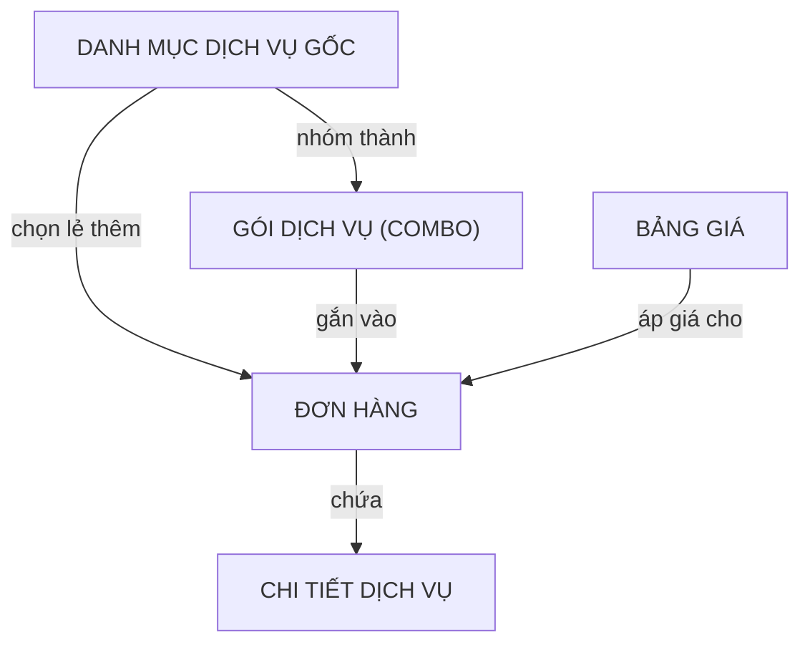

# Dịch vụ — Kỳ Tốc

## 1. Khái niệm
Dịch vụ là các hạng mục chi phí đi kèm đơn hàng (thủ tục hải quan, cước vận tải, kho bãi, thuế...), cấu thành doanh thu chính của Kỳ Tốc.

## 2. Luồng nghiệp vụ

## 3. Thông tin cốt lõi

| Nhóm | Chi tiết |
|------|----------|
| **Gói dịch vụ (Combo)** | Vòng đời: Nháp → Chờ duyệt → Hoạt động → Tạm dừng / Hết hạn / Huỷ. Mỗi lần sửa tạo phiên bản mới (v1, v2...). |
| **Cấu hình phân bổ** | Cả dịch vụ gốc lẫn combo đều có loại phân bổ chi phí (theo giá trị / số lượng / cân nặng / số khối) và tỷ lệ phân bổ theo loại uỷ thác (XK, NK, XNK, KUT) gồm: tỷ lệ giá khai, tỷ lệ giá XHĐ, tỷ lệ XHĐ dịch vụ. |
| **Định mức phê duyệt** | Mỗi combo có ngưỡng phê duyệt theo M3 và theo KG. Khi vượt định mức → yêu cầu phê duyệt. |
| **Trạng thái giá** | Chưa có giá → Chờ giá → Đã báo giá → Chờ duyệt → Đã duyệt → Đã tính. |

## 4. Quy tắc nghiệp vụ
- Khoá tỷ giá: Khi chốt giá, tỷ giá ngoại tệ bị khoá cố định, không bị ảnh hưởng biến động sau đó.
- Chốt đơn: Đơn chỉ được quyết toán khi 100% dịch vụ đã chốt giá.
- Khoá đơn: Đơn bị khoá → chặn mọi thay đổi dịch vụ.
- Phân bổ: Chi phí phân bổ theo giá trị / số lượng / cân nặng / số khối.
- Giảm giá: Chỉ 0–100%.
