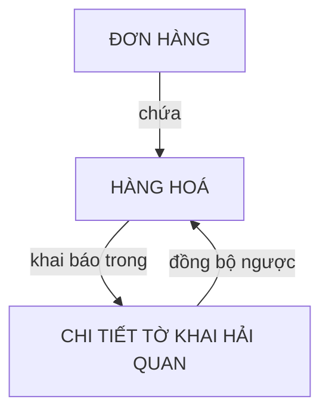

# Hàng hoá — Kỳ Tốc

## 1. Khái niệm
Hàng hoá là các mặt hàng xuất nhập khẩu nằm trong đơn hàng, gắn liền với thông tin thông quan, thuế và vận chuyển.

## 2. Luồng nghiệp vụ

## 3. Thông tin cốt lõi

| Nhóm | Chi tiết |
|------|----------|
| **Vật lý** | Tên, quy cách, khối lượng (kg), thể tích — CBM (Cubic Meter) |
| **Hải quan** | Mã HS (Harmonized System), giá khai báo, thuế NK, thuế VAT (Value Added Tax) |
| **Xuất xứ** | Nước sản xuất, điều kiện giá — FOB (Free On Board), CIF (Cost Insurance and Freight) |
| **Giá cả** | Đơn giá báo khách (ngoại tệ), đơn giá khách đề xuất, chiết khấu (cố định / theo %) |
| **Mô tả sản phẩm** | Cấu hình chọn mô tả sản phẩm từ danh mục có sẵn, dùng cho khai báo hải quan và chứng từ |

## 4. Quy tắc nghiệp vụ
- Cảnh báo khi giá báo khách thấp hơn giá nội bộ hoặc giá vốn.
- Giảm giá chỉ trong khoảng 0–100%.
