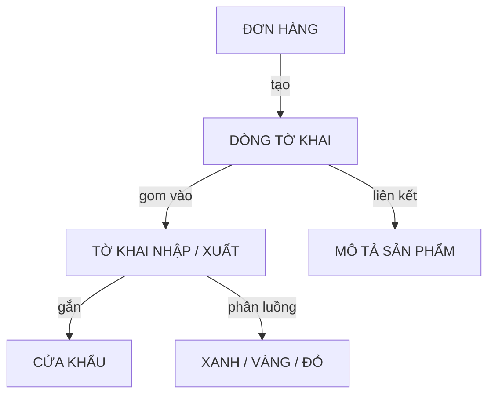

# Tờ khai — Chứng từ — Thông quan — Kỳ Tốc

## 1. Khái niệm
Tờ khai hải quan là đơn vị quản lý chứng từ xuất nhập khẩu. Hệ thống quản lý 3 cấp: Dòng tờ khai (1 mặt hàng, gắn 1 hoặc nhiều mã lô) → Tờ khai (gom nhiều dòng từ đơn hàng) → Xe hàng (chở nhiều tờ khai).

## 2. Luồng nghiệp vụ

## 3. Thông tin cốt lõi

### Loại hình uỷ thác

| Loại hình | Ai đứng tên | Tờ khai |
|-----------|-------------|---------|
| **UT Xuất** | Cty TQ | Riêng |
| **UT Nhập** | Cty VN (DPT/LTV/Deka) | Riêng |
| **UT XNK** | Cty TQ xuất + Cty VN nhập | Riêng hoặc chung |
| **Khai báo hộ** | KH tự đứng tên, cty chỉ thao tác hệ thống | Riêng |

### Luồng tiền

| Mã | Mô tả |
|----|-------|
| **501** | KH → VND → Cty VN → USD → Qisu → CNY → Xưởng |
| **502** | Cty VN → USD → Cty TQ → ví 1688/Taobao → CNY → Xưởng |
| **503** | USD trả thẳng xưởng (hiếm, cước < 1.000 CNY) |
| **Wechat/Alipay** | Thanh toán ngoài hệ thống |

### Chứng từ nhập khẩu

| Loại | Chứng từ |
|------|----------|
| **Bắt buộc** | Contract, Invoice, Packing list, Tờ khai HQ, Giấy kiểm tra chuyên ngành — phải khớp tuyệt đối |
| **Không bắt buộc** | C/O (Giấy chứng nhận xuất xứ) — có C/O → thuế NK giảm (ví dụ: 15% → 0%). Giá: 300 tệ |

### Luồng thông quan

| Luồng | Quy trình |
|-------|-----------|
| **Xanh** | Đính chứng từ → Đóng thuế → Thông quan |
| **Vàng** | HQ tiếp nhận → HQ làm việc với DN → Đính chứng từ → Đóng thuế → Thông quan |
| **Đỏ** | HQ tiếp nhận → HQ làm việc với DN → Đính chứng từ → Đóng thuế → Kiểm hoá → Thông quan |

### Trạng thái sau thông quan

| Trạng thái | Ý nghĩa | Xuất HĐ? |
|------------|---------|----------|
| **Thông quan** | Hồ sơ + thuế đầy đủ | Có |
| **Giải phóng hàng** | Tham vấn giá, DN vẫn được sử dụng hàng | Có |
| **Mang hàng về bảo quản** | Chờ kiểm tra chuyên ngành, cả xe không được sử dụng | **Không** |

### Mã lô, Pháp nhân, Tuân thủ

| Nhóm | Chi tiết |
|------|----------|
| **Mã lô** | Ký tự 1 = năm (A=2023…D=2026), ký tự 2 = tháng (A=T1…), số đuôi = số kiện |
| **Pháp nhân** | DPT, DK (Deka), LTV — phải khớp trên chứng từ, HĐ và đề nghị thanh toán |
| **Tuân thủ 2026** | Chuẩn chỉnh: cty tự TT tiền hàng TQ, KH TT từ TK cty → TK cty VN, HĐ xuất đầy đủ |
| **Tuân thủ 2025** | Không chuẩn chỉnh: HĐ theo giá mong muốn, tách luồng tiền, hoặc KH tự TT đầu TQ |

## 4. Quy tắc nghiệp vụ
- Hàng cấm/hạn chế: Không nhận hàng vi phạm bảo hộ thương hiệu, hàng danh mục cấm, hàng cũ. Ngoại lệ: máy móc cũ dưới 10 năm (loại hình A12, KH tự đứng tên, tự giám định).
- Kiểm tra bảo hộ thương hiệu: Tra cứu trên hệ thống TQ, VN và WIPO quốc tế.
- Phân bổ chi phí: Dựa trên **giá trị hàng hoá**, tuyệt đối **không theo cân nặng hay số khối**.
- UT XNK: CP tại TQ cộng vào giá khai. CP tại VN phân bổ sau giá nhập → xuất 1 HĐ.
- Chỉ UT NK: Chỉ chuyển trả xưởng đúng tiền hàng. CP dịch vụ TQ phân bổ sau giá nhập tại VN.
- Chỉ UT XK: KH tự đứng tên NK → cty chỉ xuất HĐ dịch vụ (không xuất HĐ bán hàng hoá).
- Quy trình tính giá: Hàng về VN → tính giá khai trước → in tờ khai → về kho VN → tính giá XHĐ sau khi có tờ khai thông quan.
- Thời gian di chuyển TQ→VN kéo dài bất thường → tự động phân luồng Đỏ.
