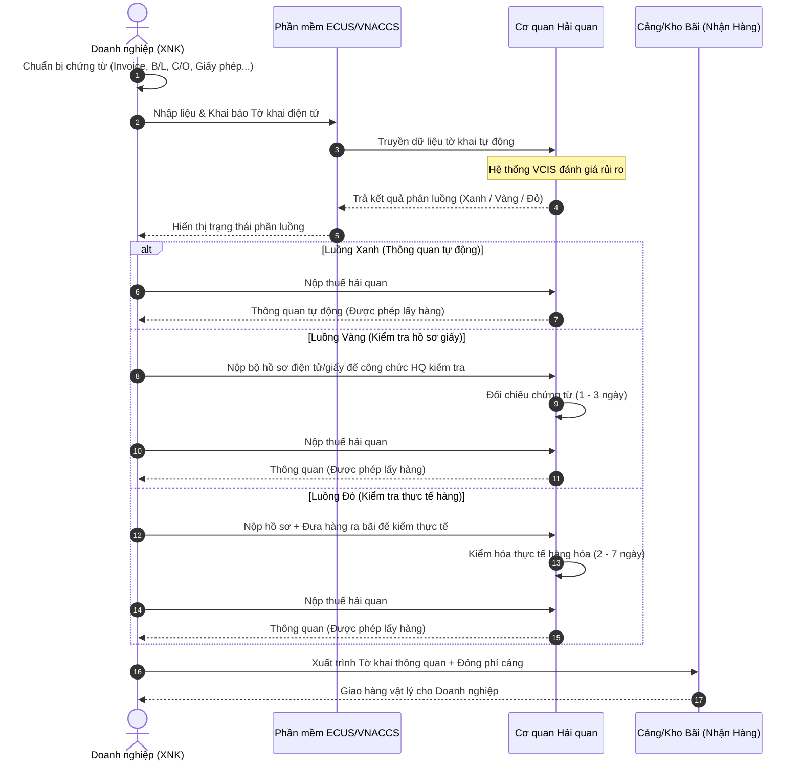

# Quy trình Hải quan Toàn diện
## Tờ khai — Chứng từ — Thông quan
### Chuẩn quốc tế (WCO/RKC) & Việt Nam (VNACCS/VCIS)

---

## MỤC LỤC

1. [Tổng quan hệ thống & Luồng Nghiệp vụ](#1-tổng-quan)
2. [Tờ khai hải quan (Hộ chiếu hàng hóa)](#2-tờ-khai)
3. [Chứng từ hải quan (Bằng chứng pháp lý)](#3-chứng-từ)
4. [Phân luồng & Quản lý rủi ro (Cửa an ninh)](#4-phân-luồng)
5. [Thuế & Trị giá hải quan (Ví dụ số liệu chi tiết)](#5-thuế)
6. [Quy trình thông quan từng bước](#6-thông-quan)
7. [Kiểm tra sau thông quan (KTSTQ)](#7-ktstq)
8. [Doanh nghiệp ưu tiên (AEO)](#8-aeo)
9. [Khung pháp lý tham chiếu](#9-pháp-lý)

---

## 1. TỔNG QUAN HỆ THỐNG & LUỒNG NGHIỆP VỤ

### 1.1 Sơ đồ luồng nghiệp vụ tổng quát
Để người mới bắt đầu dễ hình dung, dưới đây là sơ đồ tuần tự thể hiện cách doanh nghiệp truyền dữ liệu, hệ thống tự động phân luồng và thông quan hàng hóa:



### 1.2 Chuẩn quốc tế — WCO Revised Kyoto Convention (RKC)

Công ước Kyoto sửa đổi (RKC) là bản thiết kế chuẩn cho thủ tục hải quan hiện đại, do Tổ chức Hải quan Thế giới (WCO) soạn thảo, hiệu lực từ **03/02/2006**, hiện có **122 thành viên**.

**Cấu trúc RKC:**
- Văn bản chính (Body of Convention)
- Phụ lục Tổng quát (General Annex) — **bắt buộc** với tất cả thành viên, gồm 10 chương
- 10 Phụ lục Đặc biệt (Specific Annexes) — tùy chọn

**Nguyên tắc cốt lõi RKC:**
- Minh bạch và dự đoán được trong hành động hải quan
- Đơn giản hóa và chuẩn hóa chứng từ
- Thủ tục đơn giản cho người được ủy quyền (AEO)
- Ứng dụng tối đa công nghệ thông tin
- Kiểm soát dựa trên quản lý rủi ro
- Kiểm toán sau thông quan
- Hợp tác với các cơ quan biên giới
- Quan hệ đối tác với cộng đồng thương mại

### 1.3 Hệ thống Việt Nam — VNACCS/VCIS

**VNACCS** (Vietnam Automated Cargo Clearance System): Hệ thống thông quan điện tử tự động, triển khai từ 2014.

**VCIS** (Vietnam Customs Intelligence System): Hệ thống thông tin tình báo hải quan, phân tích rủi ro.

**Phần mềm khai hải quan:**
- ECUS5/ECUS6 — phần mềm khai hải quan phổ biến nhất
- Các phần mềm được TCHQ cấp phép khác (FAST, ITax…)

---

## 2. TỜ KHAI HẢI QUAN (HỘ CHIẾU HÀNG HÓA)
> **Liên tưởng:** Tờ khai hải quan giống như một cuốn **Hộ chiếu (Passport)** của lô hàng, khai báo đầy đủ lý lịch: hàng gì, số lượng, trị giá, xuất xứ từ đâu, đi từ cảng nào đến cảng nào và doanh nghiệp nào chịu trách nhiệm.

### 2.1 Phân loại tờ khai

#### Theo hướng hàng:
| Loại | Mẫu | Mô tả |
|------|-----|-------|
| Nhập khẩu | HQ/2015/NK | Hàng hóa nhập vào lãnh thổ VN |
| Xuất khẩu | HQ/2015/XK | Hàng hóa xuất ra khỏi lãnh thổ VN |

#### Theo mã loại hình XNK:
| Mã | Hướng | Loại hình | Chi tiết nghiệp vụ thực tế |
|----|-------|-----------|---------------------------|
| **A11** | NK | Hàng kinh doanh thông thường | Nhập mua đứt bán đoạn về bán tiêu dùng nội địa |
| **B11** | XK | Hàng kinh doanh thông thường | Xuất khẩu thương mại thông thường |
| **E11** | NK | Hàng gia công cho nước ngoài (nguyên liệu vào) | Nhập nguyên liệu về gia công, thành phẩm xuất trả nước ngoài |
| **E21** | XK | Hàng gia công cho nước ngoài (thành phẩm ra) | Xuất khẩu sản phẩm sau khi đã gia công xong |
| **G11** | NK | Tạm nhập tái xuất | Hàng vào Việt Nam tạm thời, sau đó phải xuất đi nước khác |
| **G21** | XK | Tái xuất hàng tạm nhập | Xuất trả hàng đã tạm nhập trước đó |
| **H11** | NK | Tái nhập hàng tạm xuất | Hàng tạm xuất đi sửa chữa/triển lãm nay nhập lại |
| **H21** | XK | Tạm xuất tái nhập | Tạm xuất hàng đi nước ngoài, sau này mang về lại |
| **A31** | NK | Hàng phi thương mại | Quà tặng, hàng mẫu không thanh toán tiền hàng |
| **B31** | XK | Hàng phi thương mại | Xuất quà tặng, hàng mẫu ra nước ngoài |
| **F** | NK | Hàng chuyển phát nhanh / bưu chính | Hàng đi qua DHL, FedEx, bưu điện |
| **A42** | NK | Hàng nhập khẩu tại chỗ | Bán hàng cho đối tác ngoại nhưng giao hàng trên đất VN |

### 2.2 Chỉ tiêu bắt buộc trên tờ khai điện tử

**Thông tin hàng hóa:**
- **Mã HS (HS Code):** 8 số theo biểu thuế VN (Ví dụ: `8528.59.10` cho màn hình LCD máy tính).
- **Mô tả hàng hóa:** Tên thương mại + tên kỹ thuật (Ví dụ: *Màn hình máy tính LCD hiệu Samsung, kích thước 27 inch, mới 100%*).
- **Số lượng, đơn vị tính**
- **Trọng lượng tịnh / Gross weight**
- **Trị giá hải quan:** CIF tính bằng USD.
- **Điều kiện giao hàng:** Incoterms 2020 (Ví dụ: CIF, FOB, EXW...).
- **Nước xuất xứ / nước xuất khẩu**
- **Thuế suất NK và VAT**
- **Mã phân loại hàng hóa**
- **Thông tin C/O** nếu hưởng ưu đãi FTA.
- **Số hiệu container và seal number**

**Thông tin doanh nghiệp & vận tải:**
- **MST / mã số hải quan** người khai.
- **Tên, địa chỉ** người NK/XK và đối tác nước ngoài.
- **Cảng xếp hàng / cảng dỡ hàng**
- **Số vận đơn (B/L hoặc AWB)**, ngày phát hành.
- **Tên tàu / chuyến bay / số xe**
- **Mã cửa khẩu nhập/xuất**
- **Loại hình vận chuyển** (biển/hàng không/đường bộ).
- **Mã loại hình XNK**
- **Số hợp đồng thương mại**

### 2.3 Thời hạn đăng ký tờ khai
- **Hàng nhập khẩu:** Đăng ký trước khi hàng đến hoặc trong vòng **30 ngày** kể từ ngày hàng đến cửa khẩu.
- **Hàng xuất khẩu:** Đăng ký sau khi tập kết hàng tại cửa khẩu, chậm nhất **8 giờ** trước khi phương tiện xuất cảnh.
- **Hàng chuyển phát nhanh:** Ưu tiên đăng ký trước khi hàng đến để thông quan nhanh.

---

## 3. CHỨNG TỪ HẢI QUAN (BẰNG CHỨNG PHÁP LÝ)
> **Liên tưởng:** Nếu Tờ khai hải quan giống như lời khai báo của bạn, thì **Bộ chứng từ hải quan** chính là **bằng chứng pháp lý** để chứng minh toàn bộ thông tin khai báo đó là đúng sự thật.

### 3.1 Nhóm 1 — Chứng từ thương mại (Commercial Documents)

#### Hóa đơn thương mại — Commercial Invoice (BẮT BUỘC)
- **Nội dung bắt buộc:** Tên hàng hóa, mô tả chi tiết, số lượng, đơn giá, tổng trị giá, điều kiện giao hàng (Incoterms), tên và địa chỉ người mua/bán, ngày lập hóa đơn.
- **Ý nghĩa thực tế:** Chứng minh số tiền thực tế bạn phải trả cho đối tác, là căn cứ gốc để tính thuế.
- **Yêu cầu VN:** Giám đốc hoặc người được ủy quyền ký tên + đóng dấu tròn doanh nghiệp.

#### Phiếu đóng gói — Packing List (THỰC TẾ BẮT BUỘC)
- **Nội dung:** Số kiện, loại bao bì, trọng lượng tịnh/gross từng kiện, kích thước, số container, số seal.
- **Ý nghĩa thực tế:** Giúp hải quan biết cách đóng gói vật lý để dễ dàng kiểm tra thực tế khi cần thiết.

#### Hợp đồng ngoại thương — Sales Contract (HỮU ÍCH)
- Không bắt buộc nộp trực tiếp cho hải quan nhưng cần chuẩn bị sẵn để đối chiếu khi bị nghi ngờ trị giá giao dịch.

### 3.2 Nhóm 2 — Chứng từ vận tải (Transport Documents)

#### Bill of Lading — B/L (BẮT BUỘC hàng biển)
- **Các loại B/L:**
  - *Straight B/L* (đích danh): chỉ người được ghi tên mới nhận được hàng.
  - *Order B/L* (theo lệnh): chuyển nhượng bằng cách ký hậu (chữ ký ở mặt sau).
  - *Seaway Bill*: nhận hàng nhanh không cần xuất trình vận đơn gốc.
- **Thông tin cần có:** Số B/L, shipper, consignee, cảng bốc/dỡ, tên tàu, số container, số seal, mô tả hàng, trọng lượng.

#### Airway Bill — AWB (BẮT BUỘC hàng không)
- *Master AWB (MAWB):* Do hãng hàng không phát hành.
- *House AWB (HAWB):* Do forwarder phát hành.
- AWB không thể chuyển nhượng, hàng giao ngay khi máy bay hạ cánh.

#### Vận đơn đường bộ — CMR / Truck Manifest
- Áp dụng cho hàng qua cửa khẩu đường bộ (Lạng Sơn, Lào Cai, Móng Cái, Mộc Bài…).

### 3.3 Nhóm 3 — Chứng nhận xuất xứ (Certificate of Origin — C/O)

| Loại C/O | Hiệp định thương mại | Phạm vi áp dụng | Lợi ích thực tế |
|----------|----------------------|-----------------|-----------------|
| **Form D** | ATIGA | Các nước ASEAN (10 nước) | Giảm thuế NK về **0%** cho đa số mặt hàng |
| **Form E** | ACFTA | ASEAN – Trung Quốc | Giúp nhập hàng TQ với thuế suất cực kỳ ưu đãi |
| **Form AK** | AKFTA | ASEAN – Hàn Quốc | Thuế nhập khẩu ưu đãi đặc biệt |
| **EUR.1 / REX** | EVFTA | VN – Liên minh châu Âu (EU) | Giảm thuế lộ trình rất nhanh |
| **Tự chứng nhận** | CPTPP | 11 thành viên | Doanh nghiệp tự cam kết xuất xứ không cần VCCI cấp |

> ⚠️ **Quy tắc xuất xứ (Rules of Origin):** Hàng hóa muốn được cấp C/O ưu đãi phải đạt hàm lượng giá trị khu vực (RVC ≥ 40%) hoặc chuyển đổi mã số hàng hóa (CTC) phù hợp.

### 3.4 Nhóm 4 — Chứng từ kiểm tra chuyên ngành
Đảm bảo hàng hóa nhập về không gây nguy hại đến an ninh, sức khỏe, môi trường Việt Nam:

| Loại | Cơ quan cấp | Ví dụ mặt hàng áp dụng |
|------|-------------|-------------------------|
| Giấy phép NK | Bộ Công Thương | Thiết bị phát sóng, hóa chất, tiền chất |
| Kiểm tra chất lượng | Bộ KH&CN, Bộ NN | Máy móc mới/cũ, đồ điện gia dụng, mũ bảo hiểm |
| Kiểm dịch thực vật | Cục BVTV | Nông sản, hoa quả tươi, gỗ chưa qua chế biến |
| Kiểm dịch động vật | Cục Thú y | Thịt đông lạnh, sữa, trứng, hải sản tươi sống |
| ATTP | Bộ Y tế / Bộ NN | Thực phẩm ăn liền, phụ gia thực phẩm, mỹ phẩm |

---

## 4. PHÂN LUỒNG & QUẢN LÝ RỦI RO (CỬA AN NINH)
> **Liên tưởng:** Giống như cửa kiểm tra an ninh tại sân bay giúp phân tách hành khách tự động.

```
[HỆ THỐNG PHÂN LUỒNG TỰ ĐỘNG VNACCS]
 ├── 🟩 Luồng Xanh (60-70%) ── Không kiểm chứng từ, không kiểm hàng -> Nộp thuế -> Lấy hàng (Vài phút)
 ├── 🟨 Luồng Vàng (20-25%) ── Kiểm hồ sơ giấy/online -> Hợp lệ -> Nộp thuế -> Lấy hàng (1-3 ngày)
 └── 🟥 Luồng Đỏ (5-15%)   ── Kiểm hồ sơ + Mở container kiểm hàng thực tế -> Lấy hàng (2-7 ngày)
```

### 4.1 Chi tiết 3 Luồng hải quan

#### Luồng Xanh (~60–70% tờ khai)
- **Ý nghĩa:** Thông quan tự động, không kiểm chứng từ, không kiểm hàng.
- **Điều kiện:** Doanh nghiệp chấp hành tốt pháp luật, mặt hàng thông thường ít rủi ro.

#### Luồng Vàng (~20–25% tờ khai)
- **Ý nghĩa:** Chỉ kiểm hồ sơ, chứng từ (không kiểm thực tế hàng).
- **Hành động:** Công chức hải quan đối chiếu Invoice, B/L, C/O, giá trị khai báo... trên hệ thống hoặc nộp bản cứng.

#### Luồng Đỏ (~5–15% tờ khai)
- **Ý nghĩa:** Kiểm hồ sơ + Kiểm thực tế hàng hóa tại bãi.
- **Cách thức:** Soi chiếu qua máy quét (scanner) hoặc mở container kiểm thủ công 10% - 100%.

### 4.2 Tiêu chí phân luồng rủi ro (Hệ thống VCIS)
Hệ thống tự động chấm điểm rủi ro dựa trên:
1. Lịch sử chấp hành pháp luật của doanh nghiệp (có từng trốn thuế, khai gian không).
2. Mặt hàng (mã HS nhạy cảm, dễ gian lận thuế).
3. Xuất xứ hàng hóa (từ nước có rủi ro cao về dịch bệnh/buôn lậu).
4. Trị giá khai báo quá thấp so với cơ sở dữ liệu hải quan.

---

## 5. THUẾ & TRỊ GIÁ HẢI QUAN (VÍ DỤ SỐ LIỆU CHI TIẾT)

### 5.1 Các loại thuế hàng nhập khẩu

| Loại thuế | Cơ sở tính | Mức |
|-----------|-----------|-----|
| Thuế nhập khẩu | Trị giá CIF | 0–150% tùy mã HS |
| Thuế VAT | (CIF + Thuế NK + TTĐB) | 0%, 5%, hoặc 10% |
| Thuế TTĐB | Trị giá NK hoặc giá bán | Rượu 35–65%, bia 65%, ô tô 45–150% |
| Thuế BVMT | Trọng lượng / thể tích | Xăng dầu, túi ni-lông… |

### 5.2 Công thức tính thuế
```
1. Trị giá tính thuế NK (Giá CIF) = Giá trị hàng tại cửa khẩu xuất (FOB) + Phí vận chuyển (F) + Phí bảo hiểm (I)
2. Thuế NK = Trị giá tính thuế (CIF) × Thuế suất NK (%)
3. Giá tính thuế VAT = Trị giá tính thuế (CIF) + Thuế NK
4. Thuế VAT = Giá tính thuế VAT × Thuế suất VAT (%)
```

### 5.3 Bài toán thực tế tính thuế nhập khẩu màn hình LCD
Giả sử doanh nghiệp **TechVina** nhập **100 chiếc màn hình LCD** từ Hàn Quốc, giá CIF là **15,000 USD** (Tỷ giá tạm tính: **1 USD = 25,000 VND**).
*   Trị giá CIF quy đổi ra VNĐ = $15,000 \times 25,000 = \mathbf{375,000,000\text{ VND}}$.
*   Thuế suất Nhập khẩu thông thường của màn hình LCD = **5%**.
*   Thuế suất VAT = **10%**.

#### 📐 Trường hợp 1: KHÔNG có C/O ưu đãi AKFTA
1. **Thuế Nhập khẩu phải nộp:**
   $$\text{Thuế NK} = 375,000,000\text{ VND} \times 5\% = \mathbf{18,750,000\text{ VND}}$$
2. **Giá tính thuế VAT:**
   $$\text{Giá VAT} = 375,000,000 + 18,750,000 = 393,750,000\text{ VND}$$
3. **Thuế VAT phải nộp:**
   $$\text{Thuế VAT} = 393,750,000\text{ VND} \times 10\% = \mathbf{39,375,000\text{ VND}}$$
4. **Tổng số thuế phải nộp:**
   $$\text{Tổng thuế} = 18,750,000 + 39,375,000 = \mathbf{58,125,000\text{ VND}}$$

#### 📐 Trường hợp 2: CÓ C/O ưu đãi Form AK hợp lệ (Thuế suất NK giảm về 0%)
1. **Thuế Nhập khẩu phải nộp:**
   $$\text{Thuế NK} = 375,000,000\text{ VND} \times 0\% = \mathbf{0\text{ VND}}$$
2. **Giá tính thuế VAT:**
   $$\text{Giá VAT} = 375,000,000 + 0 = 375,000,000\text{ VND}$$
3. **Thuế VAT phải nộp:**
   $$\text{Thuế VAT} = 375,000,000\text{ VND} \times 10\% = \mathbf{37,500,000\text{ VND}}$$
4. **Tổng số thuế phải nộp:**
   $$\text{Tổng thuế} = 0 + 37,500,000 = \mathbf{37,500,000\text{ VND}}$$

> 💡 **Nhận xét:** Việc sở hữu chứng từ xuất xứ (C/O) hợp lệ giúp doanh nghiệp tiết kiệm ngay lập tức **20,625,000 VND** tiền thuế nhập khẩu!

---

## 6. QUY TRÌNH THÔNG QUAN TỪNG BƯỚC

*   **Bước 1: Xác định loại hàng và chuẩn bị:** Tra mã HS 8 số để biết thuế suất, kiểm tra xem hàng có thuộc danh mục cấm hoặc phải kiểm tra chuyên ngành không. Chuẩn bị Invoice, B/L, C/O.
*   **Bước 2: Khai thông tin trên hệ thống:** Dùng phần mềm ECUS5 khai báo đầy đủ các chỉ tiêu của tờ khai.
*   **Bước 3: Truyền dữ liệu và nhận phân luồng:** Bấm nút truyền tờ khai lên VNACCS và đợi vài giây để hệ thống phản hồi kết quả phân luồng.
*   **Bước 4: Xử lý theo luồng chỉ định:**
    *   *Luồng Xanh:* Nộp thuế là xong.
    *   *Luồng Vàng:* Nộp hồ sơ chứng từ để công chức kiểm tra.
    *   *Luồng Đỏ:* Đưa hàng ra bãi cảng tiến hành mở cont kiểm hóa thực tế.
*   **Bước 5: Nộp thuế:** Thanh toán tiền thuế qua ngân hàng liên kết trực tiếp với Tổng cục Hải quan.
*   **Bước 6: Nhận thông quan & lấy hàng:** In tờ mã vạch thông quan, xuất trình tại cảng để bốc hàng về kho doanh nghiệp.

---

## 7. KIỂM TRA SAU THÔNG QUAN (KTSTQ)

### 7.1 Cơ sở pháp lý
- Việt Nam: Điều 77–81 Luật Hải quan 54/2014/QH13; Luật Hải quan sửa đổi 2025.
- Quốc tế: RKC General Annex Chapter 6.

### 7.2 Thời hạn và phạm vi

| Nội dung | Quy định |
|----------|----------|
| **Thời hạn KTSTQ** | Trong vòng **5 năm** kể từ ngày đăng ký tờ khai |
| **Địa điểm** | Tại trụ sở cơ quan hải quan hoặc trực tiếp tại doanh nghiệp |
| **Đối tượng** | Sổ sách kế toán, chứng từ, hóa đơn, hàng hóa tồn kho thực tế |
| **Tần suất** | Tối đa 2 lần/năm cho cùng một doanh nghiệp |

### 7.3 Thời hạn lưu trữ chứng từ bắt buộc
- **5 năm:** Tờ khai, hóa đơn, vận đơn, C/O và toàn bộ hồ sơ hải quan (tính từ ngày thông quan).
- **10 năm:** Hàng hóa đặc biệt (thiết bị quân sự, phóng xạ, hóa chất độc hại).
- **Vô thời hạn:** Tờ khai liên quan đến các vụ tranh chấp pháp lý chưa ngã ngũ.

---

## 8. DOANH NGHIỆP ƯU TIÊN (AEO)

### 8.1 Khái niệm
AEO (Authorized Economic Operator) là chương trình công nhận doanh nghiệp đáng tin cậy trong chuỗi cung ứng quốc tế, dựa trên WCO SAFE Framework.

### 8.2 Điều kiện công nhận DN ưu tiên tại Việt Nam (TT 72/2015/TT-BTC)
- Kim ngạch XNK ≥ 100 triệu USD/năm (hoặc 50 triệu USD với sản xuất).
- Tuân thủ pháp luật hải quan trong 2 năm liên tiếp.
- Không có nợ thuế quá hạn.
- Hệ thống kiểm soát nội bộ đạt yêu cầu.
- An ninh cơ sở vật chất đạt chuẩn.

### 8.3 Ưu đãi
- Tự động phân luồng xanh.
- Không phải nộp bảo lãnh thuế ngay.
- Thông quan trước, kiểm tra sau (PCA).
- Không phải kiểm tra thực tế khi không có dấu hiệu vi phạm.
- Hưởng thỏa thuận AEO song phương (VN đã ký với Hàn Quốc, Nhật Bản, EU đang đàm phán).

---

## 9. KHUNG PHÁP LÝ THAM CHIẾU

### 9.1 Quốc tế
- WCO Revised Kyoto Convention (RKC) 1999.
- WCO SAFE Framework 2005.
- WTO Customs Valuation Agreement (Điều VII GATT) - Quy tắc 6 phương pháp xác định trị giá.

### 9.2 Việt Nam
- Luật Hải quan 54/2014/QH13 & Luật sửa đổi Luật Hải quan 2025.
- Thông tư 38/2015/TT-BTC (sửa đổi bổ sung bởi Thông tư 39/2018/TT-BTC) - Thông tư gốc về thủ tục hải quan.
- Nghị định 128/2020/NĐ-CP - Xử phạt vi phạm hành chính trong lĩnh vực hải quan.

---
*Tài liệu được cập nhật bổ sung các sơ đồ trực quan và ví dụ nghiệp vụ chi tiết hỗ trợ đào tạo người mới bắt đầu trong dự án Odoo Logistic Core.*  
*Cập nhật: Tháng 5/2026*
