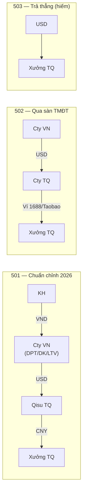
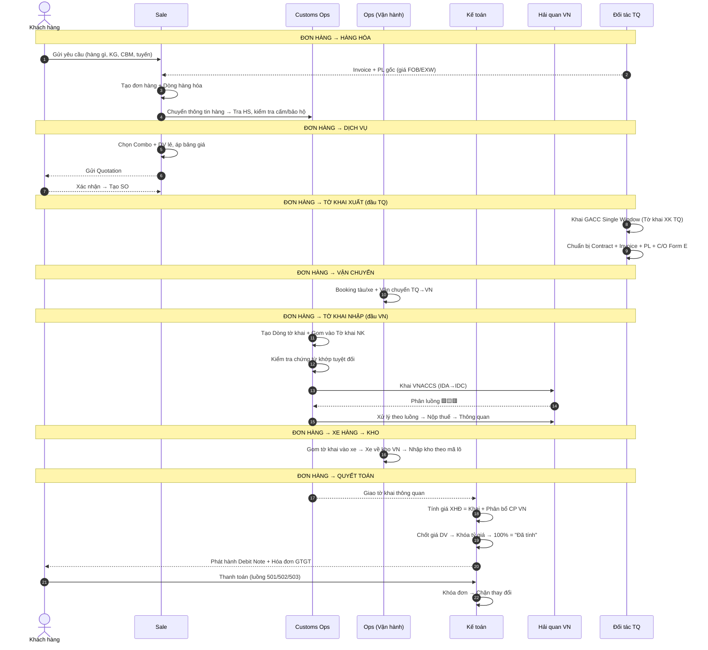

# Đơn Hàng — Tổng Quan Nghiệp Vụ (Top-Down)
## Cây phân rã từ Đơn hàng đến từng chi tiết
### Tài liệu Nghiệp vụ — Hệ thống Odoo Logistics Core (Kỳ Tốc)

---

> **Cách đọc tài liệu này:**  
> File này là **gốc (root)** của toàn bộ tài liệu nghiệp vụ. Mọi thứ bắt đầu từ **ĐƠN HÀNG**.  
> Mỗi nhánh drill-down có link đến file chi tiết. Click vào link để đi sâu hơn.

---

## SƠ ĐỒ TỔNG QUAN — CÂY ĐƠN HÀNG

```mermaid
flowchart TD
    SO["🏢 ĐƠN HÀNG<br/>(Sales Order)"]

    SO --> HH["📦 1. HÀNG HÓA<br/>(Product Lines)"]
    SO --> DV["⚙️ 2. DỊCH VỤ<br/>(Service Lines)"]
    SO --> TK["📋 3. TỜ KHAI & CHỨNG TỪ<br/>(Declarations)"]
    SO --> LT["💰 4. LUỒNG TIỀN<br/>(Money Flow)"]
    SO --> UT["🤝 5. ỦY THÁC<br/>(Delegation Type)"]
    SO --> QT["✅ 6. QUYẾT TOÁN<br/>(Settlement)"]

    HH --> HH1["Thông tin vật lý<br/>(tên, KG, CBM, SL)"]
    HH --> HH2["Mã HS + Thuế suất"]
    HH --> HH3["Chuỗi giá<br/>FOB → CIF → Khai → XHĐ"]
    HH --> HH4["Mô tả sản phẩm"]
    HH --> HH5["Kiểm tra cấm/hạn chế"]

    DV --> DV1["Dịch vụ gốc<br/>(Service Items)"]
    DV --> DV2["Gói Combo<br/>(v1, v2...)"]
    DV --> DV3["Bảng giá<br/>(Price List)"]
    DV --> DV4["State Machine giá<br/>Chưa có → ... → Đã tính"]
    DV --> DV5["Phân bổ<br/>(Value/KG/CBM/QTY)"]

    TK --> TK_XK["3a. Tờ khai XUẤT<br/>(đầu NCC / TQ)"]
    TK --> TK_NK["3b. Tờ khai NHẬP<br/>(đầu Kỳ Tốc / VN)"]
    TK --> XE["3c. XE HÀNG<br/>(gom nhiều tờ khai)"]

    TK_XK --> TK_XK1["Dòng tờ khai XK"]
    TK_XK --> TK_XK2["Chứng từ XK<br/>(Contract, Invoice, PL, C/O)"]
    TK_XK --> TK_XK3["Khai GACC<br/>(Single Window TQ)"]

    TK_NK --> TK_NK1["Dòng tờ khai NK<br/>(gom từ đơn hàng)"]
    TK_NK --> TK_NK2["Chứng từ NK<br/>(Contract, Invoice, PL,<br/>C/O, Kiểm tra CN)"]
    TK_NK --> TK_NK3["Khai ECUS/VNACCS"]
    TK_NK --> TK_NK4["Phân luồng<br/>🟩 Xanh / 🟨 Vàng / 🟥 Đỏ"]
    TK_NK --> TK_NK5["Trạng thái sau TQ<br/>Thông quan / Giải phóng / Bảo quản"]

    XE --> XE1["Biển số / Container / Seal"]
    XE --> XE2["Mã lô tổng hợp"]

    LT --> LT1["501: KH→VND→CtyVN→USD→Qisu→CNY→Xưởng"]
    LT --> LT2["502: CtyVN→USD→CtyTQ→1688→CNY→Xưởng"]
    LT --> LT3["503: USD trả thẳng"]

    UT --> UT1["UT Xuất — Cty TQ đứng tên"]
    UT --> UT2["UT Nhập — Cty VN đứng tên"]
    UT --> UT3["UT XNK — Cả 2 đầu"]
    UT --> UT4["Khai báo hộ — KH đứng tên"]

    QT --> QT1["Chốt đơn: 100% DV = Đã tính"]
    QT --> QT2["Khóa đơn → Chặn thay đổi"]
    QT --> QT3["Giá XHĐ = Khai + Phân bổ CP VN"]
    QT --> QT4["Xuất HĐ GTGT"]
```



---

## 1. HÀNG HÓA (Product Lines)

> **📍 Đơn hàng → Hàng hóa**

Mỗi đơn hàng chứa 1 hoặc nhiều **dòng hàng hóa**. Mỗi dòng hàng hóa mang theo thông tin vật lý, hải quan, xuất xứ và giá cả.

### 1.1 Thông tin trên mỗi dòng hàng hóa

| Nhóm | Trường dữ liệu | Mô tả |
|------|----------------|-------|
| **Vật lý** | Tên hàng, Quy cách, KG, CBM, SL kiện | Mô tả vật lý, dùng tính cước |
| **Hải quan** | Mã HS (8 số VN), Giá khai, Thuế NK (%), VAT (%) | Xác định nghĩa vụ thuế |
| **Xuất xứ** | Nước SX, Incoterms (FOB/CIF), C/O Form E | Xác định ưu đãi FTA |
| **Giá cả** | Giá FOB xưởng, Giá báo KH, Chiết khấu | Chuỗi tính giá |
| **Mô tả SP** | Chọn từ danh mục chuẩn → Liên kết tờ khai | Chuẩn hóa khai HQ |

### 1.2 Chuỗi tính giá (Top-down)

```
Đơn hàng
 └── Hàng hóa (dòng)
      ├── Giá FOB/EXW (từ xưởng TQ)
      ├── + Freight + Insurance = Giá CIF
      ├── + CP TQ (nếu UT XNK) = Giá khai HQ
      ├── × Thuế NK (%) = Thuế NK
      ├── × VAT (%) = Thuế VAT
      ├── + Phân bổ CP dịch vụ VN = Giá XHĐ
      └── + Lợi nhuận Kỳ Tốc = Giá bán KH
```

### 1.3 Kiểm tra hàng hóa (Guard Clauses)

| # | Kiểm tra | Kết quả |
|---|----------|---------|
| 1 | Hàng cấm / bảo hộ thương hiệu? | → Từ chối đơn |
| 2 | Giá báo KH < giá vốn? | → Cảnh báo + phê duyệt GĐ |
| 3 | Giảm giá ngoài 0-100%? | → Từ chối |

### 1.4 Drill-down — Quy trình chi tiết

| Phạm vi | File chi tiết |
|---------|--------------|
| Quốc tế (WCO, HS, CVA) | [quy_trinh_quan_ly_hang_hoa.md](file:///d:/Odoo/bmad-odoo/_bmad-output/Tài liệu/Nghiệp vụ/quy_trinh_quan_ly_hang_hoa.md) |
| Trung Quốc (GACC, CCC, CIFER) | [quy_trinh_quan_ly_hang_hoa_trung_quoc.md](file:///d:/Odoo/bmad-odoo/_bmad-output/Tài liệu/Nghiệp vụ/quy_trinh_quan_ly_hang_hoa_trung_quoc.md) |
| Kỳ Tốc (Odoo Custom) | [quy_trinh_quan_ly_hang_hoa_ky_toc.md](file:///d:/Odoo/bmad-odoo/_bmad-output/Tài liệu/Nghiệp vụ/quy_trinh_quan_ly_hang_hoa_ky_toc.md) |

---

## 2. DỊCH VỤ (Service Lines)

> **📍 Đơn hàng → Dịch vụ**

Mỗi đơn hàng gắn **Gói Combo** hoặc **dịch vụ lẻ**. Dịch vụ = doanh thu chính của Kỳ Tốc.

### 2.1 Cấu trúc dịch vụ trên đơn hàng

```
Đơn hàng
 └── Dịch vụ
      ├── Gói Combo (ví dụ: "NK Biển FCL TQ→VN")
      │   ├── Dịch vụ gốc 1: Cước biển FCL
      │   ├── Dịch vụ gốc 2: THC
      │   ├── Dịch vụ gốc 3: D/O
      │   ├── Dịch vụ gốc 4: Khai HQ NK
      │   └── Dịch vụ gốc 5: Phí ứng thuế
      │
      └── Dịch vụ lẻ thêm
           ├── Bảo hiểm hàng hóa
           └── Phí kiểm dịch
```

### 2.2 State Machine giá dịch vụ

```
Chưa có giá → Chờ giá → Đã báo giá → Chờ duyệt → Đã duyệt → Đã tính (Chốt)
                                          ↑                         │
                                          └── Từ chối ← Sửa giá ───┘
```

- **Khóa tỷ giá** khi chốt giá → Tỷ giá CNY/USD cố định, không biến động
- **Chốt đơn** chỉ khi **100% dịch vụ** = "Đã tính"

### 2.3 Phân bổ chi phí dịch vụ → Hàng hóa

| Phương pháp | Áp dụng |
|------------|---------|
| Theo giá trị (Value) | Thuế, cước biển |
| Theo KG | Cước bay |
| Theo CBM | Cước biển LCL, kho bãi |
| Theo SL | Phí đóng gói |

### 2.4 Drill-down — Quy trình chi tiết

| Phạm vi | File chi tiết |
|---------|--------------|
| Quốc tế (FIATA, IATA, IMO) | [quy_trinh_quan_ly_dich_vu.md](file:///d:/Odoo/bmad-odoo/_bmad-output/Tài liệu/Nghiệp vụ/quy_trinh_quan_ly_dich_vu.md) |
| Trung Quốc (MOT, NVOCC, Biên mậu) | [quy_trinh_quan_ly_dich_vu_trung_quoc.md](file:///d:/Odoo/bmad-odoo/_bmad-output/Tài liệu/Nghiệp vụ/quy_trinh_quan_ly_dich_vu_trung_quoc.md) |
| Kỳ Tốc (Combo, Bảng giá, Phê duyệt) | [quy_trinh_quan_ly_dich_vu_ky_toc.md](file:///d:/Odoo/bmad-odoo/_bmad-output/Tài liệu/Nghiệp vụ/quy_trinh_quan_ly_dich_vu_ky_toc.md) |

---

## 3. TỜ KHAI & CHỨNG TỪ (Declarations & Documents)

> **📍 Đơn hàng → Tờ khai & Chứng từ**

Mỗi đơn hàng sinh ra **Dòng tờ khai** → gom vào **Tờ khai NK/XK** → xếp lên **Xe hàng**.

### 3.1 Mô hình dữ liệu 3 cấp

```
Đơn hàng (SO)
 └── Hàng hóa (Product Line)
      └── DÒNG TỜ KHAI (Declaration Line) ← Cấp 3
           │   • 1 mặt hàng, gắn 1+ mã lô
           │   • Liên kết → Mô tả sản phẩm chuẩn
           │
           └── gom vào → TỜ KHAI NK/XK (Declaration) ← Cấp 2
                │   • Số tờ khai 12 số (VNACCS)
                │   • Loại hình: A11, B11, E11, A12...
                │   • Cửa khẩu
                │   • Phân luồng: 🟩🟨🟥
                │
                └── xếp lên → XE HÀNG (Truck/Container) ← Cấp 1
                     • Biển số / Số container + Seal
                     • Gom nhiều tờ khai (nhiều KH)
                     • Mã lô tổng hợp
```

### 3a. Tờ khai XUẤT (Đầu NCC / TQ)

> **📍 Đơn hàng → Tờ khai → Tờ khai Xuất (đầu NCC)**

| Thành phần | Chi tiết |
|-----------|---------|
| **Ai khai** | Đối tác TQ / Forwarder TQ khai trên GACC Single Window |
| **Chứng từ XK** | Contract, Invoice gốc xưởng, Packing List, C/O Form E |
| **Dòng tờ khai XK** | Mỗi mặt hàng XK = 1 dòng, ghi mã HS TQ (10 số) |
| **Quy tắc từ 10/2025** | Phải khai đúng **nhà SX thực tế**. Cấm mua GP XK bên thứ 3. |

### 3b. Tờ khai NHẬP (Đầu Kỳ Tốc / VN)

> **📍 Đơn hàng → Tờ khai → Tờ khai Nhập (đầu Kỳ Tốc)**

| Thành phần | Chi tiết |
|-----------|---------|
| **Ai khai** | CusOps Kỳ Tốc khai trên ECUS/VNACCS |
| **Pháp nhân** | DPT / DK (Deka) / LTV — **phải khớp** trên mọi chứng từ |
| **Chứng từ NK bắt buộc** | Contract, Invoice, PL, Tờ khai HQ, Giấy kiểm tra CN — **khớp tuyệt đối** |
| **Chứng từ không bắt buộc** | C/O Form E (~300 tệ) → Thuế NK giảm 15%→0% |
| **Dòng tờ khai NK** | Gom từ đơn hàng, mỗi mặt hàng = 1 dòng, gắn mã lô |
| **Phân luồng** | 🟩 Xanh: Đính CT → Thuế → TQ. 🟨 Vàng: +Kiểm hồ sơ. 🟥 Đỏ: +Kiểm hóa thực tế. |
| **Trạng thái sau TQ** | **Thông quan** (xuất HĐ ✅) · **Giải phóng** (xuất HĐ ✅) · **Bảo quản** (xuất HĐ ❌) |

### 3c. Xe hàng (Truck / Container)

> **📍 Đơn hàng → Tờ khai → Xe hàng**

| Thành phần | Chi tiết |
|-----------|---------|
| Xe gom nhiều TK | 1 xe chở hàng nhiều KH, nhiều đơn hàng, nhiều tờ khai |
| Tuyến đường | CK biên giới / Cảng → Kho VN |
| Mã lô | Tổng hợp mã lô từ tất cả tờ khai trên xe |

### 3.2 Quy tắc Mã lô

| Vị trí | Ý nghĩa | Ví dụ |
|--------|---------|-------|
| Ký tự 1 | Năm: A=2023, B=2024, C=2025, **D=2026** | D |
| Ký tự 2 | Tháng: A=T1, B=T2, ..., **E=T5** | E |
| Số đuôi | Số kiện | 015 = 15 kiện |

> **DE015** = Năm 2026, Tháng 5, 15 kiện.

### 3.3 Drill-down — Quy trình chi tiết

| Phạm vi | File chi tiết |
|---------|--------------|
| HQ VN — Quốc tế (7 bước, Xanh/Vàng/Đỏ) | [quy_trinh_hai_quan_vn_quoc_te.md](file:///d:/Odoo/bmad-odoo/_bmad-output/Tài liệu/Nghiệp vụ/quy_trinh_hai_quan_vn_quoc_te.md) |
| HQ VN — Trung Quốc (GACC, biên giới, swap) | [quy_trinh_hai_quan_vn_trung_quoc.md](file:///d:/Odoo/bmad-odoo/_bmad-output/Tài liệu/Nghiệp vụ/quy_trinh_hai_quan_vn_trung_quoc.md) |
| Tờ khai Kỳ Tốc (3 cấp, mã lô, luồng, UT) | [quy_trinh_to_khai_thong_quan_ky_toc.md](file:///d:/Odoo/bmad-odoo/_bmad-output/Tài liệu/Nghiệp vụ/quy_trinh_to_khai_thong_quan_ky_toc.md) |

---

## 4. LUỒNG TIỀN (Money Flow)

> **📍 Đơn hàng → Luồng tiền**

Mỗi đơn hàng có 1 mã luồng tiền xác định cách thanh toán từ KH → Xưởng TQ.



| Mã | Mô tả | Áp dụng |
|----|-------|---------|
| **501** | KH → VND → Cty VN → USD → Qisu → CNY → Xưởng | **Phổ biến nhất**, chuẩn chỉnh 2026 |
| **502** | Cty VN → USD → Cty TQ → ví 1688/Taobao → CNY → Xưởng | Hàng mua qua sàn TMĐT TQ |
| **503** | USD trả thẳng xưởng | Hiếm, chỉ khi cước < 1.000 CNY |
| **Wechat/Alipay** | Thanh toán ngoài hệ thống | Không chuẩn chỉnh |

---

## 5. ỦY THÁC (Delegation Type)

> **📍 Đơn hàng → Ủy thác**

Loại ủy thác quyết định: ai đứng tên tờ khai, cách tính giá khai, cách xuất hóa đơn.

| Loại UT | Ai đứng tên TK | Giá khai | Hóa đơn |
|---------|----------------|---------|---------|
| **UT Xuất** | Cty TQ | KH tự khai NK | HĐ dịch vụ riêng |
| **UT Nhập** | Cty VN (DPT/DK/LTV) | CIF tiêu chuẩn | HĐ gộp (hàng + DV) |
| **UT XNK** | Cty TQ (XK) + Cty VN (NK) | CIF + CP TQ cộng vào giá khai | HĐ gộp 1 |
| **Khai báo hộ** | KH tự đứng tên | KH tự khai | HĐ dịch vụ riêng |

### Ảnh hưởng của Ủy thác đến Tờ khai & Giá

| Loại UT | Tờ khai XK | Tờ khai NK | CP TQ | CP VN |
|---------|-----------|-----------|-------|-------|
| UT XK | Cty TQ khai | KH tự khai NK | — | — |
| UT NK | — | DPT/DK/LTV khai | Chuyển trả xưởng đúng tiền hàng. CP DV TQ phân bổ sau giá nhập VN | Phân bổ sau giá nhập → Gộp HĐ |
| UT XNK | Cty TQ khai | DPT/DK/LTV khai | **Cộng vào giá khai** | Phân bổ sau giá nhập → 1 HĐ |
| KUT | KH tự khai | KH tự khai | — | — |

---

## 6. QUYẾT TOÁN (Settlement)

> **📍 Đơn hàng → Quyết toán**

Quy trình chốt đơn hàng và xuất hóa đơn.

### 6.1 Điều kiện quyết toán

```
Đơn hàng
 ├── ✅ 100% Dịch vụ = "Đã tính" (chốt giá)?
 ├── ✅ Tờ khai đã thông quan / giải phóng?
 ├── ✅ Tỷ giá đã khóa?
 └── → ĐỦ ĐIỀU KIỆN → Quyết toán → Khóa đơn
```

### 6.2 Quy trình tính giá → Xuất HĐ

```
1. Hàng về VN
2. → Tính giá khai (CIF + CP TQ nếu UT XNK)
3. → In tờ khai HQ → Khai VNACCS → Phân luồng → Thông quan
4. → Có tờ khai thông quan (giá khai chính thức)
5. → Tính giá XHĐ = Giá khai chính thức + Phân bổ CP dịch vụ VN
6. → Xuất Hóa đơn GTGT
7. → Khóa đơn → Chặn mọi thay đổi
```

### 6.3 Trạng thái sau thông quan → Ảnh hưởng quyết toán

| Trạng thái | Xuất HĐ? | Dùng hàng? | Hành động |
|-----------|----------|-----------|-----------|
| **Thông quan** | ✅ | ✅ | Tính giá XHĐ → Xuất HĐ GTGT → Giao hàng |
| **Giải phóng hàng** | ✅ | ✅ | Tính giá XHĐ tạm → Chờ HQ kết luận tham vấn → Tính lại nếu cần |
| **Mang hàng về bảo quản** | ❌ | ❌ | Chờ kiểm tra CN hoàn tất → Không xuất HĐ, không giao hàng |

### 6.4 Tuân thủ pháp lý

| 2025 (Cũ) | 2026 (Chuẩn chỉnh) |
|-----------|---------------------|
| KH tự TT đầu TQ | **Cty tự TT** tiền hàng TQ |
| HĐ theo giá mong muốn | **HĐ xuất đầy đủ** theo giá XHĐ thực tế |
| Tách luồng tiền | **KH TT từ TK cty → TK cty VN** |

---

## LUỒNG TỔNG QUÁT — SEQUENCE DIAGRAM



---

## DANH MỤC FILE CHI TIẾT

| # | File | Phạm vi | Vị trí trong Đơn hàng |
|---|------|---------|----------------------|
| 1 | [quy_trinh_quan_ly_hang_hoa.md](file:///d:/Odoo/bmad-odoo/_bmad-output/Tài liệu/Nghiệp vụ/quy_trinh_quan_ly_hang_hoa.md) | Hàng hóa — Quốc tế | Đơn hàng → Hàng hóa |
| 2 | [quy_trinh_quan_ly_hang_hoa_trung_quoc.md](file:///d:/Odoo/bmad-odoo/_bmad-output/Tài liệu/Nghiệp vụ/quy_trinh_quan_ly_hang_hoa_trung_quoc.md) | Hàng hóa — Trung Quốc | Đơn hàng → Hàng hóa |
| 3 | [quy_trinh_quan_ly_hang_hoa_ky_toc.md](file:///d:/Odoo/bmad-odoo/_bmad-output/Tài liệu/Nghiệp vụ/quy_trinh_quan_ly_hang_hoa_ky_toc.md) | Hàng hóa — Kỳ Tốc | Đơn hàng → Hàng hóa |
| 4 | [quy_trinh_quan_ly_dich_vu.md](file:///d:/Odoo/bmad-odoo/_bmad-output/Tài liệu/Nghiệp vụ/quy_trinh_quan_ly_dich_vu.md) | Dịch vụ — Quốc tế | Đơn hàng → Dịch vụ |
| 5 | [quy_trinh_quan_ly_dich_vu_trung_quoc.md](file:///d:/Odoo/bmad-odoo/_bmad-output/Tài liệu/Nghiệp vụ/quy_trinh_quan_ly_dich_vu_trung_quoc.md) | Dịch vụ — Trung Quốc | Đơn hàng → Dịch vụ |
| 6 | [quy_trinh_quan_ly_dich_vu_ky_toc.md](file:///d:/Odoo/bmad-odoo/_bmad-output/Tài liệu/Nghiệp vụ/quy_trinh_quan_ly_dich_vu_ky_toc.md) | Dịch vụ — Kỳ Tốc | Đơn hàng → Dịch vụ |
| 7 | [quy_trinh_hai_quan_vn_quoc_te.md](file:///d:/Odoo/bmad-odoo/_bmad-output/Tài liệu/Nghiệp vụ/quy_trinh_hai_quan_vn_quoc_te.md) | Hải quan — Quốc tế | Đơn hàng → Tờ khai |
| 8 | [quy_trinh_hai_quan_vn_trung_quoc.md](file:///d:/Odoo/bmad-odoo/_bmad-output/Tài liệu/Nghiệp vụ/quy_trinh_hai_quan_vn_trung_quoc.md) | Hải quan — Trung Quốc | Đơn hàng → Tờ khai |
| 9 | [quy_trinh_to_khai_thong_quan_ky_toc.md](file:///d:/Odoo/bmad-odoo/_bmad-output/Tài liệu/Nghiệp vụ/quy_trinh_to_khai_thong_quan_ky_toc.md) | Tờ khai — Kỳ Tốc | Đơn hàng → Tờ khai |

---
*File tổng quan top-down Đơn hàng — gốc (root) của toàn bộ tài liệu nghiệp vụ Kỳ Tốc.*  
*Cập nhật: 25/05/2026*
