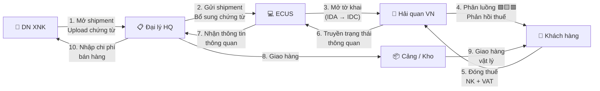

> **📍 Vị trí trong Đơn hàng:** `Đơn hàng → Tờ khai & Chứng từ → [FILE NÀY]`  
> ↩️ [Quay về Tổng quan Đơn hàng](file:///d:/Odoo/bmad-odoo/_bmad-output/Tài liệu/Nghiệp vụ/don_hang_tong_quan.md) · Xem thêm: [HQ VN-TQ](file:///d:/Odoo/bmad-odoo/_bmad-output/Tài liệu/Nghiệp vụ/quy_trinh_hai_quan_vn_trung_quoc.md) · [Tờ khai Kỳ Tốc](file:///d:/Odoo/bmad-odoo/_bmad-output/Tài liệu/Nghiệp vụ/quy_trinh_to_khai_thong_quan_ky_toc.md)

# Quy Trình Hải Quan — Luồng Việt Nam — Quốc Tế
### Tài liệu Nghiệp vụ — Hệ thống Odoo Logistics Core

---

## SƠ ĐỒ LUỒNG TƯƠNG TÁC — HẢI QUAN QUỐC TẾ



---

## 1. TÁC NHÂN

| Tác nhân | Viết tắt | Vai trò |
|---------|----------|--------|
| DN XNK | DN | Chủ hàng, chuẩn bị chứng từ |
| Đại lý HQ | Broker | Khai VNACCS thay DN |
| Hải quan VN | TCHQ | Tiếp nhận, phân luồng, kiểm tra, thông quan |
| Cơ quan kiểm tra CN | KTCN | Kiểm dịch, kiểm tra CL, ATTP |

---

## 2. CHỨNG TỪ HẢI QUAN

| # | Chứng từ | Bắt buộc | Ghi chú |
|---|---------|---------|---------|
| 1 | Hợp đồng mua bán | ✅ | Khớp pháp nhân |
| 2 | Commercial Invoice | ✅ | Khớp tờ khai |
| 3 | Packing List | ✅ | Khớp tờ khai |
| 4 | Vận đơn (B/L, AWB, CIM, CMR) | ✅ | Theo phương thức |
| 5 | C/O (Form E, D, EUR.1...) | ⚠️ Nếu FTA | Giảm/miễn thuế NK |
| 6 | Giấy kiểm tra chuyên ngành | ⚠️ Nếu hàng thuộc DM | Kiểm dịch, CL, ATTP |

---

## 3. PHÂN LUỒNG VCIS

```
[Phân luồng — Hành động theo luồng]
 ├── 🟩 Xanh ── Đính CT → Nộp thuế → Thông quan tự động (60-70%)
 ├── 🟨 Vàng ── HQ kiểm hồ sơ → Bổ sung CT → Nộp thuế → TQ (20-25%)
 └── 🟥 Đỏ  ── HQ kiểm hồ sơ + Kiểm hóa thực tế → Nộp thuế → TQ (5-15%)
```

---

## 4. QUY TRÌNH 7 BƯỚC

> 📌 **Xem sơ đồ luồng tương tác 10 bước** ở đầu file — đã thay thế quy trình 7 bước.


---

## 5. CÔNG THỨC THUẾ

```
Trị giá HQ (CIF) = FOB + Freight + Insurance
Thuế NK          = CIF × Thuế suất NK (%)
Thuế VAT         = (CIF + Thuế NK) × VAT (%)
```

---

## 6. GUARD CLAUSES

| # | Kiểm tra | Nếu vi phạm |
|---|----------|-------------|
| 1 | Chứng từ khớp tuyệt đối? | → Chặn truyền tờ khai |
| 2 | Hàng cấm / bảo hộ? | → Từ chối |
| 3 | C/O hợp lệ? | → Mất ưu đãi thuế |
| 4 | Khai sai trị giá? | → Tham vấn + truy thu |

---
*Quy trình Hải quan VN-Quốc tế — Top-down từ Đơn hàng.*  
*Cập nhật: 25/05/2026*