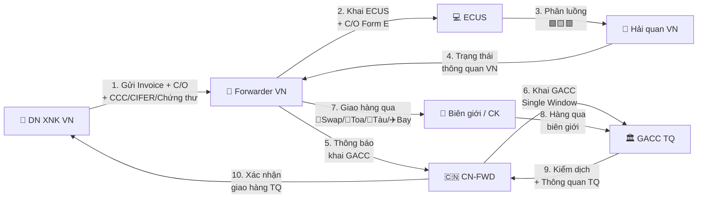

> **📍 Vị trí trong Đơn hàng:** `Đơn hàng → Tờ khai & Chứng từ → [FILE NÀY]`  
> ↩️ [Quay về Tổng quan Đơn hàng](file:///d:/Odoo/bmad-odoo/_bmad-output/Tài liệu/Nghiệp vụ/don_hang_tong_quan.md) · Xem thêm: [HQ Quốc tế](file:///d:/Odoo/bmad-odoo/_bmad-output/Tài liệu/Nghiệp vụ/quy_trinh_hai_quan_vn_quoc_te.md) · [Tờ khai Kỳ Tốc](file:///d:/Odoo/bmad-odoo/_bmad-output/Tài liệu/Nghiệp vụ/quy_trinh_to_khai_thong_quan_ky_toc.md)

# Quy Trình Hải Quan — Luồng Việt Nam ↔ Trung Quốc
### Tài liệu Nghiệp vụ — Hệ thống Odoo Logistics Core

---

## SƠ ĐỒ LUỒNG TƯƠNG TÁC — HẢI QUAN VN — TQ

---

## 1. TÁC NHÂN

| Tác nhân | Viết tắt | Vai trò |
|---------|----------|--------|
| DN XNK VN | DN VN | Chủ hàng, khai phía VN |
| Thương nhân TQ | CN | Đối tác TQ, khai phía TQ |
| TCHQ Việt Nam | VN Customs | VNACCS/VCIS, phân luồng, thông quan |
| GACC (Hải quan TQ) | GACC | Single Window, kiểm dịch 100% nông sản |
| Cục BVTV VN | VN-SPS | Kiểm dịch XK, chứng thư |

---

## 2. SO SÁNH 2 HỆ THỐNG

| Tiêu chí | VN (VNACCS/VCIS) | TQ (GACC Single Window) |
|---------|------------------|------------------------|
| Mã HS | 8 số | 10 số |
| Phân luồng | VCIS: 🟩🟨🟥 | GACC Risk + Random Spot Check |
| Kiểm dịch | Cục BVTV cấp chứng thư | GACC kiểm 100% nông sản tươi |
| Nộp thuế | Điện tử 24/7 | Điện tử qua NH TQ |
| KTSTQ | 5 năm | 3 năm |

---

## 3. CHỨNG TỪ ĐẶC THÙ VIỆT-TRUNG

| Chứng từ | XK VN→TQ | NK TQ→VN |
|---------|---------|---------|
| Invoice | ✅ Ghi nhà SX thực tế (từ 10/2025) | ✅ |
| C/O Form E | ✅ GACC kiểm tra kỹ | ✅ |
| CCC Certificate | ✅ Thiết bị điện | — |
| GACC CIFER | ✅ Thực phẩm | — |
| Mã vùng trồng | ✅ Nông sản tươi | — |
| Chứng thư kiểm dịch | ✅ Nông sản/thủy sản | ✅ Thực phẩm TQ |

---

## 4. QUY TRÌNH 7 BƯỚC

> 📌 **Xem sơ đồ luồng tương tác 10 bước** ở đầu file — đã thay thế quy trình 7 bước.

---

## 5. GIAO NHẬN THEO PHƯƠNG THỨC

| Phương thức | XK VN→TQ | NK TQ→VN |
|------------|---------|---------|
| 🚛 Bộ | BVTV → TQ VN → Swap → GACC | TQ GACC → Biên giới → TQ VN |
| 🚂 Sắt | TQ VN → Toa qua biên giới → GACC | GACC → Toa qua → TQ VN |
| 🚢 Biển | TQ VN cảng → Tàu → GACC cảng TQ | GACC → Tàu → TQ VN cảng |
| ✈️ Không | TQ VN sân bay → Bay → GACC | GACC → Bay → TQ VN |

---

## 6. GUARD CLAUSES

| # | Kiểm tra | Nếu vi phạm |
|---|----------|-------------|
| 1 | Thiếu CCC? | → Tịch thu + Tiêu hủy tại TQ |
| 2 | Không đạt kiểm dịch GACC? | → Xuất trả / tiêu hủy |
| 3 | Nhà SX chưa CIFER? | → Từ chối nhập TQ |
| 4 | Khai sai nhà SX (từ 10/2025)? | → Phạt + đình chỉ XK |
| 5 | Giả mạo C/O Form E? | → Truy thu + cấm FTA 3 năm |
| 6 | Mã HS VN ≠ TQ? | → Áp sai thuế |
| 7 | Hàng di chuyển kéo dài bất thường? | → Tự động luồng Đỏ |

---
*Quy trình Hải quan VN-TQ — Top-down từ Đơn hàng.*  
*Cập nhật: 25/05/2026*