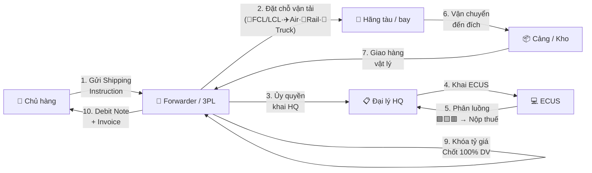

> **📍 Vị trí trong Đơn hàng:** `Đơn hàng → Dịch vụ → [FILE NÀY]`  
> ↩️ [Quay về Tổng quan Đơn hàng](file:///d:/Odoo/bmad-odoo/_bmad-output/Tài liệu/Nghiệp vụ/don_hang_tong_quan.md) · Xem thêm: [DV VN-TQ](file:///d:/Odoo/bmad-odoo/_bmad-output/Tài liệu/Nghiệp vụ/quy_trinh_quan_ly_dich_vu_trung_quoc.md) · [DV Kỳ Tốc](file:///d:/Odoo/bmad-odoo/_bmad-output/Tài liệu/Nghiệp vụ/quy_trinh_quan_ly_dich_vu_ky_toc.md)

# Quy Trình Quản Lý Dịch Vụ — Quốc Tế
### Tài liệu Nghiệp vụ — Hệ thống Odoo Logistics Core

---

## SƠ ĐỒ LUỒNG TƯƠNG TÁC — DỊCH VỤ QUỐC TẾ



---

## 1. TÁC NHÂN

| Tác nhân | Viết tắt | Vai trò |
|---------|----------|--------|
| Chủ hàng | Shipper | Thuê dịch vụ, thanh toán |
| Forwarder / 3PL | FWD | Tổ chức vận chuyển, khai HQ, quản lý kho |
| NVOCC | NVOCC | Gom hàng lẻ, phát hành HBL |
| Hãng tàu / bay | Carrier | Vận tải thực tế, phát hành MBL/MAWB |
| Đại lý Hải quan | Broker | Khai báo HQ, chịu trách nhiệm pháp lý |

---

## 2. PHÂN LOẠI DỊCH VỤ

| Nhóm | Mã | Ví dụ |
|------|----|-------|
| Vận tải | FRT | Cước biển (O/F), cước bay (A/F), đường bộ, sắt |
| Hải quan | CUS | Khai thuê HQ, xin C/O, giấy phép |
| Kho bãi | WHS | Lưu kho, đóng gói, dán nhãn |
| Xếp dỡ | HDL | THC, nâng hạ, bốc xếp |
| Chứng từ | DOC | B/L, AWB, D/O |
| Bảo hiểm | INS | Marine/Air Cargo Insurance |
| Tài chính | FIN | Ứng thuế, bảo lãnh, tỷ giá |
| VAS | VAS | Consolidation, door-to-door |

---

## 3. CHỨNG TỪ THEO PHƯƠNG THỨC

| Phương thức | Vận đơn | Lệnh giao hàng | Hóa đơn DV |
|------------|---------|----------------|-----------|
| 🚢 Biển | MBL / HBL | D/O | Debit Note |
| ✈️ Không | MAWB / HAWB | Release Note | Debit Note |
| 🚂 Sắt | CIM / SMGS | Lệnh giao toa | Debit Note |
| 🚛 Bộ | CMR | — | Debit Note |

---

## 4. QUY TRÌNH 7 BƯỚC

> 📌 **Xem sơ đồ luồng tương tác 10 bước** ở đầu file — đã thay thế quy trình 7 bước.


---

## 5. STATE MACHINE GIÁ DỊCH VỤ

```
Chưa có giá → Chờ giá → Đã báo giá → Chờ duyệt → Đã duyệt → Đã tính (Chốt)
```

- **Khóa tỷ giá** khi chốt giá
- **Chốt đơn** chỉ khi **100% dịch vụ** = "Đã tính"

---

## 6. GUARD CLAUSES

| # | Kiểm tra | Nếu vi phạm |
|---|----------|-------------|
| 1 | FWD/Broker có giấy phép? | → Không cho khai HQ |
| 2 | NVOCC có đăng ký? | → Phạt + Đình chỉ |
| 3 | 100% DV đã chốt giá? | → Không cho quyết toán |
| 4 | Tỷ giá đã khóa? | → Không thay đổi sau chốt |

---
*Quy trình Dịch vụ Quốc tế & VN — Top-down từ Đơn hàng.*  
*Cập nhật: 25/05/2026*