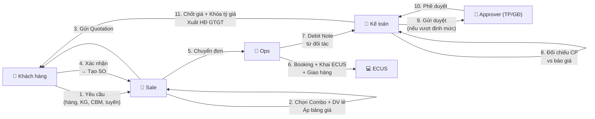
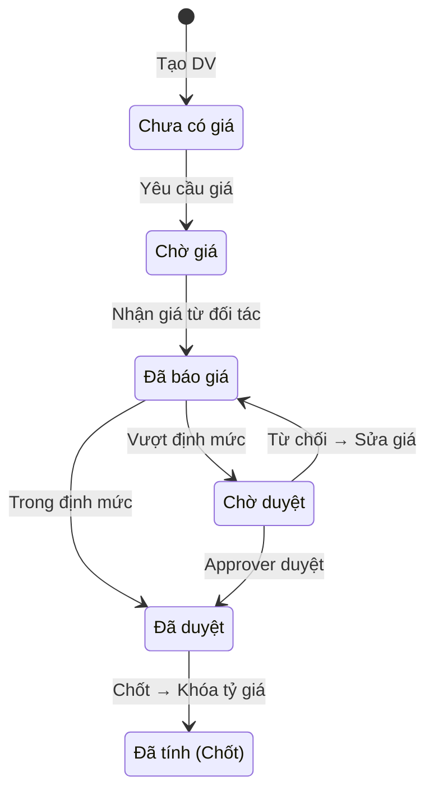

> **📍 Vị trí trong Đơn hàng:** `Đơn hàng → Dịch vụ → [FILE NÀY]`  
> ↩️ [Quay về Tổng quan Đơn hàng](file:///d:/Odoo/bmad-odoo/_bmad-output/Tài liệu/Nghiệp vụ/don_hang_tong_quan.md) · Xem thêm: [DV Quốc tế](file:///d:/Odoo/bmad-odoo/_bmad-output/Tài liệu/Nghiệp vụ/quy_trinh_quan_ly_dich_vu.md) · [DV VN-TQ](file:///d:/Odoo/bmad-odoo/_bmad-output/Tài liệu/Nghiệp vụ/quy_trinh_quan_ly_dich_vu_trung_quoc.md)

# Quy Trình Quản Lý Dịch Vụ — Kỳ Tốc (Odoo Custom)
### Tài liệu Nghiệp vụ — Hệ thống Odoo Logistics Core

---

## SƠ ĐỒ LUỒNG TƯƠNG TÁC — DỊCH VỤ KỲ TỐC

---

## 1. TÁC NHÂN

| Tác nhân | Viết tắt | Vai trò |
|---------|----------|--------|
| Sale | Sale | Chọn Combo, báo giá, tạo SO |
| Ops | Ops | Booking, khai HQ, kiểm dịch, giao hàng |
| Kế toán | Acct | Thu thập CP, chốt giá, khóa tỷ giá, xuất HĐ |
| Trưởng phòng / GĐ | Approver | Phê duyệt vượt định mức M3/KG |
| Đối tác TQ | CN-Partner | Cung cấp DV phía TQ, gửi Debit Note CNY |

---

## 2. CẤU TRÚC DỊCH VỤ

### Dịch vụ gốc (Service Item)

| Nhóm | Ví dụ | Đơn vị |
|------|-------|--------|
| Hải quan | Phí khai HQ, C/O Form E | Lần / TK |
| Vận tải | Cước biển FCL/LCL, cước bộ | CBM / KG / Cont |
| Kho bãi | Lưu kho, bốc xếp | Ngày × CBM |
| Chứng từ | D/O, B/L, Telex | Lần |
| Tài chính | Ứng thuế, bảo lãnh | % giá trị |

### Combo (Gói dịch vụ)

| Thuộc tính | Mô tả |
|-----------|-------|
| Phiên bản | v1, v2... Cũ tự động hết hạn |
| Vòng đời | Nháp → Chờ duyệt → Hoạt động → Hết hạn/Huỷ |
| Định mức | Ngưỡng M3/KG → Vượt = phê duyệt |

---

## 3. STATE MACHINE GIÁ

---

## 4. QUY TRÌNH 7 BƯỚC

> 📌 **Xem sơ đồ luồng tương tác 10 bước** ở đầu file — đã thay thế quy trình 7 bước.

---

## 5. PHÂN BỔ CHI PHÍ

| Phương pháp | Áp dụng |
|------------|---------|
| Theo giá trị (Value) | Thuế, cước biển |
| Theo KG | Cước bay |
| Theo CBM | Cước biển LCL, kho bãi |
| Theo SL | Đóng gói |

### Hóa đơn theo ủy thác

| Loại UT | HĐ bán hàng | HĐ dịch vụ |
|---------|-------------|-----------|
| UT Nhập | ✅ 1 HĐ gộp (hàng + DV) | — |
| UT Xuất | — | ✅ HĐ DV riêng |
| UT XNK | ✅ 1 HĐ (CP TQ + CP VN) | — |
| KUT | — | ✅ HĐ DV riêng |

---

## 6. GUARD CLAUSES

| # | Kiểm tra | Nếu vi phạm |
|---|----------|-------------|
| 1 | Đơn đã khóa? | → Chặn mọi thay đổi DV |
| 2 | 100% DV = "Đã tính"? | → Không cho quyết toán |
| 3 | Tỷ giá đã khóa? | → Không thay đổi |
| 4 | Giảm giá 0-100%? | → Từ chối ngoài phạm vi |
| 5 | Combo còn hiệu lực? | → Không áp Combo hết hạn |

---
*Quy trình Dịch vụ Kỳ Tốc — Top-down từ Đơn hàng.*  
*Cập nhật: 25/05/2026*