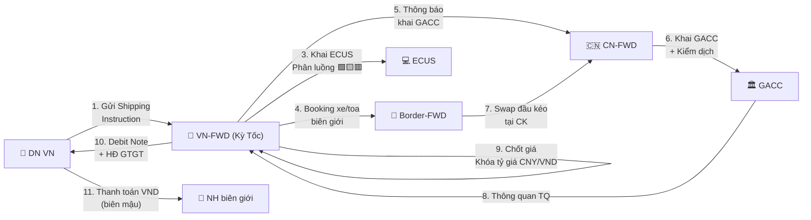

> **📍 Vị trí trong Đơn hàng:** `Đơn hàng → Dịch vụ → [FILE NÀY]`  
> ↩️ [Quay về Tổng quan Đơn hàng](file:///d:/Odoo/bmad-odoo/_bmad-output/Tài liệu/Nghiệp vụ/don_hang_tong_quan.md) · Xem thêm: [DV Quốc tế](file:///d:/Odoo/bmad-odoo/_bmad-output/Tài liệu/Nghiệp vụ/quy_trinh_quan_ly_dich_vu.md) · [DV Kỳ Tốc](file:///d:/Odoo/bmad-odoo/_bmad-output/Tài liệu/Nghiệp vụ/quy_trinh_quan_ly_dich_vu_ky_toc.md)

# Quy Trình Quản Lý Dịch Vụ — Luồng VN ↔ Trung Quốc
### Tài liệu Nghiệp vụ — Hệ thống Odoo Logistics Core

---

## SƠ ĐỒ LUỒNG TƯƠNG TÁC — DỊCH VỤ VN — TQ



---

## 1. TÁC NHÂN

| Tác nhân | Viết tắt | Vai trò |
|---------|----------|--------|
| DN XNK Việt Nam | DN VN | Chủ hàng, thuê dịch vụ |
| Forwarder VN (Kỳ Tốc) | VN-FWD | Khai HQ VN, booking, quản lý kho |
| Forwarder TQ | CN-FWD | Khai GACC, nhận hàng TQ. Từ 10/2025: khai rõ nhà SX |
| Border-FWD | Border | Swap đầu kéo, sang tải, CK số |
| NVOCC | NVOCC | Gom LCL, phát hành HBL. TQ: MOT + đặt cọc RMB 800,000 |
| Đội xe biên giới | Carrier-Road | Xe kéo rơ-moóc qua biên giới |

---

## 2. GÓI COMBO ĐẶC THÙ VIỆT-TRUNG

| Gói Combo | Thành phần | Phương thức |
|----------|-----------|------------|
| XK Nông sản biên giới | BVTV + Khai HQ VN + CK số + Swap + Bãi | 🚛 Bộ |
| XK Nông sản đường biển | BVTV + Khai VN + THC + Cước biển + Khai GACC | 🚢 Biển |
| NK Hàng tiêu dùng TQ | Cước xe TQ + Swap + Bãi + Khai VN + Thuế NK | 🚛 Bộ |
| NK Nguyên liệu TQ biển | Cước biển + THC + D/O + Khai VN + Thuế NK | 🚢 Biển |
| E-commerce XK TQ | Cước bay + Handling + Khai VN + Khai GACC | ✈️ Không |

---

## 3. QUY TRÌNH 7 BƯỚC

> 📌 **Xem sơ đồ luồng tương tác 10 bước** ở đầu file — đã thay thế quy trình 7 bước.


---

## 4. DỊCH VỤ HAI QUAN 2 ĐẦU

| Dịch vụ HQ | Phía VN | Phía TQ |
|-----------|--------|--------|
| Hệ thống | ECUS | GACC Single Window |
| Phân luồng | VCIS (Xanh/Vàng/Đỏ) | GACC Risk + Spot Check |
| Nộp thuế hộ | Điện tử 24/7 | Điện tử qua NH TQ |
| Xin C/O | VCCI cấp | GACC kiểm tra |

---

## 5. STATE MACHINE & CHỐT GIÁ

```
Chưa có giá → Chờ giá → Đã báo giá → Chờ duyệt → Đã duyệt → Đã tính
```

- **Khóa tỷ giá** CNY/VND tại thời điểm chốt
- Vượt định mức M3/KG → Phê duyệt cấp trên
- Chốt đơn khi **100% DV = "Đã tính"**

---

## 6. GUARD CLAUSES

| # | Kiểm tra | Nếu vi phạm |
|---|----------|-------------|
| 1 | NVOCC có MOT license + đặt cọc RMB 800K? | → Phạt + thu hồi |
| 2 | Mua GP XK bên thứ 3? | → Cấm (từ 10/2025) |
| 3 | 100% DV đã chốt giá? | → Không cho quyết toán |
| 4 | Tỷ giá đã khóa? | → Không thay đổi |
| 5 | Tắc biên kéo dài? | → Contingency: chuyển biển/sắt |

---
*Quy trình Dịch vụ VN-TQ — Top-down từ Đơn hàng.*  
*Cập nhật: 25/05/2026*