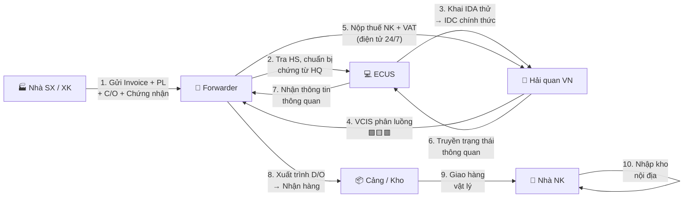

> **📍 Vị trí trong Đơn hàng:** `Đơn hàng → Hàng hóa → [FILE NÀY]`  
> ↩️ [Quay về Tổng quan Đơn hàng](file:///d:/Odoo/bmad-odoo/_bmad-output/Tài liệu/Nghiệp vụ/don_hang_tong_quan.md) · Xem thêm: [Hàng hóa TQ](file:///d:/Odoo/bmad-odoo/_bmad-output/Tài liệu/Nghiệp vụ/quy_trinh_quan_ly_hang_hoa_trung_quoc.md) · [Hàng hóa Kỳ Tốc](file:///d:/Odoo/bmad-odoo/_bmad-output/Tài liệu/Nghiệp vụ/quy_trinh_quan_ly_hang_hoa_ky_toc.md)

# Quy Trình Quản Lý Hàng Hóa — Quốc Tế & Việt Nam
### Tài liệu Nghiệp vụ — Hệ thống Odoo Logistics Core

---

## SƠ ĐỒ LUỒNG TƯƠNG TÁC — HÀNG HÓA QUỐC TẾ



---

## 1. TÁC NHÂN

| Tác nhân | Viết tắt | Vai trò chính |
|---------|----------|--------------|
| Nhà SX / Xuất khẩu | MFR | Cấp Invoice, PL, chứng nhận SP |
| Nhà Nhập khẩu | IMP | Khai HQ, thanh toán, chịu trách nhiệm pháp lý |
| Forwarder / 3PL | FWD | Tổ chức vận chuyển, khai thuê HQ |
| Hải quan Quốc gia | Customs | Phân loại HS, trị giá, thu thuế, phân luồng |
| Cơ quan Chứng nhận | Cert Body | Kiểm dịch, chứng nhận CCC/CE/Hợp quy |

---

## 2. PHÂN LOẠI HS & CHỨNG NHẬN

### 2.1 Hệ thống mã HS

| Cấp | Số chữ số | Ý nghĩa |
|-----|-----------|---------|
| WCO (Quốc tế) | 6 số | Chuẩn phân loại toàn cầu |
| Trung Quốc | 10 số | Mở rộng quốc gia TQ |
| Việt Nam | 8 số | Mở rộng quốc gia VN |

### 2.2 Chứng nhận bắt buộc theo thị trường

| Thị trường | Chứng nhận | Áp dụng |
|-----------|-----------|---------|
| Trung Quốc | CCC, GACC CIFER, Mã vùng trồng | Thiết bị điện, thực phẩm, nông sản |
| EU | CE Marking | Máy móc, đồ chơi, y tế |
| Mỹ | UL / FDA / FCC | Điện, thực phẩm, viễn thông |
| Việt Nam | Hợp quy CR | Máy móc, gia dụng, thực phẩm |

---

## 3. CHỨNG TỪ HÀNG HÓA

### 3.1 Ma trận chứng từ

| Chứng từ | Quốc tế | TQ (GACC) | VN (TCHQ) |
|---------|---------|----------|----------|
| Invoice | ✅ | ✅ + Ghi nhà SX thực tế | ✅ |
| Packing List | ✅ | ✅ | ✅ |
| Vận đơn (B/L, AWB, CIM, CMR) | ✅ | ✅ | ✅ |
| C/O (Xuất xứ) | ⚠️ Nếu FTA | Form E (ACFTA) | Form D, EUR.1... |
| CCC Certificate | — | ✅ Thiết bị điện | — |
| GACC CIFER | — | ✅ Thực phẩm | — |

### 3.2 Chứng từ theo phương thức vận tải

| Phương thức | Vận đơn | Đơn vị tracking |
|------------|---------|-----------------|
| 🚢 Biển | B/L (MBL/HBL) | Container + Seal |
| ✈️ Không | AWB (MAWB/HAWB) | Pieces + Weight |
| 🚂 Sắt | CIM/SMGS | Wagon + Seal |
| 🚛 Bộ | CMR | Biển số xe + Seal |

---

## 4. QUY TRÌNH 7 BƯỚC

> 📌 **Xem sơ đồ luồng tương tác 10 bước** ở đầu file — đã thay thế quy trình 7 bước.


---

## 5. CÔNG THỨC TÍNH THUẾ

```
Trị giá HQ (CIF) = FOB + Freight + Insurance
Thuế NK          = CIF × Thuế suất NK (%)     ← Giảm nếu có C/O
Thuế VAT         = (CIF + Thuế NK) × VAT (%)
Tổng thuế        = Thuế NK + VAT + TTĐB (nếu có)
```

---

## 6. GUARD CLAUSES

| # | Kiểm tra | Nếu vi phạm |
|---|----------|-------------|
| 1 | Hàng cấm / bảo hộ thương hiệu? | → Từ chối |
| 2 | Thiếu CCC (TQ) / CE (EU) / Hợp quy (VN)? | → Không cho thông quan |
| 3 | Phân loại sai mã HS? | → Truy thu thuế + phạt |
| 4 | Giả mạo C/O? | → Truy thu + cấm FTA 3 năm |
| 5 | Không đạt kiểm dịch SPS? | → Tái xuất hoặc tiêu hủy |

---
*Quy trình Hàng hóa Quốc tế & VN — Top-down từ Đơn hàng.*  
*Cập nhật: 25/05/2026*