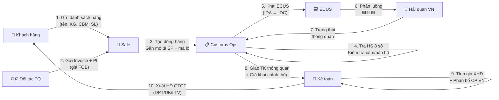
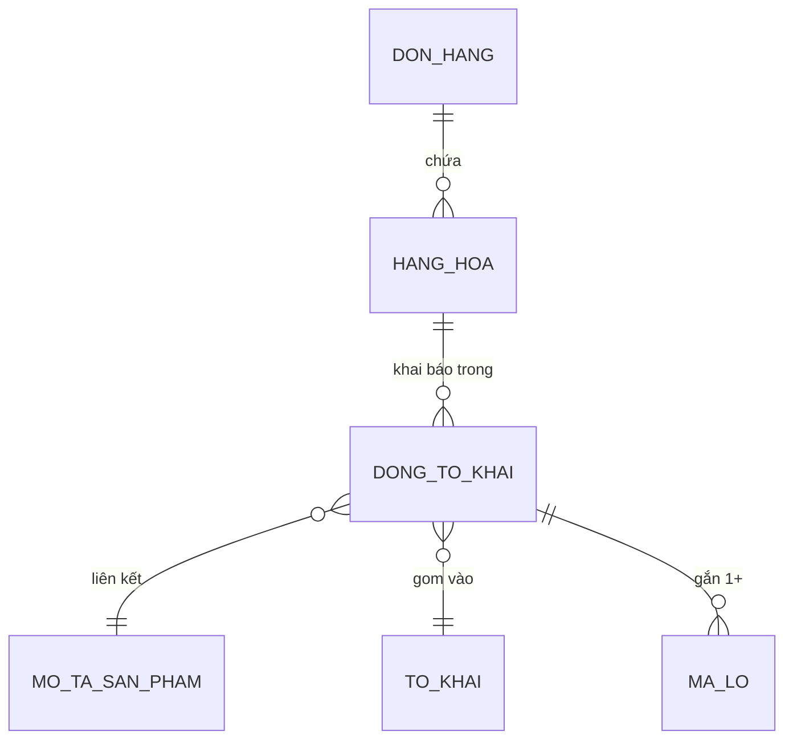

> **📍 Vị trí trong Đơn hàng:** `Đơn hàng → Hàng hóa → [FILE NÀY]`  
> ↩️ [Quay về Tổng quan Đơn hàng](file:///d:/Odoo/bmad-odoo/_bmad-output/Tài liệu/Nghiệp vụ/don_hang_tong_quan.md) · Xem thêm: [Hàng hóa Quốc tế](file:///d:/Odoo/bmad-odoo/_bmad-output/Tài liệu/Nghiệp vụ/quy_trinh_quan_ly_hang_hoa.md) · [Hàng hóa TQ](file:///d:/Odoo/bmad-odoo/_bmad-output/Tài liệu/Nghiệp vụ/quy_trinh_quan_ly_hang_hoa_trung_quoc.md)

# Quy Trình Quản Lý Hàng Hóa — Kỳ Tốc (Odoo Custom)
### Tài liệu Nghiệp vụ — Hệ thống Odoo Logistics Core

---

## SƠ ĐỒ LUỒNG TƯƠNG TÁC — HÀNG HÓA KỲ TỐC



---

## 1. TÁC NHÂN

| Tác nhân | Viết tắt | Vai trò |
|---------|----------|--------|
| Sale | Sale | Tạo đơn, nhập hàng, báo giá KH |
| Customs Ops | CusOps | Tra HS, tính giá khai, khai ECUS |
| Kế toán | Acct | Tính giá XHĐ, phân bổ CP, xuất HĐ GTGT |
| Khách hàng | KH | Cung cấp thông tin hàng, xác nhận đơn |
| Đối tác TQ | CN-Partner | Cung cấp Invoice + PL gốc |

---

## 2. CẤU TRÚC HÀNG HÓA TRÊN ĐƠN HÀNG



| Nhóm | Trường chính |
|------|-------------|
| Vật lý | Tên hàng, Quy cách, KG, CBM, SL kiện |
| Hải quan | Mã HS (8 số), Giá khai, Thuế NK (%), VAT (%) |
| Xuất xứ | Nước SX, Incoterms, C/O Form E |
| Giá cả | Giá FOB xưởng, Giá báo KH, Chiết khấu |
| Mô tả SP | Chọn từ danh mục chuẩn → Liên kết tờ khai |

---

## 3. CHUỖI TÍNH GIÁ (TOP-DOWN)

```
Đơn hàng → Hàng hóa (dòng)
  ├── Giá FOB/EXW (từ xưởng TQ)
  ├── + Freight + Insurance = Giá CIF
  ├── + CP TQ (nếu UT XNK) = Giá khai HQ
  ├── × Thuế NK (%) = Thuế NK
  ├── × VAT (%) = Thuế VAT
  ├── + Phân bổ CP dịch vụ VN = Giá XHĐ
  └── + Lợi nhuận Kỳ Tốc = Giá bán KH
```

### Xử lý giá theo loại ủy thác

| Loại UT | CP TQ | CP VN | Hóa đơn |
|---------|-------|-------|---------|
| UT XNK | Cộng vào giá khai | Phân bổ sau giá nhập | 1 HĐ gộp |
| UT Nhập | Phân bổ sau giá nhập VN | Phân bổ sau giá nhập | 1 HĐ gộp |
| UT Xuất | — | — | HĐ dịch vụ riêng |
| Khai báo hộ | — | — | HĐ dịch vụ riêng |

---

## 4. QUY TRÌNH 7 BƯỚC

> 📌 **Xem sơ đồ luồng tương tác 10 bước** ở đầu file — đã thay thế quy trình 7 bước.


---

## 5. CẢNH BÁO GIÁ

| # | Điều kiện | Hành động |
|---|-----------|-----------|
| 1 | Giá báo KH < Giá nội bộ | ⚠️ Cảnh báo Sale |
| 2 | Giá báo KH < Giá vốn | 🚨 Phê duyệt GĐ |
| 3 | Giảm giá > 100% | ❌ Từ chối |

---

## 6. GUARD CLAUSES

| # | Kiểm tra | Nếu vi phạm |
|---|----------|-------------|
| 1 | Hàng cấm / bảo hộ thương hiệu? | → Từ chối đơn |
| 2 | Giá báo KH < giá vốn? | → Phê duyệt GĐ |
| 3 | Pháp nhân (DPT/DK/LTV) khớp chứng từ? | → Chặn xuất HĐ |
| 4 | Mã lô đúng format? | → Validate trước lưu |
| 5 | Hàng cũ (ngoài A12)? | → Từ chối |

---
*Quy trình Hàng hóa Kỳ Tốc — Top-down từ Đơn hàng.*  
*Cập nhật: 25/05/2026*