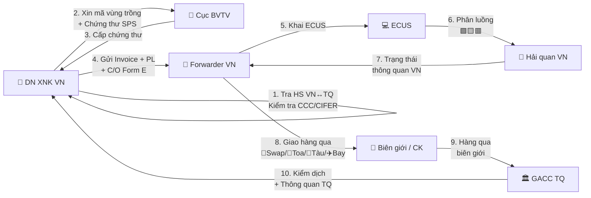

> **📍 Vị trí trong Đơn hàng:** `Đơn hàng → Hàng hóa → [FILE NÀY]`  
> ↩️ [Quay về Tổng quan Đơn hàng](file:///d:/Odoo/bmad-odoo/_bmad-output/Tài liệu/Nghiệp vụ/don_hang_tong_quan.md) · Xem thêm: [Hàng hóa Quốc tế](file:///d:/Odoo/bmad-odoo/_bmad-output/Tài liệu/Nghiệp vụ/quy_trinh_quan_ly_hang_hoa.md) · [Hàng hóa Kỳ Tốc](file:///d:/Odoo/bmad-odoo/_bmad-output/Tài liệu/Nghiệp vụ/quy_trinh_quan_ly_hang_hoa_ky_toc.md)

# Quy Trình Quản Lý Hàng Hóa — Luồng Việt Nam — Trung Quốc
### Tài liệu Nghiệp vụ — Hệ thống Odoo Logistics Core

---

## SƠ ĐỒ LUỒNG TƯƠNG TÁC — HÀNG HÓA VN — TQ

---

## 1. TÁC NHÂN

| Tác nhân | Viết tắt | Vai trò chính |
|---------|----------|--------------|
| DN XNK Việt Nam | DN VN | Chủ hàng, đăng ký mã vùng trồng, xin CCC |
| Thương nhân TQ | Supplier CN | Cung cấp Fapiao, phối hợp khai GACC |
| GACC (Hải quan TQ) | GACC | HS 10 số, kiểm dịch 100% nông sản, CIFER |
| SAMR (Quản lý TQ) | SAMR | Chứng nhận CCC, QR Code truy xuất (từ 03/2026) |
| TCHQ Việt Nam | VN Customs | HS 8 số, ECUS/VCIS, phân luồng |
| Cục BVTV / Thú y VN | VN-SPS | Mã vùng trồng, chứng thư kiểm dịch |

---

## 2. RÀO CẢN PHÁP LÝ VÀO TQ (3 RÀO CẢN LỚN)

| # | Rào cản | Phạm vi | Hậu quả thiếu |
|---|---------|---------|----------------|
| 1 | **CCC** (SAMR) | Thiết bị điện, đồ chơi, pin, sạc EV | Tịch thu + Tiêu hủy |
| 2 | **GACC CIFER** | Thực phẩm, đồ uống, sữa, thịt | Từ chối nhập khẩu |
| 3 | **Mã vùng trồng** | Nông sản tươi (sầu riêng, thanh long...) | Trả hàng / Tiêu hủy |

---

## 3. MAPPING MÃ HS

| Tiêu chí | Việt Nam | Trung Quốc |
|---------|---------|-----------|
| Số chữ số | 8 số | 10 số |
| Rủi ro | Khai 8 số VN ≠ 10 số TQ | → Sai thuế, C/O bị từ chối |
| Giải pháp | Đối chiếu mapping HS VN ↔ TQ | Trước khi khai ECUS + GACC |

---

## 4. QUY TRÌNH 7 BƯỚC

> 📌 **Xem sơ đồ luồng tương tác 10 bước** ở đầu file — đã thay thế quy trình 7 bước.

---

## 5. CÔNG THỨC TÍNH THUẾ

| Sắc thuế | NK vào VN (từ TQ) | NK vào TQ (từ VN) |
|---------|-------------------|-------------------|
| Thuế NK MFN | 0-150% | 0-65% |
| **Thuế NK ưu đãi ACFTA (C/O Form E)** | **0%** đa số | **0%** đa số |
| Thuế VAT | 8% hoặc 10% | 13% (chuẩn) / 9% (nông sản) |

---

## 6. GUARD CLAUSES

| # | Kiểm tra | Nếu vi phạm |
|---|----------|-------------|
| 1 | Thiếu CCC? | → Tịch thu + Tiêu hủy tại biên giới TQ |
| 2 | Nông sản không đạt kiểm dịch GACC? | → Xuất trả / tiêu hủy |
| 3 | Nhà SX chưa đăng ký CIFER? | → Từ chối nhập khẩu toàn bộ lô |
| 4 | Khai sai nhà SX thực tế (từ 10/2025)? | → Phạt + đình chỉ XK |
| 5 | Giả mạo C/O Form E? | → Truy thu + cấm FTA 3 năm |
| 6 | Mã HS VN ≠ TQ không mapping? | → Áp sai thuế, C/O bị từ chối |

---
*Quy trình Hàng hóa VN-TQ — Top-down từ Đơn hàng.*  
*Cập nhật: 25/05/2026*