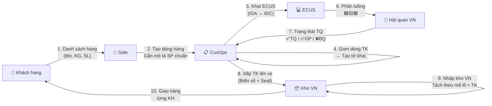

> **📍 Vị trí trong Đơn hàng:** `Đơn hàng → Tờ khai & Chứng từ → [FILE NÀY]`  
> ↩️ [Quay về Tổng quan Đơn hàng](file:///d:/Odoo/bmad-odoo/_bmad-output/Tài liệu/Nghiệp vụ/don_hang_tong_quan.md) · Xem thêm: [HQ Quốc tế](file:///d:/Odoo/bmad-odoo/_bmad-output/Tài liệu/Nghiệp vụ/quy_trinh_hai_quan_vn_quoc_te.md) · [HQ VN-TQ](file:///d:/Odoo/bmad-odoo/_bmad-output/Tài liệu/Nghiệp vụ/quy_trinh_hai_quan_vn_trung_quoc.md)

# Quy Trình Tờ Khai Thông Quan — Kỳ Tốc (Odoo Custom)
### Tài liệu Nghiệp vụ — Hệ thống Odoo Logistics Core

---

## SƠ ĐỒ LUỒNG TƯƠNG TÁC — TỜ KHAI KỲ TỐC

---

## 1. TÁC NHÂN

| Tác nhân | Viết tắt | Vai trò |
|---------|----------|--------|
| Customs Ops | CusOps | Tạo dòng TK, gom TK, khai VNACCS, theo dõi luồng |
| Sale | Sale | Tạo đơn → Hệ thống tạo dòng TK |
| Kế toán | Acct | Tính thuế, tính giá XHĐ sau thông quan |
| Kho vận | WhsOps | Quản lý xe hàng, nhập kho theo mã lô |
| Đối tác TQ | CN-Partner | Invoice + PL gốc, khai XK TQ |
| Hải quan VN | VN Customs | Phân luồng VCIS, thông quan |
| Pháp nhân KT | Legal | DPT / DK / LTV — phải khớp trên mọi chứng từ |

---

## 2. MÃ LÔ

| Ký tự | Ý nghĩa | Ví dụ |
|-------|---------|-------|
| 1 | Năm: A=2023, D=2026 | D |
| 2 | Tháng: A=T1, E=T5 | E |
| Số đuôi | Số kiện | 015 |

> **DE015** = 2026, Tháng 5, 15 kiện.

---

## 3. CHỨNG TỪ

| # | Chứng từ | Yêu cầu |
|---|---------|---------|
| 1 | Hợp đồng | Khớp pháp nhân (DPT/DK/LTV) |
| 2 | Invoice | Khớp tuyệt đối với TK |
| 3 | Packing List | Khớp tuyệt đối |
| 4 | Tờ khai HQ | Số 12 số VNACCS |
| 5 | Giấy kiểm tra CN | Nếu hàng thuộc Danh mục |
| 6 | C/O Form E (~300 tệ) | Thuế NK 15% → 0% |

> ⚠️ **Quy tắc vàng:** Tất cả chứng từ **phải khớp tuyệt đối** về tên hàng, SL, KG, giá trị, pháp nhân.

---

## 4. LOẠI HÌNH ỦY THÁC

| Loại UT | Ai đứng tên TK | Đặc điểm |
|---------|----------------|---------|
| UT Xuất | Cty TQ | Kỳ Tốc chỉ xuất HĐ DV |
| UT Nhập | DPT/DK/LTV | Kỳ Tốc đứng tên NK |
| UT XNK | TQ (XK) + VN (NK) | CP TQ cộng giá khai |
| KUT | KH tự đứng tên | KH chịu trách nhiệm PL |

---

## 5. QUY TRÌNH 7 BƯỚC

> 📌 **Xem sơ đồ luồng tương tác 10 bước** ở đầu file — đã thay thế quy trình 7 bước.

---

## 6. LUỒNG TIỀN

| Mã | Mô tả | Áp dụng |
|----|-------|---------|
| 501 | KH → VND → Cty VN → USD → Qisu → CNY → Xưởng | Chuẩn 2026 |
| 502 | Cty VN → USD → Cty TQ → 1688 → CNY → Xưởng | Sàn TMĐT |
| 503 | USD trả thẳng xưởng | Hiếm, < 1.000 CNY |

---

## 7. TRẠNG THÁI SAU THÔNG QUAN

| Trạng thái | Xuất HĐ? | Dùng hàng? |
|-----------|----------|-----------|
| Thông quan | ✅ | ✅ |
| Giải phóng hàng | ✅ | ✅ |
| Mang hàng về bảo quản | ❌ | ❌ |

---

## 8. GUARD CLAUSES

| # | Kiểm tra | Nếu vi phạm |
|---|----------|-------------|
| 1 | Chứng từ khớp tuyệt đối? | → Chặn truyền TK |
| 2 | Pháp nhân đồng nhất? | → Chặn truyền TK |
| 3 | Hàng cấm / bảo hộ? | → Từ chối đơn |
| 4 | Mã lô đúng format? | → Validate |
| 5 | "Mang hàng về bảo quản"? | → Chặn xuất HĐ + chặn dùng hàng |
| 6 | Di chuyển kéo dài bất thường? | → Tự động luồng Đỏ |

---
*Quy trình Tờ khai Kỳ Tốc — Top-down từ Đơn hàng.*  
*Cập nhật: 25/05/2026*