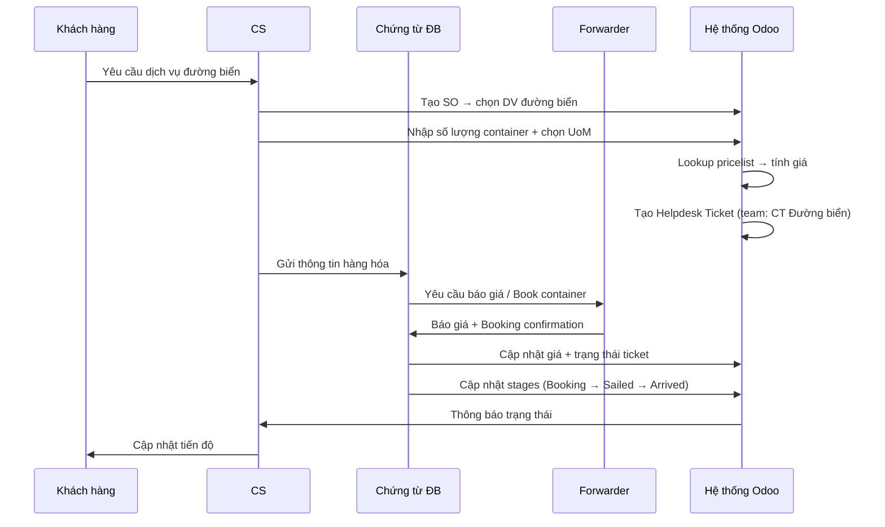
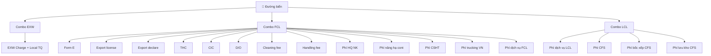

# 🚢 Phiên Brainstorming — Dịch vụ Đường biển (Sea Freight)

**Ngày:** 2026-05-19 16:44
**Facilitator:** Mary 🔍
**Người tham gia:** dungpx

---

# ⚠️ PHẦN 1: CÂU HỎI CẦN XÁC NHẬN VỚI NGƯỜI DÙNG

> **Trạng thái: CHƯA XÁC NHẬN**
> Các câu hỏi dưới đây cần được xác nhận trước khi bắt đầu phân tích chức năng chi tiết.
> Câu trả lời sẽ ảnh hưởng trực tiếp đến thiết kế kiến trúc và scope triển khai.

## 🔴 Câu hỏi QUAN TRỌNG — Quyết định kiến trúc

| # | Câu hỏi | Giải thích rõ | Tác động |
|---|---------|--------------|---------|
| **Q1** | **Combo hay Dịch vụ đơn lẻ?** | **Combo:** gộp nhiều DV (THC, CIC, D/O...) thành 1 gói, chọn 1 lần → tự load tất cả DV con. **Dịch vụ đơn lẻ:** user tự chọn từng DV một trên SO. | ⚠️ Quyết định **toàn bộ kiến trúc** — data model, bảng giá, báo giá |
| **Q2** | **O/F (Ocean Freight) — nhập tay hay cấu hình bảng giá theo tuyến?** | Cước biển là **chi phí lớn nhất**, biến động theo tuyến (Ningbo→HP, Shanghai→HCM), mùa (peak T8-T12), hãng tàu (COSCO, SITC...). Nếu nhập tay: user nhập giá mỗi đơn. Nếu bảng giá: cấu hình sẵn theo tuyến. | Quyết định cấu trúc **pricelist** và **required fields** |

## 🟡 Câu hỏi TRUNG BÌNH — Ảnh hưởng thiết kế

| # | Câu hỏi | Giải thích rõ | Tác động |
|---|---------|--------------|---------|
| **Q3** | **Required fields trên SO — cần POL, POD, ETD, ETA, hãng tàu không?** | Khi tạo đơn hàng đường biển, user có bắt buộc nhập: Cảng đi (POL), Cảng đến (POD), Ngày dự kiến đi (ETD), Ngày dự kiến đến (ETA), Hãng tàu? | Quyết định **fields bắt buộc** trên SO/combo |
| **Q4** | **HBL vs MBL — cần quản lý cả 2 loại vận đơn không?** | Trong vận tải biển có 2 loại Bill of Lading: **MBL** (Master B/L) do hãng tàu phát cho Forwarder, **HBL** (House B/L) do Forwarder phát cho DPT/khách. DPT cần lưu/tracking cả MBL hay chỉ HBL? | Ảnh hưởng **thiết kế chứng từ** trên helpdesk |
| **Q5** | **Form E > 20 items — phí thêm $8/page tính tự động hay nhập tay?** | Khi lô hàng có hơn 20 mặt hàng, Form E (chứng nhận xuất xứ) cần thêm trang, mỗi trang phụ thu **$8**. Hệ thống tự tính theo số items hay user nhập tay? | Ảnh hưởng **logic tính giá** |

## 🟢 Câu hỏi phát hiện từ file Quy trình (MỚI)

> Sau khi đọc lại file "Quy trình - Đường biển.csv", phát hiện thêm các gap chưa được đề cập:

| # | Câu hỏi | Giải thích rõ | Tác động |
|---|---------|--------------|---------|
| **Q6** | **Vai trò "Khai báo TQ" — cần tracking trong hệ thống không?** | Quy trình B18-B19: CT đường biển gửi thông tin cho "Khai báo TQ", rồi Khai báo TQ gửi INV, PL tiếng Trung cho FWD. Đây là vai trò riêng biệt. Cần tạo stage/ticket riêng? | Ảnh hưởng **số stage** trên helpdesk |
| **Q7** | **Luồng tờ khai (vàng/đỏ) — xử lý khác nhau thế nào?** | B42: "Luồng vàng: Đóng thuế / Luồng đỏ: kiểm hàng → xử lý phát sinh". Cần 2 nhánh khác nhau trên helpdesk? Hay chỉ cần 1 field đánh dấu? | Ảnh hưởng **workflow helpdesk** |
| **Q8** | **Debit Note + Hóa đơn VCQT — quản lý ở đâu?** | B29-B30: FWD gửi Debit Note + hóa đơn vận chuyển quốc tế + local charge VN. Lưu trên SO, helpdesk hay account.move? | Ảnh hưởng **tích hợp kế toán** |
| **Q9** | **Tem phụ / Tem nhãn — cần check trên hệ thống?** | B14 (quy trình xuất): "Check tem phụ, tem nhãn". Có cần field/checklist riêng trên SO? | Ảnh hưởng **fields trên SO** |

## Bảng tổng hợp câu hỏi

| # | Câu hỏi | Mức độ | Trạng thái | Trả lời |
|---|---------|--------|-----------|---------|
| Q1 | Combo hay DV đơn lẻ? | 🔴 Quan trọng nhất | ⏳ Chờ | — |
| Q2 | O/F nhập tay hay bảng giá? | 🔴 Quan trọng | ⏳ Chờ | — |
| Q3 | Required fields? | 🟡 Trung bình | ⏳ Chờ | — |
| Q4 | HBL vs MBL? | 🟡 Trung bình | ⏳ Chờ | — |
| Q5 | Form E >20 items? | 🟡 Trung bình | ⏳ Chờ | — |
| Q6 | Khai báo TQ tracking? | 🟢 Mới phát hiện | ⏳ Chờ | — |
| Q7 | Luồng vàng/đỏ xử lý? | 🟢 Mới phát hiện | ⏳ Chờ | — |
| Q8 | Debit Note + HĐ VCQT? | 🟢 Mới phát hiện | ⏳ Chờ | — |
| Q9 | Tem phụ / Tem nhãn? | 🟢 Mới phát hiện | ⏳ Chờ | — |

---

# ✅ PHẦN 2: CÂU HỎI ĐÃ ĐƯỢC XÁC NHẬN

> Các quyết định dưới đây đã được **dungpx** xác nhận trong phiên brainstorming.

| # | Câu hỏi | Quyết định | Ghi chú |
|---|---------|-----------|---------|
| A1 | Phương thức nhận diện | `is_sea_freight_service` Boolean flag trên `dpt.service.management` | |
| A2 | Liên kết SO | Combo/DV đường biển trên SO (chờ Q1) | |
| A3 | Chọn dịch vụ | **Người dùng tự chọn** trên SO (KHÔNG auto-create) | |
| A4 | Quy trình vận hành | Dùng Helpdesk Ticket + luồng chứng từ đã có | |
| A5 | Bảng giá | Cấu hình pricelist, đơn vị Cont20/Cont40 | |
| A6 | Tích hợp XNK | Theo logic liên kết tờ khai đã có | |
| A7 | HP vs HCM | Cấu hình trên từng **dịch vụ con** (đánh dấu VN hay TQ) | Không tạo combo riêng |
| A8 | Phí phát sinh | **Người vận hành tự thêm** vào phần dịch vụ trên SO | Dịch vụ phát sinh riêng |
| A9 | 3 cột giá trên report | Là **3 mức giá từ bảng giá** (Giá 1, Giá 2, Giá 3) | Pricelist table detail |
| A10 | Mẫu báo giá | Cần tạo **MẪU MỚI RIÊNG** cho đường biển | Liệt kê chi tiết DV con |
| A11 | Multi-company | Không áp dụng — chỉ 1 công ty | |

---

# 📋 PHẦN 3: PHÂN TÍCH CHỨC NĂNG (Sau khi xác nhận Q1-Q5)

> **Lưu ý:** Phần phân tích dưới đây dựa trên giả định ban đầu là dùng **Combo**. 
> Nếu Q1 trả lời là "Dịch vụ đơn lẻ", cần điều chỉnh lại kiến trúc.

## Phát hiện từ Bảng giá CSV

3 gói dịch vụ đường biển:

### Combo 1: EXW (EXW Charge + Local charge TQ)

Dịch vụ đầu Trung Quốc, tính theo Shipment.

### Combo 2: FCL (Full Container Load)

| # | Dịch vụ con | ĐVT | VAT | Ghi chú |
|---|------------|-----|-----|---------|
| 1 | Form E | Set | 0% | < 20 items, thêm phí $8/page |
| 2 | Export license (giấy phép XK) | Set | 0% | |
| 3 | Export declare (khai báo XK) | Set | 0% | |
| 4 | THC (Phụ phí xếp dỡ cảng) | Cont | 8% | Khác giá 20ft vs 40ft |
| 5 | CIC (Phí cân bằng cont) | Cont | 8% | Khác giá 20ft vs 40ft |
| 6 | D/O (Phí chứng từ) | Set | 8% | |
| 7 | Cleaning fee (Vệ sinh cont) | Cont | 8% | |
| 8 | Handling fee (Truyền tờ khai) | Set | 8% | |
| 9 | Phí thủ tục HQ NK (vàng/đỏ) | Set | 8% | VND, 2 mức giá |
| 10 | Phí nâng hạ cont | Cont | 8% | |
| 11 | Phí CSHT | Cont | 0% | |
| 12 | Phí trucking nội địa VN | Đơn | 8% | |
| 13 | Phí dịch vụ FCL | Đơn | 0% | Phí DPT |

### Combo 3: LCL (Less than Container Load)

Dịch vụ hàng lẻ + phí CFS (kho CFS, bốc xếp, giao nhận).

---

## Mẫu Báo giá Đường biển (Mới)

Cấu trúc mẫu báo giá đường biển (từ CSV):

```
┌─────────────────────────────────────────────────────────────────────┐
│ ĐƯỜNG BIỂN NHẬP KHẨU - FCL Cont20 Hải Phòng                       │
├──────┬─────────────────────────────┬───────┬───────┬───────┬───────┤
│ STT  │ ĐẦU MỤC                     │ T.TỆ  │ ĐVT   │ Đ.GIÁ │ S.LG  │
├──────┼─────────────────────────────┼───────┼───────┼───────┼───────┤
│ 1    │ Trung Quốc (EXW)            │       │       │       │       │
│ 1.1  │   EXW Charge & local charge │ USD   │ Shipt │   x   │       │
│ 1.2  │   Form E (nếu có)           │ USD   │ Set   │  60   │       │
│      │   Tổng nhóm 1               │       │       │       │       │
├──────┼─────────────────────────────┼───────┼───────┼───────┼───────┤
│ 2    │ O/F (Ocean Freight)          │ USD   │ Cont  │   x   │       │
│      │   Tổng O/F                   │       │       │       │       │
├──────┼─────────────────────────────┼───────┼───────┼───────┼───────┤
│ 3    │ Việt Nam (FCL)               │       │       │       │       │
│ 3.1  │   THC                        │ USD   │ Cont  │  120  │       │
│ 3.2  │   CIC                        │ USD   │ Cont  │  120  │       │
│ 3.3  │   D/O                        │ USD   │ Set   │   35  │       │
│  ... │   ...                        │ ...   │ ...   │  ...  │       │
│      │   Tổng nhóm 3                │       │       │       │       │
├──────┼─────────────────────────────┼───────┼───────┼───────┼───────┤
│ 4    │ Phí dịch vụ DPT              │ VND   │ Set   │ 3tr   │       │
├──────┼─────────────────────────────┼───────┼───────┼───────┼───────┤
│      │ Tổng chi phí logistics       │       │       │       │       │
│      │ Tổng Thuế NK + VAT           │       │       │       │       │
│      │ Tổng chi phí về tay          │       │       │       │       │
└──────┴─────────────────────────────┴───────┴───────┴───────┴───────┘
```

**Khác biệt so với mẫu báo giá hiện tại:**

| Khác biệt | Mẫu hiện tại (T1-T5) | Mẫu đường biển MỚI |
|-----------|----------------------|-------------------|
| Đơn vị cơ sở | Dòng hàng hóa (tờ khai) | Container / Shipment |
| Cấu trúc | Hàng → phân bổ DV | Nhóm → liệt kê DV con |
| Tiền tệ | CNY → VND (1 tỷ giá) | USD + VND (multi-currency) |
| Phân nhóm | Không nhóm | 3 nhóm: TQ, O/F, VN |
| Chi tiết | Tên combo, tổng tiền | Từng dòng dịch vụ con |

---

## Edge Cases — "Nhỡ... thì sao?"

| # | Câu hỏi | Guard / Xử lý |
|---|---------|---------------|
| 1 | Đơn có cả EXW + FCL? | Cho phép nhiều combo/DV trên 1 SO |
| 2 | Cont20 + Cont40 trong cùng 1 đơn? | Phân biệt UoM |
| 3 | Giá O/F thay đổi giữa báo và book? | `is_price_fixed` + `locked_exchange_rate` |
| 4 | Hải quan luồng đỏ (kiểm hóa)? | Người vận hành thêm DV phát sinh |
| 5 | Phí DEM/DET phát sinh? | Người vận hành thêm DV phát sinh trên SO |
| 6 | Khách hủy booking? | Stage "Cancelled" trên helpdesk |
| 7 | Container bị roll (rớt tàu)? | Stage "Rolled" + thông báo CS |
| 8 | Giá theo cảng HP khác HCM? | Cấu hình trên dịch vụ con (VN/TQ) |
| 9 | Tỷ giá USD thay đổi? | `locked_exchange_rate` khi chốt giá |
| 10 | LCL phí CFS? | Combo LCL có thêm dịch vụ CFS riêng |
| 11 | Peak season surcharge? | O/F nhập tay (pending Q2) |
| 12 | Hàng DG/Reefer? | DV phát sinh hoặc combo riêng |

---

## Sơ đồ Luồng đề xuất



---

## Cấu trúc Combo chi tiết



---

> **📚 Tài liệu nghiệp vụ bổ sung:** [sea-freight-domain-knowledge.md](file:///d:/Odoo/bmad-odoo/_bmad-output/brainstorming/sea-freight-domain-knowledge.md)
