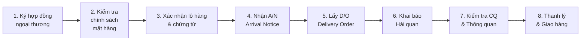
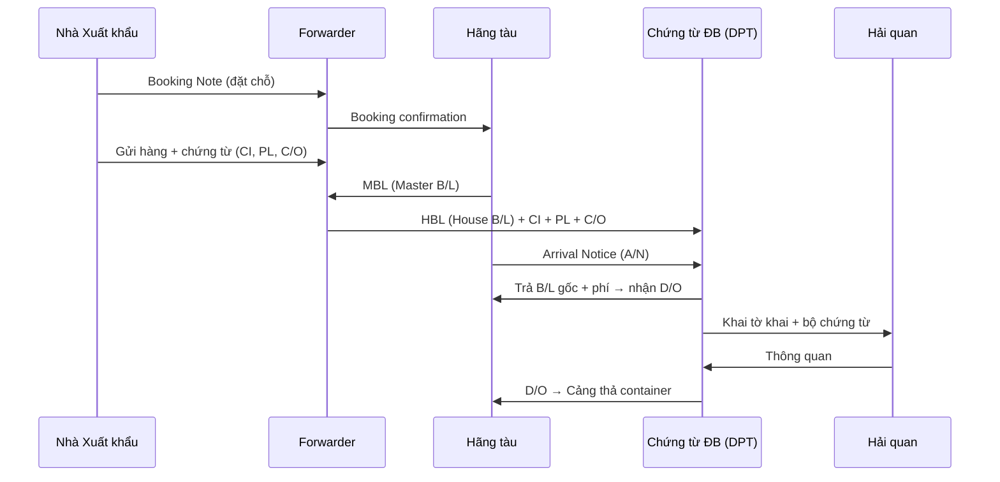

# 🚢 Nghiệp vụ Logistics Đường biển — Kiến thức chuyên sâu

**Mục đích:** Bổ sung kiến thức nghiệp vụ cho phiên brainstorming dịch vụ đường biển DPT

---

## 1. Quy trình nhập khẩu đường biển (8 bước)

### Chi tiết từng bước

| Bước | Tên | Mô tả | Người thực hiện | Chứng từ liên quan |
|------|-----|-------|----------------|-------------------|
| 1 | Ký hợp đồng ngoại thương | Xác định Incoterms, giá, trách nhiệm | Khách hàng + Nhà XK | Hợp đồng, PI |
| 2 | Kiểm tra chính sách | Hàng cấm? Giấy phép? Kiểm dịch? | CS / Chứng từ ĐB | Danh mục quản lý |
| 3 | Xác nhận lô hàng & chứng từ | Nhận Invoice, Packing List, B/L, C/O từ NXK | Chứng từ ĐB | Invoice, PL, B/L, C/O |
| 4 | Nhận Arrival Notice (A/N) | FWD/Hãng tàu gửi thông báo hàng đến | FWD → Chứng từ ĐB | A/N |
| 5 | Lấy Delivery Order (D/O) | Mang B/L + phí đến lấy lệnh giao hàng | Chứng từ ĐB → Hãng tàu | D/O |
| 6 | Khai báo Hải quan | Truyền tờ khai điện tử | Khai báo TQ | Tờ khai HQ |
| 7 | Kiểm tra CQ & Thông quan | Kiểm hóa nếu luồng vàng/đỏ | HQ + CQ liên quan | Biên bản kiểm hóa |
| 8 | Thanh lý & Giao hàng | Nộp phí cảng, điều xe, giao về kho KH | Vận hành + Trucking | Phiếu giao hàng |

---

## 2. Chứng từ đường biển quan trọng

### Bảng chứng từ & ý nghĩa

| Chứng từ | Viết tắt | Ai phát hành | Ý nghĩa | Khi nào cần |
|---------|---------|-------------|---------|------------|
| **Booking Note** | B/N | FWD → Hãng tàu | Đặt chỗ trên tàu | Trước khi ship hàng |
| **Master Bill of Lading** | MBL | Hãng tàu → FWD | Hợp đồng vận chuyển chính | Khi hàng lên tàu |
| **House Bill of Lading** | HBL | FWD → Shipper/CS | Hợp đồng giữa FWD và khách | Khi hàng lên tàu |
| **Arrival Notice** | A/N | FWD/Hãng tàu → Consignee | Thông báo hàng đến cảng | Tàu sắp cập cảng |
| **Delivery Order** | D/O | Hãng tàu → Consignee | Lệnh giao hàng (cho cảng thả cont) | Sau khi trả phí |
| **Commercial Invoice** | CI | NXK → NNK | Hóa đơn thương mại | Khai HQ |
| **Packing List** | PL | NXK → NNK | Chi tiết đóng gói | Khai HQ |
| **Certificate of Origin** | C/O | Cơ quan XK | Chứng nhận xuất xứ (Form E, D, AK...) | Ưu đãi thuế |

### Luồng chứng từ

---

## 3. Các loại phí đường biển (chi tiết)

### 3.1 Phí đầu nước xuất khẩu (Origin Charges)

| Phí | Tiếng Anh | ĐVT | VAT | Mô tả |
|-----|----------|-----|-----|-------|
| Phí local charge TQ | EXW Charge | Shipment | 0% | Phí xử lý tại cảng xuất (TQ) |
| Form E | Certificate of Origin | Set | 0% | Chứng nhận xuất xứ (<20 items) |
| Giấy phép XK | Export License | Set | 0% | Nếu hàng cần giấy phép |
| Khai báo XK | Export Declaration | Set | 0% | Phí khai báo xuất khẩu |

### 3.2 Cước vận chuyển biển (Ocean Freight)

| Phí | Tiếng Anh | ĐVT | Mô tả |
|-----|----------|-----|-------|
| **Cước biển** | **Ocean Freight (O/F)** | Cont 20/40 hoặc CBM | Giá vận chuyển chính, biến động theo tuyến, mùa, hãng tàu |

**Biến số ảnh hưởng O/F:**
- Tuyến (POL → POD): Ningbo→HP khác Shanghai→HCM
- Hãng tàu: COSCO, Evergreen, MSC, SITC, MCC/CNC
- Container: 20ft, 40ft, 40HQ, Reefer
- Mùa: Peak season (T8-T12) giá cao hơn
- Loại hàng: DG (nguy hiểm), Reefer (lạnh) phụ phí riêng

### 3.3 Phí đầu Việt Nam (Destination Charges / Local Charges)

| Phí | Viết tắt | ĐVT | VAT | Mô tả chi tiết |
|-----|---------|-----|-----|----------------|
| **Terminal Handling Charge** | THC | Cont | 8% | Phí xếp dỡ container tại cảng — bốc container từ tàu → bãi container |
| **Container Imbalance Charge** | CIC | Cont | 8% | Phí cân bằng vỏ container — bù chi phí vận chuyển vỏ rỗng |
| **Delivery Order Fee** | D/O | Set | 8% | Phí lệnh giao hàng — trả để nhận lệnh thả container |
| **Cleaning/Washing Fee** | CLN | Cont | 8% | Phí vệ sinh container sau khi rút hàng |
| **Handling Fee** | HLF | Set | 8% | Phí xử lý chứng từ, truyền tờ khai (FWD thu) |
| **Phí thủ tục HQ NK** | Customs | Set | 8% | Phí khai báo hải quan nhập (luồng xanh/vàng/đỏ) |
| **Phí nâng hạ container** | Lift | Cont | 8% | Phí nâng/hạ container tại bãi/kho |
| **Phí CSHT** | Infra | Cont | 0% | Phí cơ sở hạ tầng cảng |
| **Phí trucking nội địa** | Trucking | Cont | 8% | Vận chuyển container từ cảng → kho khách |

### 3.4 Phí phát sinh (không cố định)

| Phí | Viết tắt | ĐVT | Khi nào phát sinh |
|-----|---------|-----|-------------------|
| **Demurrage** | DEM | Cont/ngày | Container nằm quá hạn tại cảng (free time thường 3-7 ngày) |
| **Detention** | DET | Cont/ngày | Giữ container quá hạn bên ngoài cảng (rút hàng chậm trả vỏ) |
| **Phí kiểm hóa** | Exam | Set | Hải quan kiểm tra thực tế (luồng đỏ) |
| **Phí lưu bãi** | Storage | Cont/ngày | Container nằm tại cảng quá free time |
| **Sửa B/L** | Amend | Set | Sửa đổi thông tin trên vận đơn |
| **Phí phát sinh bill** | Extra BL | Set | Phát hành thêm bản B/L |

---

## 4. Trạng thái Container (Container Tracking)

### Lifecycle hoàn chỉnh

```mermaid
graph LR
    S1["📦 Booking<br/>Confirmed"] --> S2["🏗️ Empty Gate Out<br/>Lấy vỏ rỗng"]
    S2 --> S3["📥 Full Gate In<br/>Cont đầy vào cảng"]
    S3 --> S4["🛃 Customs Cleared<br/>Thông quan XK"]
    S4 --> S5["🚢 Loaded on Board<br/>Đã lên tàu"]
    S5 --> S6["🌊 In Transit<br/>Đang vận chuyển"]
    S6 --> S7["⚓ Discharged<br/>Dỡ tại cảng đích"]
    S7 --> S8["🛃 Import Cleared<br/>Thông quan NK"]
    S8 --> S9["🚛 Gate Out Full<br/>Lấy cont đầy"]
    S9 --> S10["📤 Empty Return<br/>Trả vỏ rỗng"]
```

### Chi tiết trạng thái

| # | Trạng thái | Ý nghĩa | Vị trí | Ai chịu trách nhiệm |
|---|-----------|---------|--------|---------------------|
| 1 | **Booking Confirmed** | Đã xác nhận đặt chỗ trên tàu | — | FWD |
| 2 | **Empty Gate Out** | Cont rỗng rời depot → đi đóng hàng | Depot XK | Shipper |
| 3 | **Full Gate In** | Cont đầy vào cảng xuất | Cảng XK (CY) | Shipper |
| 4 | **Customs Cleared** | Thông quan xuất khẩu xong | Cảng XK | Chứng từ XK |
| 5 | **Loaded on Board** | Container đã lên tàu | Tàu | Hãng tàu |
| 6 | **In Transit** | Tàu đang chạy trên biển | Trên biển | Hãng tàu |
| 7 | **Discharged** | Container dỡ tại cảng đích | Cảng NK (CY) | Hãng tàu |
| 8 | **Import Cleared** | Thông quan nhập khẩu xong | Cảng NK | Chứng từ ĐB (DPT) |
| 9 | **Gate Out Full** | Cont đầy rời cảng → đi giao hàng | Cảng NK | Trucking |
| 10 | **Empty Return** | Trả vỏ cont rỗng về depot | Depot NK | Consignee |

---

## 5. FCL vs LCL — So sánh chi tiết

| Tiêu chí | FCL (Full Container Load) | LCL (Less than Container Load) |
|---------|--------------------------|-------------------------------|
| **Đơn vị** | Nguyên container (20ft/40ft/40HQ) | Theo CBM hoặc tấn (W/M) |
| **Phù hợp** | Hàng nhiều, đủ 1 container | Hàng ít, không đủ 1 container |
| **Nhận hàng** | Tại bãi container (CY) | Tại kho CFS |
| **Phí đặc thù** | THC, CIC, nâng hạ cont | CFS fee, phí tách B/L |
| **Thời gian** | Nhanh hơn (không ghép hàng) | Chậm hơn (chờ ghép/tách) |
| **Rủi ro** | Thấp (hàng riêng 1 cont) | Cao hơn (ghép với hàng khác) |
| **Giá vận chuyển** | Theo container | Theo CBM (thường tối thiểu 1 CBM) |
| **Chứng từ** | 1 HBL cho 1 container | 1 HBL cho 1 lô hàng lẻ |

### Phí đặc thù LCL (bổ sung so với FCL)

| Phí | Mô tả |
|-----|-------|
| **CFS Fee** | Phí xử lý tại kho CFS (Container Freight Station) |
| **Phí bốc xếp CFS** | Phí bốc xếp hàng ra khỏi cont tại kho CFS |
| **Phí lưu kho CFS** | Phí lưu hàng tại kho CFS (theo ngày/m3) |
| **Phí giao nhận CFS** | Phí giao nhận hàng tại kho CFS |

---

## 6. Incoterms & Trách nhiệm chi phí đường biển

| Incoterm | Bên bán chịu | Bên mua chịu | Phù hợp |
|----------|-------------|-------------|---------|
| **EXW** | Chỉ chuẩn bị hàng tại xưởng | **Tất cả**: local TQ, O/F, local VN, HQ, trucking | DPT làm hết cho KH |
| **FOB** | Local TQ + xếp hàng lên tàu | O/F + local VN + HQ + trucking | KH tự thuê FWD đầu TQ |
| **CIF** | Local TQ + O/F + bảo hiểm | Local VN + HQ + trucking | KH chỉ lo đầu VN |

### Ánh xạ Incoterm → Combo DPT

| Incoterm | Combo EXW | O/F | Combo FCL/LCL (VN) |
|----------|----------|-----|-------------------|
| **EXW** | ✅ KH trả | ✅ KH trả | ✅ KH trả |
| **FOB** | ❌ NXK trả | ✅ KH trả | ✅ KH trả |
| **CIF** | ❌ NXK trả | ❌ NXK trả | ✅ KH trả |

---

## 7. Mapping nghiệp vụ → Hệ thống Odoo DPT

### Bảng ánh xạ vai trò

| Vai trò nghiệp vụ | Odoo Module/Model | Ghi chú |
|-------------------|-------------------|---------|
| CS (Customer Service) | `sale.order` | Tạo SO, chọn combo |
| Chứng từ Đường biển | `helpdesk.ticket` | Team riêng, quản lý chứng từ |
| Forwarder (FWD) | Bên ngoài | Booking, cước biển |
| Khai báo Hải quan | `dpt.export.import` | Tờ khai XNK |
| Kế toán | `account.move` | Hóa đơn, công nợ |

### Bảng ánh xạ chứng từ → Hệ thống

| Chứng từ | Lưu ở đâu | Cách lưu |
|---------|----------|---------|
| Booking Note | Helpdesk ticket | Attachment |
| HBL/MBL | Helpdesk ticket | Attachment |
| A/N | Helpdesk ticket | Attachment + stage change |
| D/O | Helpdesk ticket | Attachment + stage change |
| Tờ khai HQ | `dpt.export.import` | Record riêng |
| Invoice, PL, C/O | Sale Order | Attachment |

### Bảng ánh xạ trạng thái Container → Helpdesk Stage

| Container Status | Helpdesk Stage đề xuất | Mô tả |
|-----------------|----------------------|-------|
| Booking Confirmed | **Đã đặt chỗ** | FWD xác nhận booking |
| Empty Gate Out → Full Gate In | **Đang đóng hàng** | Lấy vỏ → đóng hàng → vào cảng |
| Loaded on Board | **Đã lên tàu** | Container trên tàu |
| In Transit | **Đang vận chuyển** | Tàu đang chạy |
| Discharged | **Đã cập cảng** | Container dỡ tại cảng VN |
| Import Cleared | **Đã thông quan** | HQ thông quan xong |
| Gate Out Full → Delivered | **Đã giao hàng** | Giao container về kho KH |
| Cancelled/Rolled | **Hủy/Rớt tàu** | Booking bị hủy hoặc roll |
