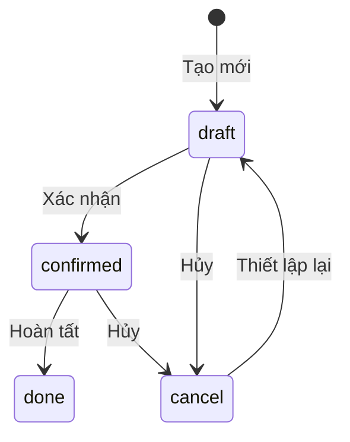
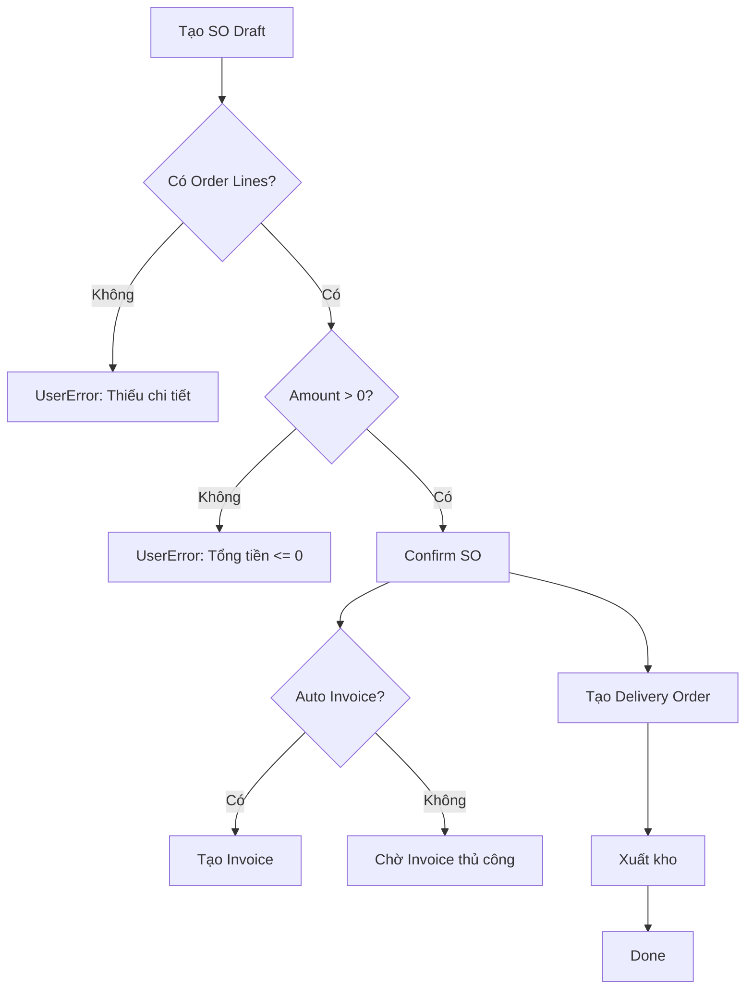
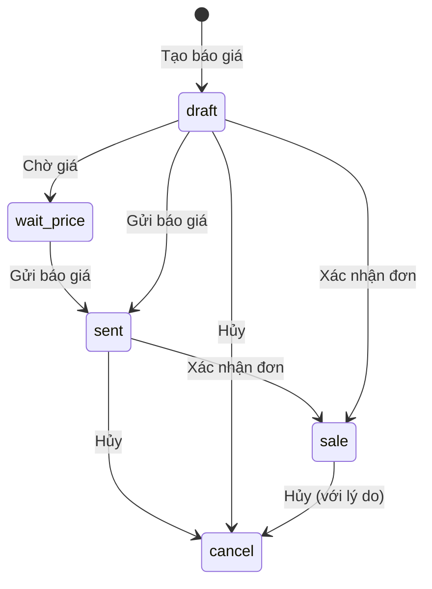
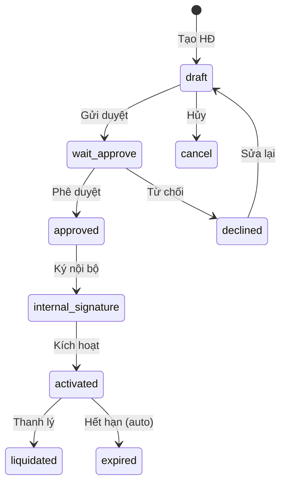
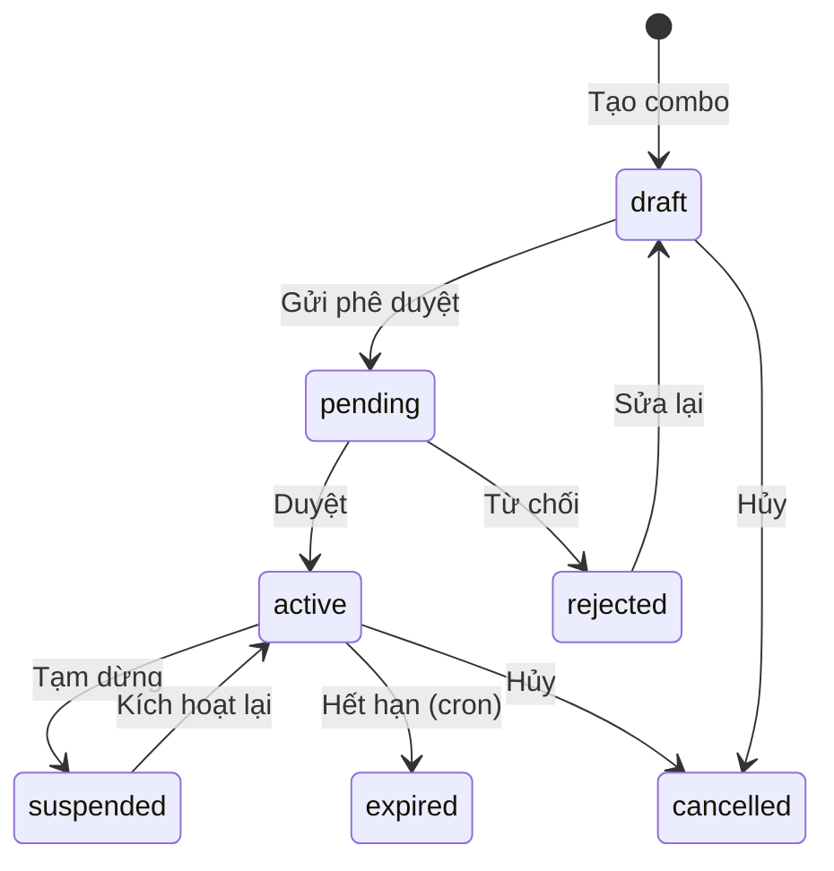
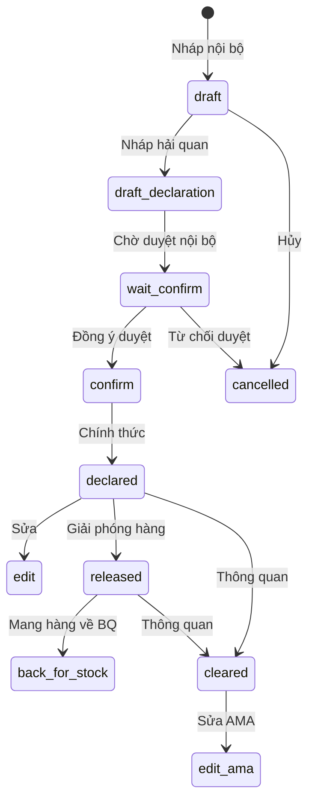
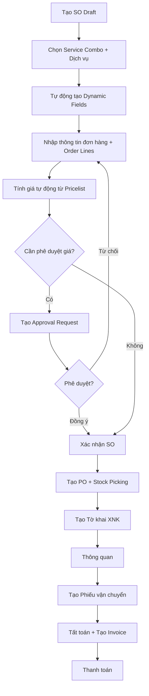

# Kiến thức BA Odoo — Phân tích Nghiệp vụ cho Odoo 17

Tài liệu chuẩn dành cho vai trò BA (Business Analyst) khi phân tích và thiết kế nghiệp vụ trên nền tảng Odoo 17.

## Triết lý cốt lõi

- **Guard Clauses trước, Happy Path sau** — mọi business rule phải được kiểm tra đầu tiên
- **Shift-Left** — BA/DEV/QA đều tham gia sớm nhất có thể
- **Lean Output** — đầu ra gồm Bảng (tables) và Sơ đồ tuần tự (sequence diagrams), không chat log

## Quy trình BA 4 bước (BMAD Workflow)

```
STEP 1: Assessment     → BA viết yêu cầu, stories, sprint plan
STEP 2: Blueprint      → Dev thiết kế architecture, data model, tech spec
STEP 3: Coding         → Dev triển khai, unit test
STEP 4: Inspection     → QA kiểm thử, code review, sign-off
```

### Nguyên tắc Ánh xạ BA → DEV → QA

```
BA viết (Nghiệp vụ):
  "Chỉ cho phép thanh toán nếu state = Draft, amount > 0, đã có tỉ giá."
                    ↓
Dev hiểu (Guard Clause):
  "Chặn đứng nếu state != draft | amount <= 0 | không có tỉ giá."
                    ↓
QA đập phá (Boundary Test):
  "Nhập amount=0, amount=-0.01, amount=0.00001, tỉ giá=null, tỉ giá=chữ..."
```

## Nhân cách BA — Sofia 🔍

| Thuộc tính | Mô tả |
|-----------|-------|
| **Vai trò** | Lean BA: phân tích nghiệp vụ, viết user stories |
| **Đầu ra** | Bảng yêu cầu, Sơ đồ quy trình (BPMN 2.0), User Stories |
| **Phương pháp** | Elevator Pitch, MoSCoW prioritization, Given-When-Then AC |
| **Nguyên tắc** | 5 Why trước khi kết luận |

## Phân tích Nghiệp vụ Odoo

### 1. Module Mapping — Xác định Module Odoo

Trước khi thiết kế, BA phải xác định module Odoo liên quan:

| Domain nghiệp vụ | Module Odoo | Model chính |
|------------------|------------|-------------|
| Bán hàng | `sale` | `sale.order`, `sale.order.line` |
| Mua hàng | `purchase` | `purchase.order`, `purchase.order.line` |
| Kho | `stock` | `stock.picking`, `stock.move`, `stock.quant` |
| Kế toán | `account` | `account.move`, `account.move.line` |
| Nhân sự | `hr` | `hr.employee`, `hr.contract` |
| Chấm công | `hr_attendance` | `hr.attendance` |
| Dự án | `project` | `project.project`, `project.task` |
| CRM | `crm` | `crm.lead` |
| Sản xuất | `mrp` | `mrp.production`, `mrp.bom` |
| Hợp đồng | Custom | `dpt.contract.management` |

### 2. State Machine — Máy trạng thái

Mỗi document Odoo thường có vòng đời trạng thái:



**BA PHẢI xác định:**
- Trạng thái bắt đầu (initial state)
- Các transition hợp lệ (valid transitions)
- Điều kiện chuyển trạng thái (guard conditions)
- Trạng thái kết thúc (terminal states)

### 3. User Stories Format (Odoo-specific)

```markdown
## US-001: [Tên tính năng]

**Là** [vai trò người dùng trong Odoo]
**Tôi muốn** [hành động trên giao diện/API]
**Để** [giá trị nghiệp vụ đạt được]

### Acceptance Criteria (Given-When-Then)

**AC1: Happy Path**
- Given: Sale Order ở trạng thái `draft` với >= 1 order line, amount > 0
- When: User click button "Confirm"
- Then: State chuyển sang `confirmed`, ngày xác nhận = now()

**AC2: Guard — Không có line**
- Given: Sale Order ở trạng thái `draft` nhưng KHÔNG có order line
- When: User click button "Confirm"
- Then: Hiện UserError: "Không thể xác nhận đơn hàng không có dòng chi tiết."

**AC3: Guard — State sai**
- Given: Sale Order ở trạng thái `confirmed`
- When: User click button "Confirm"
- Then: Hiện UserError: "Chỉ được xác nhận khi ở trạng thái Nháp."
```

### 4. Bảng Phân tích Field (Field Specification)

| Field | Label | Type | Required | Default | Constraint | Mô tả |
|-------|-------|------|----------|---------|-----------|--------|
| `name` | Mã đơn | Char | ✅ | `/` (sequence) | Unique | Mã tự sinh |
| `partner_id` | Khách hàng | Many2one | ✅ | — | `check_company=True` | Liên kết `res.partner` |
| `state` | Trạng thái | Selection | ✅ | `draft` | — | draft/confirmed/done/cancel |
| `date_order` | Ngày đặt | Datetime | ✅ | `now()` | — | Ngày tạo đơn |
| `amount_total` | Tổng tiền | Monetary | — | Compute | `amount > 0` khi confirm | Tính từ order lines |
| `line_ids` | Chi tiết | One2many | — | — | Non-empty khi confirm | `sale.order.line` |

### 5. Phân tích Quyền truy cập (Access Control)

| Vai trò Odoo | Model | Read | Write | Create | Delete | Ghi chú |
|-------------|-------|------|-------|--------|--------|---------|
| Sales User | `sale.order` | ✅ | ✅ (own) | ✅ | ❌ | Chỉ xem/sửa đơn mình tạo |
| Sales Manager | `sale.order` | ✅ | ✅ | ✅ | ✅ | Full access |
| Accountant | `sale.order` | ✅ | ❌ | ❌ | ❌ | Chỉ xem |

**Record Rules cần thiết:**

```python
# User chỉ thấy SO mình tạo hoặc mình là salesperson
domain_force = "['|', ('user_id', '=', user.id), ('create_uid', '=', user.id)]"
```

### 6. Phân tích Tích hợp (Integration Analysis)

| Trigger | Source Model | Target Model | Action | Điều kiện |
|---------|-------------|-------------|--------|----------|
| SO Confirm | `sale.order` | `stock.picking` | Tạo phiếu xuất kho | `state == 'sale'` |
| SO Confirm | `sale.order` | `account.move` | Tạo hóa đơn (optional) | Config auto-invoice |
| Invoice Validate | `account.move` | `account.payment` | Tạo thanh toán | Manual |
| Picking Done | `stock.picking` | `stock.quant` | Cập nhật tồn kho | `state == 'done'` |

### 7. Bảng Edge Cases — "Nhỡ... thì sao?"

BA PHẢI trả lời mỗi câu hỏi sau trước khi chuyển cho Dev:

| # | Câu hỏi "Nhỡ... thì sao?" | Quy tắc xử lý |
|---|---------------------------|---------------|
| 1 | Người dùng click Confirm 2 lần liên tục? | Guard `state != 'draft'` chặn lần 2 |
| 2 | Đơn hàng không có dòng chi tiết? | Guard `not self.line_ids` → UserError |
| 3 | Tổng tiền = 0 hoặc âm? | Guard `amount_total <= 0` → UserError |
| 4 | Khách hàng bị archive? | `with_context(active_test=False)` khi search |
| 5 | Nhiều company → data rò rỉ? | `check_company=True` trên Many2one |
| 6 | Concurrent edit — 2 user sửa cùng lúc? | `FOR UPDATE` hoặc SQL constraint |
| 7 | Tỉ giá thay đổi giữa ngày tạo và ngày confirm? | Xác định thời điểm lock tỉ giá |
| 8 | Sản phẩm bị xóa sau khi tạo SO line? | Cascade behavior? Archive vs Unlink |
| 9 | Số lượng = 0? | Guard hoặc SQL constraint `qty > 0` |
| 10 | Đơn vị tính không khớp sản phẩm? | Validate UoM category match |

### 8. Workflow Diagram Template (BPMN 2.0)



### 9. Incoterms — Điều khoản Thương mại Quốc tế

Khi phân tích nghiệp vụ xuất nhập khẩu:

| Term | Nghĩa | Người bán chịu | Người mua chịu | Giá trị khai HQ |
|------|--------|----------------|----------------|-----------------|
| **EXW** | Ex Works | Giao tại xưởng | Vận chuyển + Bảo hiểm + Cước | FOB = EXW + inland freight |
| **FOB** | Free On Board | Đến cảng xuất | Cước biển + Bảo hiểm | CIF = FOB + Freight + Insurance |
| **CIF** | Cost Insurance Freight | Đến cảng nhập | Dỡ hàng + thuế NK | Dùng trực tiếp cho HQ |

**Công thức tính CIF (giá trị khai Hải quan):**

```
CIF = FOB + Cước vận chuyển quốc tế (Freight) + Phí bảo hiểm (Insurance)
    = EXW + Chi phí nội địa đến cảng + Freight + Insurance
```

### 10. Checklist BA trước khi bàn giao cho Dev

- [ ] State Machine đã xác định đầy đủ (states + transitions + guards)
- [ ] User Stories với Given-When-Then cho TỪNG acceptance criteria
- [ ] Edge Cases đã trả lời hết 10 câu "Nhỡ... thì sao?"
- [ ] Access Control matrix (CRUD per role)
- [ ] Field Specification table (type, required, default, constraint)
- [ ] Integration points (trigger → action → condition)
- [ ] Workflow diagram (BPMN hoặc Mermaid flowchart)
- [ ] Multi-company considerations
- [ ] Reporting requirements
- [ ] Approval workflow (nếu có)

---

# PHẦN II: KIẾN THỨC NGHIỆP VỤ CUSTOM DPT

> Tài liệu bổ sung dành cho hệ thống ERP custom của DPT — công ty dịch vụ xuất nhập khẩu, logistics, và ủy thác thương mại.

---

## 11. Module Map — Hệ thống Module Custom DPT

### 11.1 Repo & Cấu trúc

| Repo | Vai trò | Số module |
|------|---------|-----------|
| `Odoo-DPT` | Module nghiệp vụ chính | ~80 module (60+ `dpt_*`) |
| `Odoo-DX` | Module mở rộng (Table Import, Telegram) | 2 module |
| `dpt-ai-agent` | AI Agent tích hợp Odoo | 1 module (`dpt_ai`) |
| `odoo` | Odoo CE 17 (base) | Framework |
| `enterprise` | Odoo Enterprise 17 | Helpdesk, Approvals, etc. |

### 11.2 Module Nghiệp vụ Chính — Bảng Mapping

| Domain | Module | Model chính | Mô tả |
|--------|--------|-------------|--------|
| **Dịch vụ** | `dpt_service_management` | `dpt.service.management`, `dpt.service.combo` | Quản lý danh mục dịch vụ XNK, combo dịch vụ |
| **Bán hàng** | `dpt_sale_management` | `sale.order` (inherit), `dpt.sale.service.management`, `dpt.sale.order.service.combo` | SO custom: service lines, combo, dynamic fields |
| **Báo giá phê duyệt** | `dpt_sale_approvals` | `approval.request` | Workflow phê duyệt thay đổi giá |
| **Hợp đồng** | `dpt_contract_management` | `dpt.contract.management`, `dpt.contract.management.line` | HĐ khung, phụ lục, ký số, merge PDF |
| **Tờ khai XNK** | `dpt_export_import` | `dpt.export.import`, `dpt.export.import.line` | Tờ khai hải quan, luồng xanh/vàng/đỏ |
| **Vận chuyển** | `dpt_shipping` | `dpt.shipping.slip`, `dpt.vehicle.stage` | Phiếu vận chuyển Container TQ/VN, chặng cuối |
| **Tất toán** | `dpt_settlement` | `sale.order` (inherit), `account.move` | Tất toán SO, tạo invoice từ dịch vụ |
| **Mua hàng** | `dpt_purchase_management` | `purchase.order` (inherit) | PO custom, package lines |
| **Kho** | `dpt_stock_management` | `stock.picking` (inherit), `stock.quant.package` | Kho TQ/VN, stock transfer, packing lot |
| **Thanh toán** | `dpt_account_payment_v2` | `account.payment` (inherit) | Payment v2, payment flow, risk control |
| **Tiền tệ** | `dpt_currency_management` | `res.currency` (inherit), `res.currency.rate` | Multi-currency: basic/import_export/legal_entity |
| **Hoàn thuế** | `dpt_tax_refund` | `sale.self.trading.tax.refund`, `dpt.tax.refund.profile` | Hoàn thuế GTGT, TNDN, NK |
| **Bảng giá** | `dpt_service_pricelist` | `product.pricelist` (inherit), `product.pricelist.item.detail` | Bảng giá niêm yết + bảng giá khách |
| **Chiết khấu** | `dpt_sale_discount` | `dpt.service.discount.policy` | Chính sách chiết khấu theo tier |
| **OKR** | `dpt_okr` | `dpt.okr.node` | Quản lý OKR theo phòng ban, nhân viên |
| **Helpdesk** | `dpt_helpdesk_ticket` | `helpdesk.ticket` (inherit) | Ticket vận hành, giao hàng chặng cuối |
| **Zalo OA** | `dpt_zalo_oa` | `zalo.oa.template` | Tích hợp Zalo Official Account |
| **AI Agent** | `dpt_ai` | `dpt.ai.agent`, `dpt.ai.chat`, `dpt.ai.tool` | AI chatbot, vector search, tool calling |
| **HR/Chấm công** | `dpt_hr_attendance_gps` | `hr.attendance` (inherit) | GPS tracking chấm công |
| **Tuyển dụng AI** | `dpt_hr_recruitment_ai` | `hr.applicant` (inherit) | AI đánh giá ứng viên |
| **Đào tạo** | `dpt_website_slides_training` | `training.session`, `training.assessment` | E-learning + đánh giá |
| **Partner** | `dpt_res_partner` | `res.partner` (inherit) | Partner mở rộng: vendor, legal entity |
| **Portal** | `dpt_theme_website` | `portal.mixin` (inherit) | Portal khách hàng |
| **Phân bổ** | `dpt_sale_value_allocation` | `sale.order` (inherit) | Phân bổ giá trị SO vào export/import lines |
| **Chi phí** | `dpt_cost_allocation` | — | Phân bổ chi phí XHĐ |
| **Báo cáo** | `dpt_sales_report`, `dpt_purchase_report`, `dpt_payment_report` | — | Báo cáo tùy chỉnh |
| **Bảo mật** | `dpt_security` | — | Nhóm quyền custom DPT |
| **Học tập SO** | `dpt_sale_order_learning` | `learning.session`, `learning.peer.review` | Đào tạo qua đơn hàng thực tế |
| **Phê duyệt hàng loạt** | `dpt_bulk_approval` | — | Phê duyệt nhiều yêu cầu cùng lúc |
| **Ký số USB** | `dpt_usb_token_signing` | — | Ký PDF bằng USB token |

### 11.3 Dependency Graph — Chuỗi phụ thuộc chính

```
dpt_service_management (Base)
├── dpt_service_pricelist
├── dpt_sale_management ← CORE
│   ├── dpt_sale_approvals
│   ├── dpt_sale_department
│   ├── dpt_sale_deposit
│   ├── dpt_sale_discount
│   ├── dpt_sale_iae_split
│   ├── dpt_sale_template_management
│   ├── dpt_sale_value_allocation
│   ├── dpt_sale_order_status
│   ├── dpt_sale_order_learning
│   └── dpt_settlement
├── dpt_purchase_management
│   ├── dpt_purchase_stock
│   ├── dpt_purchase_invoice
│   └── dpt_purchase_service_settlement
├── dpt_stock_management
│   └── dpt_shipping ← LOGISTICS
├── dpt_export_import ← XNK
│   ├── dpt_cost_allocation
│   └── dpt_sale_iae_split
├── dpt_contract_management ← HĐ
│   └── dpt_tax_refund_contract
├── dpt_account_payment_request
│   └── dpt_account_payment_v2
│       └── dpt_risk_control
├── dpt_currency_management
├── dpt_helpdesk_ticket
└── dpt_security (Groups)
```

---

## 12. State Machine — Các Máy Trạng Thái Custom

### 12.1 Sale Order (Extended)



**Trạng thái mở rộng DPT:**
- `locked` (Boolean): Khóa đơn hàng — không cho chỉnh sửa khi True
- `has_pending_approval` (Computed): Đang chờ phê duyệt giá
- `settle_by`: Phương thức tất toán (planned/actual)

### 12.2 Hợp đồng (dpt.contract.management)



### 12.3 Service Combo (dpt.service.combo)



### 12.4 Tờ khai XNK (dpt.export.import)



**Declaration Flow (Luồng hải quan):** `red` | `yellow` | `green`

### 12.5 Phiếu vận chuyển (dpt.shipping.slip)

```
delivery_slip_type:
├── container_tq: Container Trung Quốc (vehicle_stage: chinese)
├── container_vn: Container Việt Nam (vehicle_stage: vietnamese1)
└── last_delivery_vn: Chặng cuối Việt Nam (vehicle_stage: vietnamese2)
```

Stage phải đi theo thứ tự sequence, không được quay lại.

---

## 13. Luồng Nghiệp vụ Chính DPT

### 13.1 Luồng Bán hàng XNK



### 13.2 Luồng Hợp đồng

```
1. Tạo HĐ khung (draft) → Chọn Loại HĐ + Pháp nhân
2. Gửi duyệt (wait_approve) → Approval Request
3. Phê duyệt → Ký nội bộ (digital/manual)
4. Kích hoạt → Liên kết SO
5. Tạo Phụ lục (child_ids) nếu cần
6. Thanh lý hoặc Hết hạn (cron auto)
```

### 13.3 Luồng Tất toán

```
1. SO có 2 tab dịch vụ: Dự kiến (planned) + Thực tế (actual)
2. settle_by = 'planned' → tất toán theo planned_sale_service_ids
3. settle_by = 'actual' → tất toán theo sale_service_ids
4. Tạo Invoice từ dịch vụ → Gắn account move
5. Cập nhật thuế từ Tờ khai (update_tax_to_sale_order)
```

---

## 14. Concepts Đặc thù DPT — BA Phải Hiểu

### 14.1 Service vs Service Combo

| Concept | Mô tả | Model |
|---------|--------|-------|
| **Service** | Dịch vụ đơn lẻ (vận chuyển, khai HQ, lưu kho...) | `dpt.service.management` |
| **Service Combo** | Gói dịch vụ (thuong/bao_giao/all_in) | `dpt.service.combo` |
| **Required Fields** | Trường bắt buộc cấu hình theo dịch vụ | `dpt.service.management.required.fields` |
| **Sale Service** | Dịch vụ gắn vào SO (giá, số lượng, phân bổ) | `dpt.sale.service.management` |
| **Dynamic Fields** | Trường động tự sinh trên SO từ service | `dpt.sale.order.fields` |

### 14.2 Pháp nhân (Legal Entity)

```python
legal_entity = fields.Selection([
    ('dpt', 'DPT'),
    ('ltv', 'LTV'),
    ('deka', 'Deka'),
    ('other', 'Khác'),
])
```

Pháp nhân ảnh hưởng đến:
- Mã hợp đồng
- Tỉ giá (currency category: basic/import_export per legal_entity)
- Cấu hình ký số
- Tài khoản kế toán

### 14.3 Loại Ủy thác (Entrust Type)

| Loại | Code | Dịch vụ đánh dấu |
|------|------|-------------------|
| Ủy thác XNK | `xnk` | `is_the_commission_fee = True` |
| Ủy thác NK | `nk` | `is_the_commission_fee_import = True` |
| Ủy thác XK | `xk` | `is_the_commission_fee_export = True` |
| Không ủy thác | `kut` | Không có flag nào |

### 14.4 Phân bổ Giá trị (Allocation)

```python
allocation_type = fields.Selection([
    ('value', 'Giá trị'),      # Phân bổ theo tổng giá trị hàng
    ('quantity', 'Số lượng'),   # Phân bổ theo SL
    ('weight', 'Cân nặng'),    # Phân bổ theo kg
    ('volumn', 'Số khối'),     # Phân bổ theo m3
    ('none', 'Không'),         # Không phân bổ
])
```

### 14.5 Tỉ giá 3 lớp

| Nhóm | Category | Mục đích |
|------|----------|----------|
| Cơ bản | `basic` | Tỉ giá ngân hàng (XHĐ) |
| Hải quan | `import_export` | Tỉ giá khai HQ (ECUS5) |
| Thanh toán | Payment standard | Tỉ giá thanh toán nội bộ |

Mỗi tỉ giá phân theo `legal_entity` + `currency_code` (USD, CNY, KRW).

### 14.6 Thuế từ Tờ khai

| Loại thuế | Flag trên Service | Field trên Export Import Line |
|-----------|-------------------|-------------------------------|
| Thuế VAT | `is_vat_service` | `dpt_amount_tax_vat_customer` |
| Thuế NK | `is_import_tax_service` | `dpt_amount_tax_import_basic` |
| Thuế khác | `is_other_tax_service` | `dpt_amount_tax_other_basic` |

### 14.7 Kho 3 chặng

| Kho | Flag Warehouse | Vai trò |
|-----|----------------|---------|
| Kho TQ nhận hàng | `is_main_incoming_warehouse` | Nhận hàng từ NCC Trung Quốc |
| Kho TQ trung chuyển | `is_tq_transit_warehouse` | Container TQ chờ vận chuyển |
| Kho VN trung chuyển | `is_vn_transit_warehouse` | Container VN sau thông quan |
| Kho VN xuất hàng | `is_main_outgoing_warehouse` | Xuất giao chặng cuối |

---

## 15. Approval Workflow — Các Luồng Phê duyệt

DPT sử dụng `approvals` module (Enterprise) mở rộng.

| Mã (sequence_code) | Tên | Trigger |
|--------------------|-----|---------|
| `SCM` | Duyệt combo dịch vụ | `dpt.service.combo.action_submit_approval()` |
| `PHEDUYETTATOANDUKIEN` | Phê duyệt tất toán dự kiến | `sale.order.submit_tentative_quote_for_approval()` |
| (configurable) | Phê duyệt thay đổi giá | Khi giá SO line thay đổi |
| (configurable) | Phê duyệt hợp đồng | Khi HĐ chuyển `wait_approve` |
| (configurable) | Phê duyệt bảng giá | Khi pricelist cần active |

---

## 16. Edge Cases Đặc thù DPT — "Nhỡ... thì sao?"

| # | Câu hỏi | Quy tắc xử lý |
|---|---------|---------------|
| 1 | SO bị khóa (locked=True) nhưng cần chỉnh sửa? | `action_unlock()` trước, chỉnh sửa, `action_lock()` sau |
| 2 | Pháp nhân tờ khai khác pháp nhân SO? | `onchange_get_legal_entity()` sync từ partner_importer |
| 3 | Combo có service trùng với service đã chọn? | Check `existing_service_ids` set trước khi thêm |
| 4 | Required field cần giá trị từ partner? | `_get_partner_field_values()` auto-fill từ partner |
| 5 | Tỉ giá thay đổi sau khi khai HQ? | `action_update_exchange_rates()` lấy rate theo clearance_date |
| 6 | HĐ hết hạn nhưng chưa thanh lý? | Cron `_cron_auto_set_expired()` tự chuyển state |
| 7 | Shipping slip đổi stage sai thứ tự? | `ValidationError` nếu skip stage hoặc quay lại |
| 8 | SO có nhiều dịch vụ thuế cùng loại? | Warning notification, chỉ update dịch vụ đầu tiên |
| 9 | Tờ khai có dòng chưa gán lô (lot)? | `action_check_lot_name()` raise UserError |
| 10 | Khách hàng chưa có giới tính? | Warning trên HĐ khi chọn invoice_partner |
| 11 | Dynamic fields bị mất khi thay đổi dịch vụ? | `_generate_fields_from_services()` rebuild từ service/combo |
| 12 | Phiếu vận chuyển chặng cuối không có lot_quant? | `_constrains_get_lot_quant()` auto tạo từ ticket |

---

## 17. Nhóm quyền DPT (dpt_security)

BA cần biết các nhóm quyền custom:

| Nhóm | XML ID | Vai trò |
|------|--------|---------|
| Nhân viên kho vận | `group_dpt_nhan_vien_kho_van` | Quản lý kho, vận chuyển |
| Nhân viên Sale | (base group) | Tạo/sửa SO |
| CS (Customer Service) | (base group) | Theo dõi đơn hàng |
| Kế toán | (base group) | Thanh toán, tất toán |
| Manager | (base group) | Full access + phê duyệt |

---

## 18. Checklist BA trước khi bàn giao cho Dev (DPT-specific)

- [ ] Xác định pháp nhân ảnh hưởng (DPT/LTV/Deka)
- [ ] Loại ủy thác (XK/NK/XNK/KUT) và phân bổ tương ứng
- [ ] Tỉ giá nào sử dụng (basic/import_export)
- [ ] Service nào cần dynamic fields
- [ ] Approval flow cần tạo/mở rộng
- [ ] Kho nào liên quan (TQ/VN/transit)
- [ ] Thuế nào cần sync từ tờ khai
- [ ] Phiếu vận chuyển loại nào (container_tq/container_vn/last_delivery_vn)
- [ ] Lock/unlock SO ở bước nào
- [ ] Portal khách hàng có cần hiển thị không
