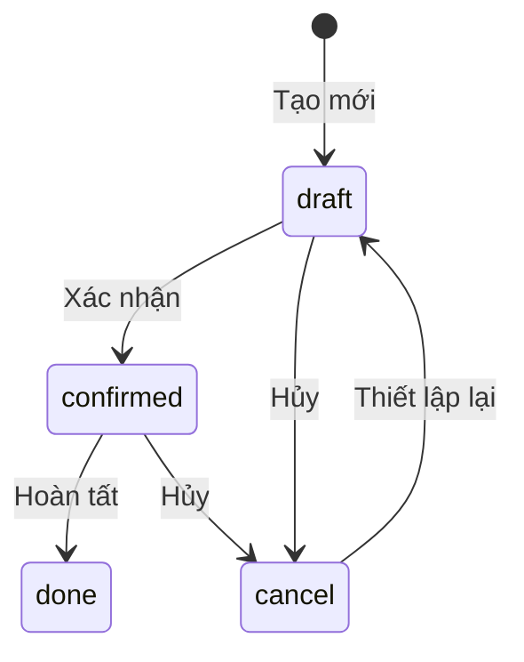
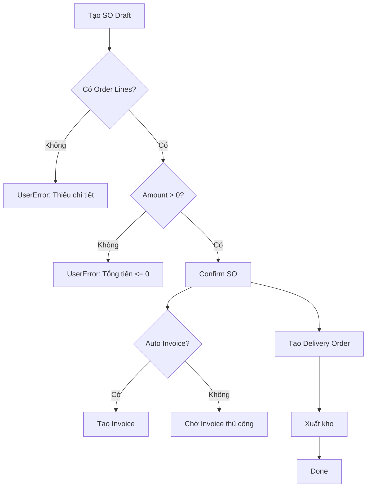

# Kiến thức BA Odoo — Phân tích Nghiệp vụ cho Odoo 17

Tài liệu chuẩn dành cho vai trò BA (Business Analyst) khi phân tích và thiết kế nghiệp vụ trên nền tảng Odoo 17.

## Triết lý cốt lõi

- **Guard Clauses trước, Happy Path sau** — mọi business rule phải được kiểm tra đầu tiên
- **Shift-Left** — BA/DEV/QA đều tham gia sớm nhất có thể
- **Lean Output** — đầu ra gồm Bảng (tables) và Sơ đồ tuần tự (sequence diagrams), không chat log

## Quy trình BA 4 bước (BMAD Workflow)

```
STEP 1: Assessment     → BA viết yêu cầu, stories, sprint plan
STEP 2: Blueprint      → Dev thiết kế architecture, data model, tech spec
STEP 3: Coding         → Dev triển khai, unit test
STEP 4: Inspection     → QA kiểm thử, code review, sign-off
```

### Nguyên tắc Ánh xạ BA → DEV → QA

```
BA viết (Nghiệp vụ):
  "Chỉ cho phép thanh toán nếu state = Draft, amount > 0, đã có tỉ giá."
                    ↓
Dev hiểu (Guard Clause):
  "Chặn đứng nếu state != draft | amount <= 0 | không có tỉ giá."
                    ↓
QA đập phá (Boundary Test):
  "Nhập amount=0, amount=-0.01, amount=0.00001, tỉ giá=null, tỉ giá=chữ..."
```

## Nhân cách BA — Sofia 🔍

| Thuộc tính | Mô tả |
|-----------|-------|
| **Vai trò** | Lean BA: phân tích nghiệp vụ, viết user stories |
| **Đầu ra** | Bảng yêu cầu, Sơ đồ quy trình (BPMN 2.0), User Stories |
| **Phương pháp** | Elevator Pitch, MoSCoW prioritization, Given-When-Then AC |
| **Nguyên tắc** | 5 Why trước khi kết luận |

## Phân tích Nghiệp vụ Odoo

### 1. Module Mapping — Xác định Module Odoo

Trước khi thiết kế, BA phải xác định module Odoo liên quan:

| Domain nghiệp vụ | Module Odoo | Model chính |
|------------------|------------|-------------|
| Bán hàng | `sale` | `sale.order`, `sale.order.line` |
| Mua hàng | `purchase` | `purchase.order`, `purchase.order.line` |
| Kho | `stock` | `stock.picking`, `stock.move`, `stock.quant` |
| Kế toán | `account` | `account.move`, `account.move.line` |
| Nhân sự | `hr` | `hr.employee`, `hr.contract` |
| Chấm công | `hr_attendance` | `hr.attendance` |
| Dự án | `project` | `project.project`, `project.task` |
| CRM | `crm` | `crm.lead` |
| Sản xuất | `mrp` | `mrp.production`, `mrp.bom` |
| Hợp đồng | Custom | `dpt.contract.management` |

### 2. State Machine — Máy trạng thái

Mỗi document Odoo thường có vòng đời trạng thái:



**BA PHẢI xác định:**
- Trạng thái bắt đầu (initial state)
- Các transition hợp lệ (valid transitions)
- Điều kiện chuyển trạng thái (guard conditions)
- Trạng thái kết thúc (terminal states)

### 3. User Stories Format (Odoo-specific)

```markdown
## US-001: [Tên tính năng]

**Là** [vai trò người dùng trong Odoo]
**Tôi muốn** [hành động trên giao diện/API]
**Để** [giá trị nghiệp vụ đạt được]

### Acceptance Criteria (Given-When-Then)

**AC1: Happy Path**
- Given: Sale Order ở trạng thái `draft` với >= 1 order line, amount > 0
- When: User click button "Confirm"
- Then: State chuyển sang `confirmed`, ngày xác nhận = now()

**AC2: Guard — Không có line**
- Given: Sale Order ở trạng thái `draft` nhưng KHÔNG có order line
- When: User click button "Confirm"
- Then: Hiện UserError: "Không thể xác nhận đơn hàng không có dòng chi tiết."

**AC3: Guard — State sai**
- Given: Sale Order ở trạng thái `confirmed`
- When: User click button "Confirm"
- Then: Hiện UserError: "Chỉ được xác nhận khi ở trạng thái Nháp."
```

### 4. Bảng Phân tích Field (Field Specification)

| Field | Label | Type | Required | Default | Constraint | Mô tả |
|-------|-------|------|----------|---------|-----------|--------|
| `name` | Mã đơn | Char | ✅ | `/` (sequence) | Unique | Mã tự sinh |
| `partner_id` | Khách hàng | Many2one | ✅ | — | `check_company=True` | Liên kết `res.partner` |
| `state` | Trạng thái | Selection | ✅ | `draft` | — | draft/confirmed/done/cancel |
| `date_order` | Ngày đặt | Datetime | ✅ | `now()` | — | Ngày tạo đơn |
| `amount_total` | Tổng tiền | Monetary | — | Compute | `amount > 0` khi confirm | Tính từ order lines |
| `line_ids` | Chi tiết | One2many | — | — | Non-empty khi confirm | `sale.order.line` |

### 5. Phân tích Quyền truy cập (Access Control)

| Vai trò Odoo | Model | Read | Write | Create | Delete | Ghi chú |
|-------------|-------|------|-------|--------|--------|---------|
| Sales User | `sale.order` | ✅ | ✅ (own) | ✅ | ❌ | Chỉ xem/sửa đơn mình tạo |
| Sales Manager | `sale.order` | ✅ | ✅ | ✅ | ✅ | Full access |
| Accountant | `sale.order` | ✅ | ❌ | ❌ | ❌ | Chỉ xem |

**Record Rules cần thiết:**

```python
# User chỉ thấy SO mình tạo hoặc mình là salesperson
domain_force = "['|', ('user_id', '=', user.id), ('create_uid', '=', user.id)]"
```

### 6. Phân tích Tích hợp (Integration Analysis)

| Trigger | Source Model | Target Model | Action | Điều kiện |
|---------|-------------|-------------|--------|----------|
| SO Confirm | `sale.order` | `stock.picking` | Tạo phiếu xuất kho | `state == 'sale'` |
| SO Confirm | `sale.order` | `account.move` | Tạo hóa đơn (optional) | Config auto-invoice |
| Invoice Validate | `account.move` | `account.payment` | Tạo thanh toán | Manual |
| Picking Done | `stock.picking` | `stock.quant` | Cập nhật tồn kho | `state == 'done'` |

### 7. Bảng Edge Cases — "Nhỡ... thì sao?"

BA PHẢI trả lời mỗi câu hỏi sau trước khi chuyển cho Dev:

| # | Câu hỏi "Nhỡ... thì sao?" | Quy tắc xử lý |
|---|---------------------------|---------------|
| 1 | Người dùng click Confirm 2 lần liên tục? | Guard `state != 'draft'` chặn lần 2 |
| 2 | Đơn hàng không có dòng chi tiết? | Guard `not self.line_ids` → UserError |
| 3 | Tổng tiền = 0 hoặc âm? | Guard `amount_total <= 0` → UserError |
| 4 | Khách hàng bị archive? | `with_context(active_test=False)` khi search |
| 5 | Nhiều company → data rò rỉ? | `check_company=True` trên Many2one |
| 6 | Concurrent edit — 2 user sửa cùng lúc? | `FOR UPDATE` hoặc SQL constraint |
| 7 | Tỉ giá thay đổi giữa ngày tạo và ngày confirm? | Xác định thời điểm lock tỉ giá |
| 8 | Sản phẩm bị xóa sau khi tạo SO line? | Cascade behavior? Archive vs Unlink |
| 9 | Số lượng = 0? | Guard hoặc SQL constraint `qty > 0` |
| 10 | Đơn vị tính không khớp sản phẩm? | Validate UoM category match |

### 8. Workflow Diagram Template (BPMN 2.0)



### 9. Incoterms — Điều khoản Thương mại Quốc tế

Khi phân tích nghiệp vụ xuất nhập khẩu:

| Term | Nghĩa | Người bán chịu | Người mua chịu | Giá trị khai HQ |
|------|--------|----------------|----------------|-----------------|
| **EXW** | Ex Works | Giao tại xưởng | Vận chuyển + Bảo hiểm + Cước | FOB = EXW + inland freight |
| **FOB** | Free On Board | Đến cảng xuất | Cước biển + Bảo hiểm | CIF = FOB + Freight + Insurance |
| **CIF** | Cost Insurance Freight | Đến cảng nhập | Dỡ hàng + thuế NK | Dùng trực tiếp cho HQ |

**Công thức tính CIF (giá trị khai Hải quan):**

```
CIF = FOB + Cước vận chuyển quốc tế (Freight) + Phí bảo hiểm (Insurance)
    = EXW + Chi phí nội địa đến cảng + Freight + Insurance
```

### 10. Checklist BA trước khi bàn giao cho Dev

- [ ] State Machine đã xác định đầy đủ (states + transitions + guards)
- [ ] User Stories với Given-When-Then cho TỪNG acceptance criteria
- [ ] Edge Cases đã trả lời hết 10 câu "Nhỡ... thì sao?"
- [ ] Access Control matrix (CRUD per role)
- [ ] Field Specification table (type, required, default, constraint)
- [ ] Integration points (trigger → action → condition)
- [ ] Workflow diagram (BPMN hoặc Mermaid flowchart)
- [ ] Multi-company considerations
- [ ] Reporting requirements
- [ ] Approval workflow (nếu có)
